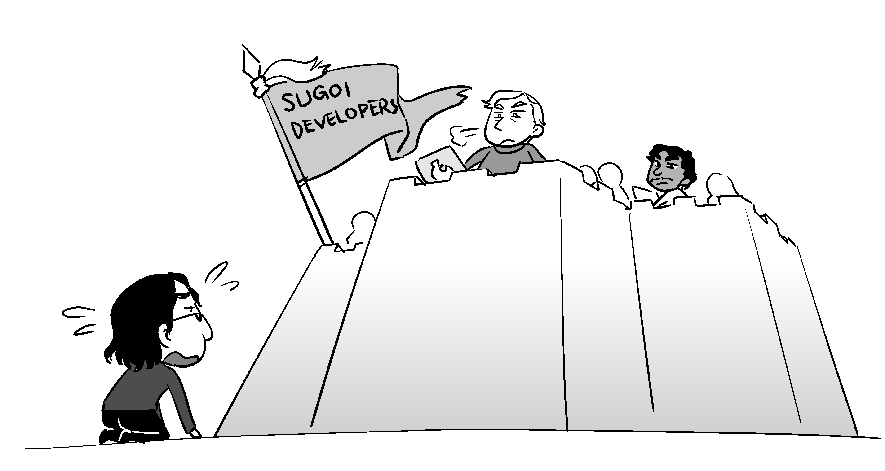
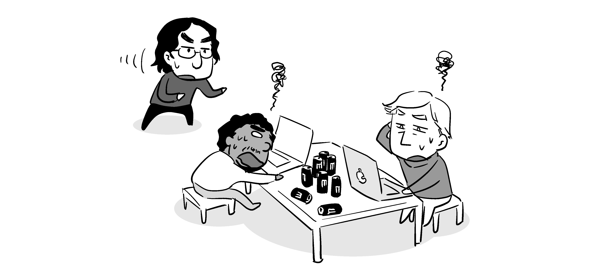
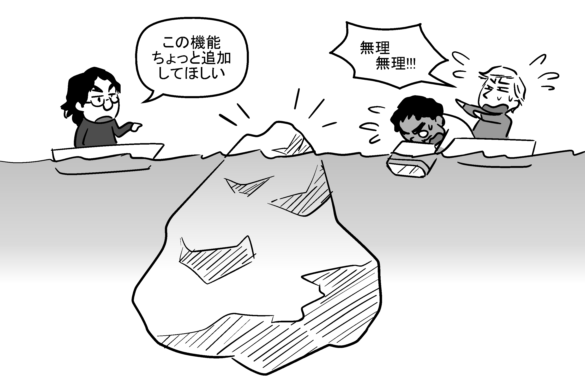
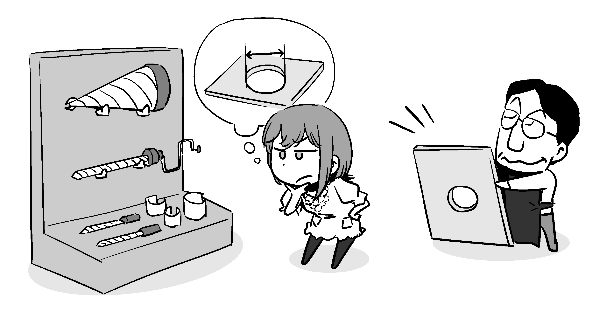
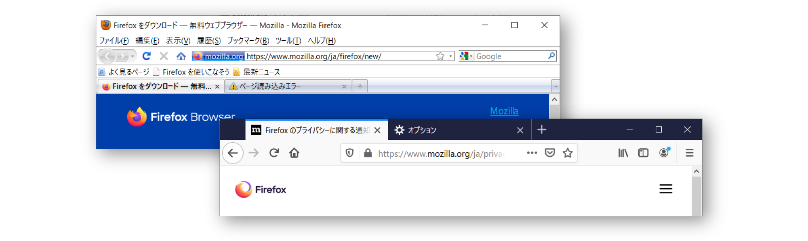

# 要望が通らない！

さて、初めてのフィードバックは無事にできたでしょうか？

すでに述べたとおり、フィードバックは、したらそれで終わりではありません。ここからはフィードバックした後の展開でよくあるつまずきを紹介していきます。


## 問題を解消してもらえない場合もある

イシューの報告では、報告者と開発者の間で何度かやり取りが行われた上で、問題が解消されイシューがクローズされる、というのが基本的な流れです。

ただ、実際には「対応しない」「却下」という判断がなされることもあり、*必ずしも報告者にとって当初の希望が叶う結果になるとは限りません*。

そういう状況は強いストレスをもたらします。「頑張って報告したのにぞんざいに扱われた！」「なんで分かってくれないんだ！」とイライラしたり、「これを却下するなんておかしい！」と怒ったり、「おかしな判断をする彼らはバカだ！」「いいから黙って対応しろ！」と思ってしまうかもしれません。筆者も何度となくそのような経験をしています。

そんなときにこそ思い出したいのが、4章「どこにフィードバックしたらいいか分からない」で触れた*「Code of Conduct」*で示される*「良い行動」*と*「良くない行動」*です。

もう一度、Contributor CovenantのCode of Conductにおける当該箇所（抄訳）を引用しましょう。

* 奨励される良い行動の例。
  * 他者に対して共感と優しさを示す。
  * 異なる視点や経験を尊重する。
  * 建設的な批判を行うと同時に、そのような批判を受容する。
  * 個人としてだけでなく、コミュニティにとって何が最善かに焦点を当てる。
* 容認されない行動の例。
  * （略）
  * 荒らし・煽り、侮辱的・軽蔑的なコメント、個人攻撃、政治的な攻撃。
  * （略）

これらは若干抽象的で、具体的にどういう行動が該当するのかピンと来ない人もいるでしょう。しかし、*望んだ通りにならないというストレスを感じているとき*にこそ、これらの抽象的な規範を具体的な行動に反映していく必要があります。


## 要望や報告が却下される理由

### 自分に非があるときは、素直に認めよう

報告者の側に責任のある理由で、要望や報告が却下されるということはあります。たとえば以下のようなケースです。

* 報告が所定の書式を満たしていない。
* そもそも使い方が間違っている。
* 報告先として不適当（原因は別のOSSにある）。

プロジェクトの背景事情をよく知らない関わり始めの時期には、こういったことをやってしまいがちで、筆者も度々やっています。こういうとき、融通がきかない、杓子定規すぎる、*せっかくのフィードバックなのだからもっと丁重に扱って欲しい*、と思う人もいるかもしれません。



でも、ちょっと待ってください。あなたが貴重な時間を割いているのと同様に、開発者達も貴重な時間を割いているのかもしれません。あらゆる曖昧なフィードバックに丁寧に対応していたら、それが数十件数百件と重なれば、開発者がそれに拘束される時間も増えていき、肝心な機能開発や不具合の修正に取れるリソースが目減りしてしまいます[^too-many-unclear-issues]。

ルールを厳密に運用するのは、そういった開発の妨げになる要素を減らすためであって、*あなたに嫌がらせをしているわけではない*のです。そういった事情に思いを巡らせることが、*「他者に対して共感と優しさを示す」「異なる視点や経験を尊重する」という行動規範の実践*と言えるでしょう。

[^too-many-unclear-issues]: 実際、筆者は使える時間のかなりの部分を曖昧な内容の報告の動作確認や原因調査に費やしています……



開発者に「開発者しかできないこと」へ注力してもらうためには、一人一人の報告者が自分にできる範囲で、なるべく質の高い報告をするように努めるしかありません。開発者が優しい人なら、参照するべき情報に誘導してもらえることもあります。単に「却下」とだけされてしまっていて従うべきルールが分からないような場合は、「ルールがどこにあるのか教えて欲しい」と質問してみてもよいでしょう。

無知が原因で望ましくないことをしてしまうのは、誰にでも必ずあることです。しかし、それを恐れて「全部のルールを把握するまで何もしない」としてしまうと、一生何もできないままです。

現実的には*「次からは同じミスを繰り返さない」「次からはミスの程度を小さくする」*という方針でやっていくしかない、と筆者は考えています。むしろ、「前のミスから学習してくれたんだな、この人は向上心があるな」と好印象になるかもしれません。

### ペンディング状態は、挑戦のチャンス

開発者が多忙で手が回らないためにペンディング（棚上げ状態）とされてしまったり、「help wanted」のようなステータスになってしまった場合、*「自分で実装する」に挑戦してみるチャンス*です。実際に筆者も、それをきっかけにプルリクエストにまで繋がった経験が何度かあります。

一例として、筆者が不得意な分野でたまたま見つけた[Firefoxの不具合を報告した際の事例](https://bugzilla.mozilla.org/show_bug.cgi?id=1476195)があります。この件の顛末は[筆者の所属会社のブログの解説記事](https://www.clear-code.com/blog/2018/10/17.html)に詳細にまとめてあるので、技術的な詳細については本書では割愛しますが、ここでお伝えしたいのは、*1人で解決したわけではなく、開発者から度々アドバイスを得て解決した*ということです。言い換えると、「自分でやってみる」にしても、*必ず1人だけでやらないといけないわけではない*、ということです。

チームでの開発において、*「できる所までは自分でやってみて、30分くらい考えても答えが分からなければ、分かりそうな人に質問する」*といった基準を設けているケースがあります（筆者の所属会社でもそのような方針をとっています）。これと同じことがOSSでも言えます。

それでは結局開発者の負担が増えるのでは？　と思うかもしれませんが、そんなことはありません。「開発者が自分でその問題の解決に取り組む」場合に比べると、*「相談に答える」ことの負担ははるかに小さい*からです。問題に取り組む上で最も負担が大きいのは「情報を集め、整理し、解決策を考える、という一通りのことを*主導すること*」それ自体で、その部分を巻き取ってもらえている時点で、開発者側は十分に助かっているわけです[^helpful]。

[^helpful]: これは妄想ではなく、筆者がホストするプロジェクトにおいて、協力者の方からの相談を受けながら作業を進めてもらった際の体験からも言えることです。また、仮に「失敗」に終わったとしても、「そのアプローチではうまく行かない」という知見を開発者は低コストで得られた（コントリビューターの人がそのコストを負担してくれた）と言えますので、その労力は無駄にはなりません。

遅かれ早かれいつかはその問題を解決しなければならないなら、*より低コストで解決できる方が望ましい*です。「問題を解決すること」が目的であるイシュートラッカーにおいては、開発者が外部のコントリビューターにアドバイスをするのは「問題をより早く・より少ない手間で解決する」という観点からも理に適っていると言えます。

人手不足のOSSプロジェクトでは、そういうわけで、実際に手を動かしてくれる人は歓迎される傾向にあります。向こうが歓迎してくれるのであれば、それに乗らない手はないでしょう。

### 自分に非がなくても却下されることも

ペンディングではなく、プロジェクト側の一方的な都合で「対応しない」と判断される場合もあります。たとえば以下のようなケースです。

* 実現に要するコストが大きすぎる。
* 問題が非常に複雑で、開発者の理解を超えている。
* それを修正すると、別の既存の機能が動作しなくなってしまう。
* プロジェクトのスコープから外れている。

あなたにとっては「不具合」と感じられる内容でも、開発者にとっては「新機能の要望」になる場合があります。実際に、筆者が開発しているFirefox用アドオン「Tree Style Tab（TST）」に寄せられる報告にもこのタイプは多いです。

たとえば、「◯◯という機能で開いたタブがツリーの子ノードにならない」という報告は、体裁としては不具合の修正要望です。しかし実情は、「元々そういう事ができるような設計になっておらず、*実現するには根本的な所からの大規模な設計変更が必要*」というケースが度々あります。

また、機能は作ればそれで終わりというわけではなく、作った後にも、正常に動作する状態を維持し続ける手間がかかるという点も見過ごせません。*「機能を1つ追加する」「設定を1つ追加する」という判断は、必ずしも簡単に決断できるものとは限らない*のです。



ユーザー視点で寄せられる要望を無尽蔵に取り込んでいくと、最初はただの「タブの表示の仕方を変える」だけのアドオンだったはずが、ポップアップブロック機能[^popup-block]が付き、サムネイル表示機能[^tab-thumbnail]が付き、リンクの制御機能が付き、という具合にどんどんソフトウェアとして肥大化していってしまいます。そうしてやがて*個人の手に余るようになって、開発を継続できなくなる*、という現象は珍しい物ではありません。

筆者がTSTの前身として開発していたアドオンは、そうして破綻し開発を放棄するという、破滅的な結末をたどりました。むしろ、TSTというOSSのスコープを「縦長のツリー表示のタブバーとして動作するサイドバーを提供すること」と強く規定しているのは、その反省があってのことです。

[^popup-block]: Webページから開かれる別ウィンドウを抑止したり、代わりにタブで開いたりする機能。
[^tab-thumbnail]: ページの内容を画像で縮小表示する機能。

プロジェクトを維持し続けるためには、*することとしないことの範囲（スコープ）を明確にすること*が非常に重要です。スコープに入るのか外れるのかが微妙な部分で、吟味に吟味を重ねた結果の開発者の判断が報告者の希望と一致しない、ということはあります。そうして要望がプロジェクトのスコープ外だと判断されたケースでは、食い下がっても判断が覆ることは希なので、*素直に引き下がる*のが得策でしょう。

### 問題を再定義しよう

ただ、コストの問題やスコープの問題で却下された要望も、*問題を小さく再定義したり、別の角度で再定義したりする*と、受け入れてもらえる場合があります。TSTに寄せられる機能追加の要望は、却下以外ではこの形での解決を見ることが多いです。

以下は、実際にあったそのような判断の例です。

* TSTは、Firefoxのタブで標準的に行える操作以外の便利機能には対応しない方針としています。そのため、「タブバーの上でマウスのホイールを回転させたら、スクロールではなくタブを切り替えて欲しい」という要望に対して、Firefoxに無い機能なので対応しませんでした。
  * その代わりに、TSTに他のアドオンと連携するための変更を加え、「ホイール回転でのタブ切り替え専用のアドオン」と組み合わせてそのような動作を実現できるようにしました。
* 「ページ内のリンクをまとめて現在のタブの子タブとして開く」機能が欲しいという要望も、スコープ外なので対応しませんでした。
  * その代わり、すでに他のアドオンで「リンクをまとめてタブで開く」という機能を提供する物があったことと、そのアドオンの側に変更を加えればTSTに限らず同様のアドオンとの併用でその動作を実現でき、且つ、デメリットが無いという状況だったため、そのアドオンの側に改修の依頼を出すという対応を取りました。
* 「ピン留めされたタブから開いたタブがツリーになるようにして欲しい」という要望は、Firefoxの構造上、その字面通りの挙動を実現できないために、対応しませんでした。
  * その代わり、「そういったタブが散らばってしまうこと」が問題であると再定義した上で、「そういったタブをグループにまとめて散らばりにくくする」機能を加えました。

報告者であるユーザーは、問題に直面して困っている当事者ではありますが、最も良い解決策を考えられる人だとは限りません。*開発者と意見を出し合い、より良い解決策を見つけていける*余地はあるはずです。



要望は、「オール・オア・ナッシング」「0か100か」で考えていては妥協の余地がありません。自分の出した解決策、つまり、特定の手段の実現に執着しすぎてしまっては、肝心の目的である「問題の解決」自体が遠のくことすらあります。*自分というユーザー個人にとっても、開発者にとっても、どちらの要望もほどほどに満たされる落とし所を見つける*。それが、*「個人としてだけでなく、コミュニティにとって何が最善かに焦点を当てる」という行動規範の実践*と言えるでしょう。

### 動きが見られない場合は

ときには、報告にまったく反応してもらえなかったり、あるいは、イシューの動きが突然途絶えてしまったり、ということもあります。開発者が急に多忙になったり、開発者側から「この情報を提供して欲しい」とコメントが示されたのを見落としていて双方が待ちの状態になってしまっていたり、単に通知に気付いていなかったり、理由は色々と考えられます。

そのような場合、念のため少し時間を空けてから、進捗を尋ねるようにしてみてもよいでしょう。たとえば、1週間くらい待ってから「Any progress? If you need more information, please tell me what information do you need.（何か進捗はありますか？　もしさらなる情報が必要な場合、どんな情報が必要か言ってください。）」とコメントする、といったやり方が考えられます。

また、それと並行してプロジェクトオーナーの動向も確認しておくとよいでしょう。たとえば以下のような要領です。

* GitHubであれば、プロジェクトオーナーのユーザーページで最近の活動状況を見てみる。
* プロジェクトオーナーのアカウント名やメールアドレスでWebを検索して、Twitterなどの別のSNSで同名・同アイコンのアカウントがあれば、最近の様子を見てみる。
* プロジェクトオーナーにメールで連絡してみる。

他での活動が活発であるにも関わらずイシューにまったく反応が無い場合、プロジェクトへの関心をすでに失っているという可能性もあります。その場合、もしかしたら*自分がプロジェクトを引き継ぐ*ことを視野に入れた方がよいかもしれません。OSSでは、こういった場面で自主的にプロジェクトをフォーク[^fork]して「派生版」「後継版」を作るということはよくあります。このケースについては、また後で改めて述べることにします。

[^fork]: 元のプロジェクトからソースコードだけ引き継いで別のプロジェクトを始めること。

### [column] コラム：理不尽な却下もあり得る、と心得ておこう

ここまで、「却下されるのはあなたの側に非があることが多い」という観点で色々と述べてきました。しかし実際には、何の非も無くても理不尽に要望が却下される場合も、無いとは言えません。

OSSの開発者達はみんな聖人君子や菩薩かというと、そんなことはありません。人間的に未熟な人もいれば、品性下劣な人も、良心に欠ける人も、Code of Conductなんて糞喰らえだという人もいます。相手がどういうタイプかはコンタクトを取ってみるまで分かりません。また、多くの人から尊敬される開発者でも、たまたま虫の居所の悪いときはあるかもしれません。

運悪く理不尽に遭遇してしまうと、心が傷付いて、悲しみに打ちひしがれてしまうでしょう。もしかしたら、アドレナリンが大量放出されて頭に血が上り、耳まで真っ赤になって、怒りに打ち震えて、「こいつの性根をたたき直してやらねば！」と正義の心に火が着くかもしれません。

かくいう筆者も、性格的にはそのタイプです。「目の前の問題を解決したい、解決されないと気が済まない」と考える筆者にとっては、*理不尽とは、「解決されるべきなのに未解決の問題」に他ならない*からです。

ですが、もしあなたがそういう理不尽に遭遇してしまったときには、*黙って立ち去る*ことをお勧めします。なぜなら、こういう場面で「相手の考えを変えさせ、相手の誤りを認めさせ、判断を撤回させる」のは、*自分の頑張りだけですぐには解決できない問題*だからです。

　

この種の「問題」の解決には、実のところ粘り強い交渉・説得が必要で、それを実現するための冷静さや話術、相手の変化の機微を捉える観察力なども必要となります。

しかし、熱くなっている時点でまず冷静さが欠けていますし、英語が不得意なら話術も発揮できません。インターネット越しの文字だけのやり取りとなると、相手の変化の機微も捉えられません。そもそも、*相手の側が「こいつの話は聞く気がしない」と思ってしまっている時点で、交渉や説得のテーブルにすら着いてもらえていません*。

理不尽な場面は、問題解決という観点で見ると大抵、スタート時点でこのように非常に分が悪い状態になっています。問題を解決できる見込みが立つまでは、無駄に悪あがきしないで時機を待つのが正解と言えるでしょう（その「時機」は、もしかしたら永遠に来ないかもしれませんが……）。筆者は、そのように考えるようになって以降、理不尽に心を囚われて強いストレスに苛まれ続けるということが減った気がしています。

　

とはいえ、いきなりそのような場面に遭遇しては、反射的な悪あがきを自制するのは難しいでしょう。できれば事前の予習として、*感情に流されないように自分自身を制御する術、自分には制御できないものに執着しすぎないコツ*を身に着けておきたいものです。

これについての筆者のおすすめの教材は、*岸見一郎・古賀史健著「嫌われる勇気―――自己啓発の源流『アドラー』の教え」（2013年、ダイヤモンド社より刊行）*です。「自分にはコントロールできないもの」との向き合い方のヒントを得られるかもしれませんので、熱くなりやすい方はぜひチェックしてみてください。

### [/column]


## 要望が通らなくても、熱くならないようにしよう

ここで、要望が通らない場面での望ましくない振る舞いが見られる、実際のフィードバック事例をご紹介しましょう。

（本節の引用部は、元々はすべて英語でなされたやり取りですが、原文と訳文を両方掲載すると長くなりますし、ここでは英語の表現自体を参考にするわけではないので、筆者による抄訳のみ掲載します。）

### Firefoxのタブバーの位置の議論

最初に、経緯を簡単に説明しておきましょう。

Firefoxのタブバーは、当初は「戻る」「進む」などのボタンがあるツールバーの下に置かれていましたが、Google Chromeに合わせるようにFirefox 4でウィンドウの最上部へと変更され、その後元の位置に戻す設定も削除されたという歴史があります。



タブバーの位置がウィンドウ最上部で固定されるようになった直後から、「元の位置に戻せるようにして欲しい」という要望が寄せられ始めましたが、その当時はいくつかのアドオンを使ってタブバーの表示位置を変更できたことから、要望は却下されていました。しかし、その後のFirefoxの仕様変更により状況が変わったため、再びこの要望がクローズアップされた……というのがここで採り上げる報告の背景事情です

* https://bugzilla.mozilla.org/show_bug.cgi?id=1601164

```text {num=false}
■タイトル

タブを（ツールバーの）下に置くモードの追加


■説明（要約）

この報告はBug #755593の複製として作られました。
その報告の最後のコメントでは、動作を元に戻すアドオンがあるので、この事はもはや問題ではないということになっていました。

最近のバージョンのFirefoxではアドオンでは実現できず、about:config（訳註：詳細設定の画面）でuserChrome.css（訳註：FirefoxのGUIを高度にカスタマイズする、上級者向けの設定ファイル）を有効化し特定のコードをそこに書くという手間が必要となっており、これは大多数の人に撮って直感的ではない、と私は思います。

なお悪い事に、Mozillaはタブバーの移動のために必要なコードを変更させ続けており、平均的なユーザーまでもが手作業でそれに追従することを強いられています。

また、大多数の人が最上部にタブバーを置いたまま使っているのは、既定の設計がそう変わった後にただそれを受容したからであって、彼らが望んでそうしたわけではありません。
```

これに対し、とある開発者は以下の通りコメントし、この報告に「RESOLVED（解決済み）」「WONTFIX（対応しない決定をした）」という印を付けました。

```text {num=false}
私達はこれをやらないことにしました。
というのも、これを望む人の数が非常に少なく（あなたが述べている通り、ほとんどの人はタブバーの位置がどちらでも気にしていないようです）、「タブバーを下にする」モードを実装し維持するコストが不釣り合いな程に大きいからです。
```

ここで、*開発者から判断の根拠が2つ示されている*ことに注目してください。このことから、「この機能は実装しない」という決定を覆すために必要なのは以下のことであると言えます。

* 要望を寄せる人が多いという事実を示す。
* 対応するコストは実際には小さいという事実を示す。

これに対して実際にどのようなコメントが行われたかを見てみましょう。

### 適切でない振る舞いの実例

開発者のコメントを受け、報告者以外の人達からは批判的なコメントが寄せられました。その中から2件を抜粋してみます。1件目はこちら：

```text {num=false}
私はこれが理由でFirefoxの使用をやめました。
あなた達がGoogle Chromeをコピーしたいなら、私はGoogle Chromeに移ります。
私はこの機能だけが理由でFirefoxを使っていました。
「みんな地獄に落ちろ」とあなた達が言っているということが私には信じられません。
地獄に落ちろとは言ってないと証明したいなら、この問題を修正して証明してください。
```

もう1件はこちら：

```text {num=false}
「この事を問題視している人は非常に少ない」と言うのは無意味です。
大多数のユーザーは「バグを報告する」ということ自体を知りません。
彼らはたとえ、困っていて深刻な影響を受けていても、それに甘んじて生活する事を学んだか、他のブラウザーに移ることを選びました。
このようなユーザー層からの声をあなた達はほとんど聞いていません。

そういう人の中で、実際に時間をかけてフィードバックする人はほとんどいません。
実際に報告している人は、その問題が彼らにとって本当に重要で、深刻な影響があるからこそしています。
そして、「WONTFIX（修正しない）」という解決を突きつけられ顔をドアにぶつける羽目になった人達がそこにいます。
彼らに大きな影響を与えた問題はまだ残ったままです。
繰り返しますが、それを受容して生きるか、ブラウザを乗り換えるしかありません。
その中には、この問題について筆を執る時間をもう取らないと決めた人達もいます。
理由を考えてみてください。
```

この両者に共通しているのは。決定を覆すために必要なことを実施するというアクションは起こさず、悪く言えば、*自分の主張が100%通るまでゴネることしかしていない*、という点です。

悪い例の1つめは、以下のように分析できます。

* 開発者の感情を逆撫でする、*捨て台詞じみたこと*を言っている。
* 私に見捨てられたくなければ私の要求に応じろ、という*恫喝的な言い方*をしている。
* 「○○していないことを証明せよ」という*不可能な要求*をしている（悪魔の証明）。その「証明」の方法として、自分の要望を実現することを唯一受け入れ可能な答えとして示しており、*それ以外の解決策は拒否する姿勢*を取っている。

悪い例の2つ目は、以下のように分析できます。

* *自分がいかに困っているかを説明することに終始*して、開発者の翻意を迫る以外の事をしていない。
* 開発者が聞く耳を持っていないと*決めつけている*（実際には、聞いた上での議論の末に決定が下っている）。
* 原文では「they do it BECAUSE the problem IS important ...」のように一部のフレーズを大文字にして強調している（英語の文章では、このような表現は*「声を荒げる」*ということに相当する）。

これらの例は、行動規範の中で*「容認されない行動の例」として書かれている「荒らし・煽り、侮辱的・軽蔑的なコメント」に該当する*と筆者には思えます。

開発者は、寄せられる要望のすべてには応えられません。矛盾する要望同士には応えられませんし、プロジェクトとして「これはやらない」と敢えて決定する（スコープを明確にする）こともあります。仮にスコープ内だとしても、人的・金銭的リソースが足りないため実現できないということもあります。

*判断を覆すための材料を提示する責任は、基本的に、判断に異を唱える側の方で負う*ことになります。それは、判断の元になった前提を崩す新しいデータを示すことかもしれませんし、あるいは、リソース不足が原因なのであれば、それを補うリソースを提案者が提供する（寄附、コードでのコントリビュートなど）ことかもしれません。

そう考えると、悪い例に共通しているのは、*そのような責任を回避して、すべてをプロジェクト運営者側に押しつける姿勢*だと言えるでしょう。

### 要望が通らなくても、建設的な議論はできる

一方、報告者自身も一旦は感情的になった様子ではありながら、こちらはもう少し建設的なコメントをしていました。

```text {num=false}
（訳註：開発者からの「他のブラウザーではそもそもCSSでそのようなカスタマイズをすることすら不可能なので、今でも恵まれた状況だということを分かって欲しい」というコメントを受けて）
確かにありがたいことですが、この方法はいつまで利用可能と思えばいいでしょうか？
Firefox側で絶えず行われる変更に対し、この回避策を使いたい人はその都度追従しなくてはならず、このような事実は間違いなく、Firefox開発者たちがこの回避策自体をぶっ壊してしまおうとしているような印象を与えます。
実際に彼ら開発者は、WebExtensionsへの移行によって多くのUIカスタマイズ性を失わせ、私がFirefoxを好きだった理由の多くを吹き飛ばしてしまいました。
```

これに端を発して、2人の開発者から以下のような状況説明のコメントがなされました。

```text {num=false}
開発者たちはFirefoxのUIをHTMLで書き直すことに忙しいだけです。
CSSでのカスタマイズ性自体はどこにも行っていません。（中略）userChrome.cssの機能は非常に単純です。
機能のメンテナンスに要するMozilla側のコストは非常に小さいと言えるので、機能が消えることはまずないでしょう。
```

```text {num=false}
いえ、CSSでのカスタマイズ性がどこにも行っていないというのは真実ではありません。
Firefox 69ではuserChrome.cssは設定で有効化しないと使えなくなっています。
（中略）
userChrome.cssはユーザーが自己責任で使う機能なのに、色々な問題の報告がなされる原因となっているため、ベンダーにとってブランド価値に対する脅威となっています。
（中略）
ともかく、私はここがuserChrome.css自体の将来についての議論に相応しい場とは思いません。
本題と関係ない話をしてしまったことを、長大なCcのリストに含まれている人々にお詫びします。
（訳註：Bugzillaでは興味がある報告に自分のメールアドレスを登録し、コメントが付くごとにそれをメールのカーボンコピーのように受け取れるようになっている）
```

ここでの報告者のコメントで注目したいのは、「回避策が将来的に使えなくなってしまうことを心配している」という、*今まで言語化されていなかった新たな懸念点を説明している*、という点です。

報告者の側は「相手は開発者で専門家なんだから、このくらい当然知ってるだろう、察してくれるだろう」という期待を持ちがちでしょう。しかし、OSSでは（実際にはOSSに限りませんが）*開発者といえどもすべてのことを把握しているとは限りません*。この事例でも、1人目の開発者は「代替の手段もなくなりそうになっている」という事実を正確には把握していなかったようです。

問題の種類によっては、開発者より外部の人の方が詳しいということはざらにあります。開発者は「ソフトウェアを開発する技術の専門家」ですが、「その問題について研究する専門家」とは限らないのです。*判断材料になりそうなのにまだ議論のテーブルに載せられていない情報*を持っているのなら、報告者の側から積極的に情報をテーブルに載せていくことが大事です。

また、もう一つこの報告者のコメントで注目したいのは、*主観と客観を区別している*という点です。

前出の良くないコメントの例はどちらも、「開発者たちはこう考えている」という、*文の主語が発言者自身ではなく開発者となる書き方*をしています。本人の考えを勝手に代弁するのは、端的に言えば「相手の考えを決めつける」ことです。このような言われ方をすると、言われた側は「いやそんなことは言っていない」と反論したくなるものです。

それに対し、報告者のコメントでは「～な印象を与えます[^impressed]」という書き方をしています。これは、受け取り手の側（自分）はこう感じたという、*間接的にではあるものの自分が主語となる言い方*です。このような書き方であれば、言われた側も「そうか、あなたはそう思ったのか」と、抵抗なく発言内容に耳を傾けることができます（ここで「いや、あなたがそう感じるのは勘違いだ」などと反論しだせば、それこそ、その方が決めつけになってしまいます）。

[^impressed]: 原文では「it definitely gives the impression that～」となっています。

このイシュー自体は、「議論が過熱して罵倒合戦になる」恐れがあるということで、それ以上コメントできないように開発者によって制限が設定されました[^restricted-issue]。しかし、userChrome.cssという機能が廃止されたとするとこのようなニーズに影響が出る、という情報が示されたことによって、プロジェクトにとっては機能の存続の判断材料が増えたと言えるでしょう。

[^restricted-issue]: 原子力発電所の設置の可否のような難しい問題の議論にはあまり人が参加せず、自転車置き場を設置するかどうかのような身近で些細な問題の議論にはなぜか人が集まってきて加熱するという、いわゆる「自転車置き場の議論」を避けるために、OSSのイシュートラッカーではこのような措置が執られることがあります。


## 反論・抗弁するときに気をつけること

OSSの開発者コミュニティでの議論は、「自分の意見を押し通そう」という考えのもとで「相手（敵） v.s. 自分」という構図を作ろうとすると、うまくいきません[^not-only-reporter]。そうではなく、*「プロジェクトの目的をより良く達成しよう」という考えのもとで、「問題 v.s. それに立ち向かうプロジェクト参加者達（そして、その一員としての新人の自分）」という構図を作る*ことが大事です。

[^not-only-reporter]: 要望を出す側の人だけの話ではなく、プロジェクトオーナーでも同様です。プロジェクトオーナーが理不尽を押し通そうとすれば、「暴君」と見なされて人離れを招きますし、プロジェクトがフォークするきっかけにもなります。

### 同じ問題に継続的に取り組む「仲間」と思って接しよう

イシューについて議論するときに最も避けたいのは、「問題を解決する義務を負っている開発者達」と「外部から善意で協力しているただのユーザーの自分」という分け方で、*自分と相手（開発者）の間に線を引いてしまうこと*です。

確かに、プロジェクトのコア開発者と、外部からの協力者では、立場も権限も責任の重さも異なります。プロジェクトが企業主催の物であれば、開発者はその従業員ということもあります。しかし、*そのプロジェクトの目的、あるいは報告した1つの問題の解決に向けて一緒に取り組みたい動機がある人だ*という点では、皆、対等な仲間と言えるはずです。

「対等な関係ではない部分がある」ということを*過剰に意識*してしまうと、実際以上に大きな上下関係を自分の中に作り上げてしまい、コミュニケーションが妨げられ、協力できるはずのことまでも「これは自分のすることじゃないから」と敬遠するような*セクショナリズム*に陥ってしまいます。

「自分は問題で損をした*被害者*なんだ。その被害者自身がわざわざ協力して*やってる*んだ」という姿勢は、その最も過激なパターンと言えるでしょう。このような捉え方は、問題の解決を遠のけさせこそすれ、近づけさせは決してしません。相手の無理解を責めたり相手をやり込めたりする事にばかり意識が向いてしまい、ひいては特定個人に対する罵倒や中傷にまでエスカレートします。お恥ずかしい話ですが、筆者も何度かこれで失敗しています。

開発者はプロジェクトの目的や方向性を大事にしているのであって、特定のユーザーに「意地悪」をすることはありません。ただし、開発者は全知全能ではないので、*「特定の人にとって嬉しくない決定」を、プロジェクトのためによかれと思ってしてしまう*ことはあります。そこにあるのは悪意ではなく*無知*です。無知は誰にでもあることで、責めるものではありません。

ですから、そのような事態に遭遇したときには、*自分の持つ知識をプロジェクトに持ち寄ることを通じて、プロジェクトをより良い方向に進める必要があり、いま自分はその機会を手にしている*、と考えるようにしましょう。その機会を、自分の軽率な行いや短絡的な憤りで無駄にしてしまうのは、勿体ないことです。

そう考えると、イシュー上でなされる批判の多くは「個人をやり込めるための物」ではなく「プロジェクトを良い方向に進めるための物」であるという見方ができるようになります。このような認識のもとでは、*「建設的な批判を行うと同時に、そのような批判を受容する」という行動規範の実践*も、そう無理難題というわけではないと感じられるのではないでしょうか。

### 敬語よりも、事実に対して誠実に発言することをまず意識しよう

英語にも敬語に相当する表現はあります[^honorific-in-english]。しかし、OSSプロジェクトでのやり取りにおいては筆者の経験上は、そういった*単語や表現のレベルでの慇懃さ・丁寧さはそれほど重要視されない*印象があります[^honorific-less-important]。

[^honorific-in-english]: 日本語の敬語表現は、自分を下げる「謙譲語」や相手を上げる「尊敬語」のように上下関係がベースになります。これに対し、英語では一般的に「自分と相手の時間的・物理的な距離を近く取るか遠く取るか」で、敬語に相当する敬意を表現するそうです。そのため、現在形の「Can you call me?（電話してもらえますか？）」「Will you help me?（助けてもらえますか？）」「You shall do it.（あなたはそれをすべきだ）」といった書き方は不躾な言い方で、過去形の「Could you call me?」「Would you help me?」「You should do it.」の方が丁寧な言い方ということになります。「よろしいでしょうか？（現在形）」より「よろしかったでしょうか？（過去形）」の方をより丁寧と見なす日本語の比較的新しい表現も、これによく似ています。
[^honorific-less-important]: 技術の文脈という前提があるため、よほど意味をなさない滅茶苦茶な英語だったり、意味が全く変わってしまう書き方になっていたりでもしない限りは、それなりに意味が通じるからです。筆者自身がフィードバックを受け取るときにも、英語に不慣れな人が書くたどたどしい文章に接していて困ることはあまりありません。

これは英語のみに限った話ではなく、日本語での報告でも同様です。たとえば、筆者もたまに、以下のように非常に丁寧な報告を受ける場合があります。

```text {num=false}
はじめまして。私、○○で××をやっております△△と申します。
普段よりこちらのソフトウェアを使わせて頂いており、大変感謝しております。
この度、当方環境での使用時に不具合と思われる現象に遭遇しましたのでご連絡申し上げます。
（中略）
状況は以上の通りとなります。
お手数をおかけしますが、なにとぞご対応頂けましたら幸いです。
もしご不明な点がございましたら、お手数ですがご返信を頂けますようお願い致します。
それでは、失礼致します。
```

ですが、一般的にはここまでかしこまった文面にする必要はありません。筆者は、以下のような程度の丁寧さで何ら問題無いと考えています。

```text {num=false}
はじめまして。
こちらのソフトウェアを使っていて、不具合と思われる現象に遭遇したため、ご報告します。
（中略）
ほかにも何か必要な情報があれば、お知らせください。
それでは、失礼します。
```

OSSへの報告では、文章表現としての丁寧さに気を配るよりは、*自分の主観と客観的事実とをきちんと区別する*こと方が重要です。

物事について述べるときは、*「主語は誰なのか？」ということを曖昧にしない*ようにしましょう。それは「私が、私が」と自己主張しろという意味ではありません。「証拠があってそうだと言える客観的な事実なのか、自分がそう思っているということ以上には特に根拠が無いのかを、*ごまかさない*ということです。

そこの区別が疎かになっている報告やコメントは、*字面の上ではどんなに丁寧な表現であっても、受け手の印象は良くない*です。そういうコメントに対しては筆者は、のらりくらりとした受け答えで責任を回避していたり、協力するための努力を回避していたり、といったネガティブな印象を持ちます。

そういう話法は、「私」を主語にすると責任を負わされてしまうということで、責任を負わずに言いたいことを言えるよう学習した結果なのかもしれません。実生活上では、そのような戦略は確かに有効なのですが、しかし、*「協力しあって1つのことに取り組む」という場面では、かえってマイナスに作用します*。

### 反論の根拠はわかりやすい形で示そう

自分にとってあまりに当たり前のことほど、説明を省略してしまいがちです。その結果、「自分にとっては、当たり前の客観的事実に基づいて述べている」「相手にとっては、全く根拠の無い話をさも当たり前であるかのように述べているようにしか見えない」というすれ違いが起こることがあります。

実行環境によって状況が大きく変わる話題や、言及している情報がプロジェクトの外部にある場合などは特に、この点に気をつける必要があります。具体的には以下の要領です。

* 「この挙動は仕様に反している」と言うときは、*仕様書のどの箇所にそう書いてあるのか*を併せて書く。可能であれば、その箇所のURLを書いたり、本文を引用したりする。
* 「性能が悪い」と言うときは、ベンチマークやパフォーマンスプロファイルなどの*客観的な計測結果*を添付する。また、実行時の条件や、開発者の環境で同じことをできる手順を説明する。
* 「日本語環境ではこうだ」と言うときは、スクリーンショットやスクリーンキャスト（動画）など、*非日本語環境でも実際の状況を見られるような資料*を添付する。
* 「みんなそうしてる」と言うときは、*その根拠と言えるデータ*を示す。統計や例を開発者が確認できるようにする。

もし根拠となる情報を示せない場合、あなたが「客観的事実だ」と思っているものは、もしかしたら*あなたが主観的にそう思っているだけ*かもしれません。証拠を調べる過程で、自分が根拠を誤解していたということに気が付く場合もあります。

実際に筆者も、「仕様でこう決まってるのだから、対応するべき」と報告して、「仕様のどこに書いてあるのか見つけられなかった」と言われ、自分で仕様書を調べ直したら、*確かに自分の主張していたようなことは書かれていなかった*（どこかで聞きかじった話と仕様とを無意識に混同してしまっていた）、ということがありました。自分が確信を持って言っているつもりのことほど、本当にその確信は正しいのか、自分の記憶違いではないのか、常に確認する必要があります。

「そのような確認は開発者の仕事だろう、だって彼らは専門家なんだから」と*確認の手間を相手方に押しつけてしまう*と、相手の時間を無駄に奪ってしまい、本来開発にあてられるべきだった時間を奪ってしまうことになります。相手のスタンスによっては、「根拠を示してくれないものは、こちらで付き合う義理はない」との判断で無視されてしまってもおかしくありません。筆者もどちらかと言えばそのタイプで、「根拠を示してほしい、根拠が出てきたら対応する」というようなコメントを残して、以後は報告者からの情報提供がない限り自分からはアクションを起こさないことにする、という判断をすることは多いです。

OSSの開発者コミュニティは、「お客さん対ベンダーの、サポートの場」ではなく、*「協力者と開発者で力を合わせて、ソフトウェアの問題の解決に取り組む場」*です。問題の速やかな解決を望む場合は、報告者からも積極的に情報を提供し、開発をサポートしていく必要があります。
