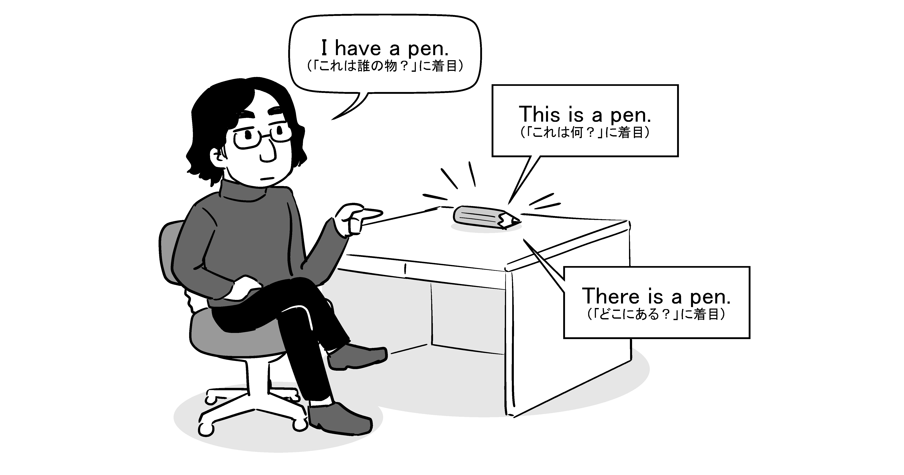
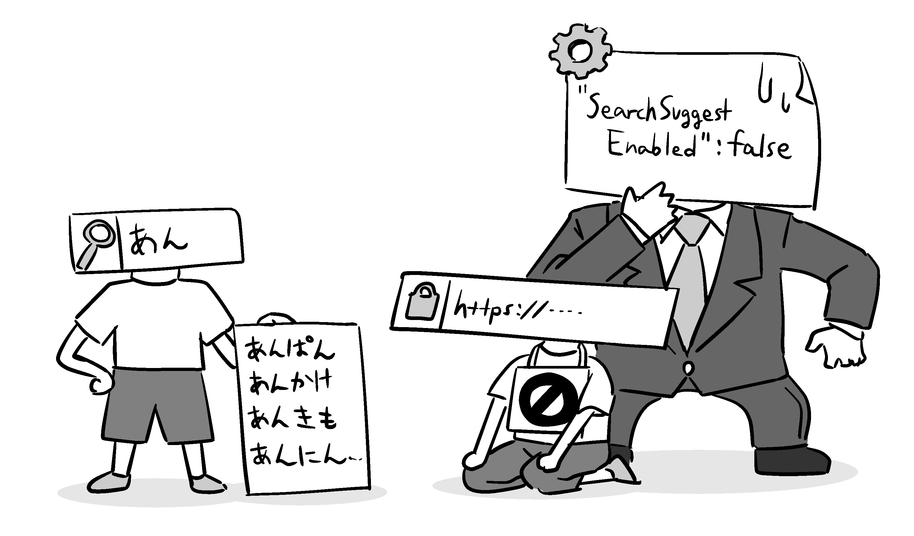

# 英語での報告の仕方が分からない

ここまで、フィードバック対象の見つけ方、フィードバックする内容の見つけ方、報告の組み立て方を解説してきました。しかし、それらの技術的な内容以前のハードルとして、*言語の壁*という物もあります。

実際にOSS Gateワークショップでも、フィードバック内容を整理することはできても、それを英語で表現することに手こずっておられる方がかなり多い印象があります。OSSでは英語が共通の言語として使われている場合が非常に多く、このこと自体が日本語を母語とする人のOSSプロジェクトへの参加障壁になっているのは否めません。

ITエンジニア向けに「こういう英語表現を覚えよう」という情報を紹介する記事は時々見かけます。ですが、ビギナー参加者の方の様子を実際に見ている限りは、必要なのは「実際の現場でよく使われる*単語や熟語の情報*」ではなく、「実際の現場で英文を書く時に行われる*考え方の解説*」の方であるように筆者には感じられました。

そこでこの章では、OSSへのフィードバックを英語でやるときの考え方に焦点を当てて解説してみます。対象読者は、英語に苦手意識のある方、中学高校の英語の授業で英作文はしたことがあるけれども自分でゼロから何かを説明する英文を書いたことはない方、といったレベル感を想定しています。


## むしろ英語の文を書きすぎない方がいい！？

冒頭からちゃぶ台を返してしまいますが、OSSへフィードバックする際には、*英語を自由自在に扱えないといけない、ということはありません*。

前章でも述べた通り、言葉での説明が難しいところは図や画像や動画を使うという方法もあります。実際に動作するプログラムやデータファイル、あるいは仮想環境そのものを用意するという手もあります。とにかく、そのときの自分に使えるあらゆる手段を柔軟に使い分けて、*どんな形ででもいいから伝える*、ということが一番大切です。

これは何度でも強調しておきたいのですが、英語で書くことも、文章を書くことも、手段であって目的ではありません。*OSSプロジェクトのイシュートラッカーは「美しい英文を披露して競う発表の場」「英語スピーチ大会の場」ではない*のです。

筆者自身もOSSを公開してフィードバックを受ける立場ですが、その実感から率直なことを言うと、筆者が英語が不得意だからということを割り引いても、*流暢な英語で、複雑なことを要点を踏まえないまま長々と説明されても、開発者としては全然嬉しくありません*。それだったら、再現手順の特定をもっと頑張るとか、せめて図の1つでも付けるかしてくれたほうがありがたい、と思うことが多々あります。

そう。意外かもしれませんが、*OSSに関わっている人の全員が全員英語が得意とは限りません*。OSSの開発者には中国人もいれば韓国人もいるし、ロシア人やインド人もいます。「英語が母語である」という人はむしろ少数派かもしれず、「英語で説明されること」自体が、情報の伝達を妨げる障害にもなりえるのです。

実際の所、前章で述べた

* 再現手順（steps to reproduce）
* 実際に得られた結果（actual result）
* 期待される結果（expected result）

という*基本の3要素を箇条書きにするだけで、報告としての体裁はもう充分に整っています*。

具体的な再現手順を書くときも、GUIの操作は「Click XXX（XXXをクリックする）」「Input XXX（XXXと入力する）」といった表現で充分ですし、コマンドライン操作は実行したコマンドや出力結果をそのままコピー＆ペーストするだけです。あとは最初か最後に一言「Is this intentional?（この結果は意図的なものですか？）」とでも添えればOKです。誤解を恐れずに言えば、*OSSへの報告は、英語の文章以外の形での具体的な説明が多いほどよく、英語の文章での抽象的な説明は少ないほどよい*、と言ってしまってもよいでしょう。

　

「英語での報告の仕方」に困ったら、冷静になって思い出してください。皆さんがしたいことは、「英語の文章を書くこと」ではなく、*「不具合を伝えること」や「要望を伝えること」の方*であったはずです。画面から一度目を離して深呼吸すれば、英語以外の何か別の手段を思いつけるかもしれません。

とはいえ、英語の文章での説明が必要な場面も現実にはたくさんあります。なので、ここから先は、どうしても英語を使うことを避けられないとなったときのために、ゼロからすらすら英語の文章を書けるようになるためのコツをお伝えしていこうと思います。


## 「日本語の文章を英語に変換する」のではなく、「同じことを説明する英語の文章を作る」という考え方をしよう

英作文に不慣れな人は、まず「日本語の文章」を考えて、それを「対応する内容の英語の文章」に変換するものだ、と考えがちなのではないでしょうか。

いきなり断言してしまうのですが、*それは無理なので、潔く諦めてしまいましょう*。

外出先から帰宅した人が在宅していた人に言う「ただいま」や、それに応えての「おかえりなさい」は、*英語に翻訳しようがない*とよく言われます。そもそも欧米には「帰宅した時に挨拶を交わす」文化が無いため、そういう言葉どころか概念が無いのだそうです。この例を一つとってみても、「日本語で書いた文章をきっちり英語に変換しきる」のは根本的には不可能だということが分かるのではないでしょうか。

　

ではどうするのかといえば、*「伝えたい内容、対象」そのものの方に立ち返って、それを表現する英語の文章を考える*、ということになります。

たとえば、ここに1本のペンがあるとします。その状態を英語で表すには、どんな文章が考えられるでしょうか？



<!--
（図：ペンを指してどう言うか。
* This is a pen.（これは一体何であるか？という点に着目）
* There is a pen.（どこにあるか？という点に着目）
* I have a pen.（誰の物か？という点に着目）
）
-->

「これはペンです」という日本語の文章を先に与えられていれば、「This is～」という文しか思いつかないかもしれません。しかし事実の方に焦点を当てると、色々な角度から表現できるということが分かるのではないでしょうか。

*「すでに書いてしまった日本語の文章」に囚われないで、「目の前にある物」や「目の前で起こっている事実」の方を意識する*ということを、常に心がけるようにしてみてください。まずはそれが最初のステップです。


## 平易に言い換えてみよう

このことを考える上で参考になる物として、*「やさしい日本語」*があります。

[やさしい日本語](https://www.sic-info.org/wp-content/uploads/2014/02/easy_japanese.pdf)とは、

* 海外からの旅行者がよく訪れる観光施設や、移民者が手続きに来る市区町村の役所などにおいて、*日本語が不得手な人*が読むことを想定して
* 複雑な表現や難しい単語をなるべく使わずに、*平易な単語や単純な文の書き方*を心がけて

書かれた、日本語の文章のことを言います。日本語ネイティブスピーカーではない人だけでなく、子供や高齢者、障害者など幅広い層にとってもメリットがあるため、近年注目されてきているそうです。

「やさしい日本語」を書くためには、*同じ物事をより平易な表現で言い換える*必要があります。たとえば、

```text {num=false}
訪日観光客で洛中・洛外は連日溢れかえっており、史跡や寺社仏閣が観光資源として有効に機能していて、誇らしい。
```

という文章は、

* 多少ニュアンスは変わったとしても、各単語を*平易な表現*に言い換える。
  * 訪日観光客→他の国から来た人達
  * 洛中・洛外→京都の町
  * 連日溢れかえり→毎日たくさんいる
  * 史跡や寺社仏閣→古い建物、お寺、神社など
  * 観光資源として機能→見どころになる
* 接続された文を*短い文*に切り分ける。
* リズム感や格好良さを優先していた*トリッキーな語順*を整理する。
* *省略された主語*（行為の主体）を補う。

といった加工をすることで、

```text {num=false}
京都の町には毎日、たくさんの人達が他の国から来る。
古い建物、お寺、神社などが見どころになっている。
私はとてもうれしい。
```

のように言い換えられるでしょう。

　

英語が不得意な人は、英語の文法にも単語力にも自信が無い場合が多いと思います。しかしその一方で、日本語はそれなりに使えるという自信が（無意識にでも）あるはずです。そのため、*自分の持てる限りの日本語力を駆使して考えた日本語の文章には、難しい単語や言い回しが無意識のうちに入ってしまいがち*です。

*日本語力と英語力の間にギャップがある*ために、日本語の方で選んだ単語や表現に対応する英語の言い方が分からなくて、手が止まってしまう……これこそが「英語になると途端になにも書けなくなる」ことの正体です。

なので、日本語の文章を英語に訳せる自信が無い場合、その前段階のワンクッションとして、まずは*自分が書いた文章を「やさしい日本語」に書き直す*ようにしてみてください。そうすればきっと、次のステップにもスムーズに進めるようになるでしょう。

## 主語を意識して「SVOの平叙文」で考えよう

英語の話に戻ります。

中学高校までの英語の授業ではさまざまな文法（文型）や単語を教わりますが[^english-grammar]、こと「OSSへのフィードバック」という場面で言うと、実際に使う知識はその中のごく一部です。特に*文章の形は、基本的にS（subject：主語）-V（verb：動詞）-O（object：目的語）の形式で書く*と考えていいです。これは「私は○○をした」「あなたは××である」のような単純な文章、いわゆる*平叙文*という形式です。

[^english-grammar]: 英語の授業ではS-V-OやS-V-C（complement：補語）、S-V-O-O、S-V-O-Cなどのさまざまな文型が登場します。これは、日本語で「～は」「～が」といった助詞で表現する情報を、英語では文型（語句の登場順）で表現する必要があるからです。日本語では「君はプログラミングが好きだ」と書いても「プログラミングが君は好きだ」と書いても意味は変わりませんが、英語では「You love programming.（君はプログラミングが好きだ）」と「Programming love you.（プログラミングは君が好きだ）」では意味がまるで変わってしまいます。

日本人が英文を書くと受動態（受け身の形、主語が何々されるという文）が多くなりがちだ、とよく言われます。それは、こなれた日本語の表現では主語が省略されがちで、主語が省略された文章をそのまま直訳すると、必然として受動態にせざるを得ないからです。

ですが、*「誰が」何をしたのか、「誰が」どうなったのか、ということを省略しないようにすれば、文章は自然とSVOの文型になります*。

「誰が」を書いたら主語が「I（私は）」「You（あなたは）」ばかりになってしまう、と思いますか？　それは、「主語は人間だ」という無意識の思い込みがあるからです。*英語では、物でも現象でも概念でも普通に主語になります*。主語をどう書くかに迷ったら、*一旦あらゆる物事を擬人化してみてください*。

たとえば、

```text {num=false}
Firefoxの法人向けポリシー設定で、検索候補の表示を無効化する`SearchSuggestEnabled`を`false`に設定しても、単独のWeb検索バーでは検索候補が表示され続けてしまう。
```

という不具合を報告したいとします[^bug1555584]。これはどう言い換えられるでしょうか。

[^bug1555584]: 実際の報告内容（ https://bugzilla.mozilla.org/show_bug.cgi?id=1555584 ）も併せて参照してみてください。

日本語での省略された主語は「私が（～を設定した）」です。しかし、ここには「私」の他にも、「Firefox」や「`SearchSuggestEnabled`という設定項目」、「その設定の値が`false`である状態」、「単独のWeb検索バーというUI部品」「検索候補」といった*登場人物達*がいます。これらを主語にしてみると、たとえば以下のような表現ができます。


* 「設定の値が`false`である状態」を擬人化して主語にする：

```text {num=false}
`SearchSuggestEnabled`=`false` does not hide search suggestions on the search bar.
≪`SearchSuggestEnabled`=`false`という状態が、検索バーの検索候補を隠してくれない≫
```

* 「検索候補」を擬人化して主語にする：

```text {num=false}
Search suggestions on the search bar are visible with `SearchSuggestEnabled`=`false`.
≪`SearchSuggestEnabled`=`false`という設定の時に、検索バーで検索候補が見える≫
```

どうでしょう。このくらいの英文なら、自分にも書けるような気がしてきませんか？　これに

```text {num=false}
There is an enterprise policy `SearchSuggestEnabled`.
≪～という法人向けポリシー設定があります。≫

The location bar shows search suggestions. The web search bar also.
≪ロケーションバーは検索候補を表示します。Web検索バーも同様。≫
```

などの文を添えれば、上述の例で報告したかった内容は言い表せたと言っていいでしょう。

　

いかがでしょうか。長く複雑な構造の文章で表されていた内容であっても、*一文一文を細かくぶつ切りにして、それぞれに主語を与えてSVOの形で書き直して*みれば、こんな要領の平易な英語の文章で表現できるのです。

ソフトウェア開発の場面であれば、「モジュール名」「メソッド名」「変数名」「ソースコード中の行番号で示した行」などなど、他にも色々な物が「登場人物」になり得ます。皆さんも、名前が付いている物は片っ端から主語にしてみてみるとよいでしょう。




## ありふれた動詞や形容詞を使おう

文章をぶつ切りにしてSVOの文型に揃えることには、同時に、*使う動詞や形容詞を辞書から見つけやすくなる*という効果もあります。というのも、和英辞書で動詞や形容詞を調べると例文は大抵「誰々が何々をする」のようなSVOの文の形になっているからです。辞書で見つけた例文をそのまま使える、これは大きな利点です。

また、先の例で使った動詞が

* show（表示する）
* hide（隠す）
* are visible（～が見える状態である）

という、教科書に出てきたりプログラムやCSSの中で見かけたりするような、*特に難しくない・ありふれた単語*だったという点に気が付いたでしょうか？

「やさしい日本語」において、難しい単語を使わず平易な単語を使うように言い換える、多少の細かいニュアンスをそぎ落としてでも端的に意味が通じる言葉を選ぶということを説明しましたが、英語でも同じことが言えます。*言いたいことに厳密に当てはまる難しい英単語は、おおむね意味合いが通じる平易な単語で代用できる*のです。平易な動詞や形容詞でも、主語を変えると意外と広い意味で使える、というのもSVOの文型を使うことの利点です。

筆者はこういう場面で使われやすい英単語をもう少し知っているので、実際にはこのような場面では状況に応じて

* appear（出現する、表れる）
* append / add（追加する）
* disappear（消える）
* deactivate / disable（無効化する）

のような単語を使うと思います。ですが、こういった単語を知らなくても、*先の平易な単語でも言いたいことは通じます*。より厳密な単語を覚えていくのは追々で問題ありません。他の人が書いている文章で「この単語、なんていう意味だろう？」と思ったらその場で調べて、自分が似たような場面に遭遇したら*次から使ってみる*、そんな感じで少しずつ語彙は増えていくので安心してください。

とはいえ、ソフトウェア開発の場面で特有の頻出単語という物は確かにあります。たとえば以下のようなまとめの記事もありますので、暗記が得意なら、頻出単語をあらかじめ頭に入れておいてもいいでしょう。

[海外エンジニアと使う頻出英単語・英文 50選](https://qiita.com/terra_yucco/items/0967ea827f308ebabbb3)
[Gitのコミットメッセージの書き方](https://qiita.com/itosho/items/9565c6ad2ffc24c09364)


## 困ったときは箇条書きにしよう

伝えたい複雑な内容を、ぶつ切りのSVOの小さな文に分けていくと、今度は*文同士の繋がりをどうするか*で悩むことになりがちです。

確かに、ぶつ切りの文章は少々不格好なのは否めません。せめて順接[^regular-connection]か逆接[^inverted-connection]かくらいは示しておきたい……いやそれだけじゃなくて因果関係も示したい……という風に考え始めて、またしても「日本語での表現の仕方は分かるが、英語での表現の仕方が分からないので、手が止まる」というドツボにはまり込んでしまうのは、よくあることです。

[^regular-connection]: 後に続く文章が前の文章を前提にそのまま続く接続。日本語なら「そして」「さらに」など、英語なら「and」「then」などがあたります。
[^inverted-connection]: 後に続く文章が前の文章を否定する接続。日本語なら「しかし」「なのに」、英語なら「but」「however」などがあたります。

筆者は、そこで悩むくらいなら*箇条書きで書いてしまう*ことをお勧めします。

たとえば対等な物を並べるなら、前述の英単語の例を列挙したような*序列無しの箇条書き*にすればいいですし、順番や優先順位に意味がある場面では、項目の頭に数字を付けた*序列付きの箇条書き*にすればいいです。この考えに則ると、「再現手順」は以下の要領で書けるでしょう。

```text {num=false}
1. ◯◯をする。
2. ××をする。
3. △△が◇◇になる。
```

これなら、受け取り手が順番を読み違えることは無いですし、「Repeat steps from 1 to 4.（1から4を繰り返す）」のように手順そのものを指し示す抽象的な書き方も容易にできます。

また、箇条書きを階層化すると、

```text {num=false}
1. ◯◯をする。
   * ◎◎が出る。
2. ××をする。
   * ◎◎が消える。
3. △△が◇◇になるかどうか。
   * ◇◇になっていたら、4に進む。
   * ◇◇になっていなかったら、1に戻る。
```

というように、各項目に付随する補助的な情報だったり、条件ごとに変わる操作だったりと、各項目の因果関係や依存関係を含んだ複雑な情報もスッキリ表せます。


## 自信が無ければ英和翻訳にかけてみよう

英語の文章を書いてみたけれど、ちゃんと書けているのか、本当に通じるのか、自信が無い……そんなときは、*書いてみた英文を「英語→日本語」の機械翻訳にかけてみる*ことをお勧めします。

機械翻訳は、「日本語に熟達した人が書いたこなれた日本語の文章を、そのニュアンスを捉えた上で、こなれた英文に翻訳する」というような高度な翻訳は、まだそれほどはこなせません。しかし、*「平易な英文を、平易な日本語の文章に翻訳する」のには充分すぎるくらいに使えます*。英和翻訳した結果の日本語の文章を読んでみて、言いたかったことがちゃんと言い表されていると思える結果になっているなら、その英文は人前に出して全然大丈夫です。

筆者も実際に、書いてみた英文の正しさに自信が無いときは、[Google翻訳](https://translate.google.co.jp/)で英和翻訳してみています。その結果を見ながら、単語の意味や前置詞の使い方を間違えていることに気が付いて手直しする場面も多々あります。

平易な文章の英和翻訳が実用になるなら、平易な文章の和英翻訳の結果も使えるのでは？ と思うかもしれませんが、筆者はそれは以下の3つの理由からお勧めしません。

* 前述しましたが、日本語に熟達した人が日本語で文章を書くと、どんなに気をつけていても、無意識のうちに*主語や目的語を省略してしまいがち*です。機械翻訳ではそのような「文章の中には含まれていない外部の情報」を推測することが難しいために、*誤訳が発生しやすい*です。
* 和英翻訳された後の英文が*自分自身の英語力を大きく超える物だった場合*、その意味を自分で読み取ることすらできず、*翻訳結果が正しいかどうかを自分では判断できない*、ということが起こります。
* サービス・ツールによっては、*機械翻訳の結果の文章の使い道を利用規約で制限している*場合があります。OSSは商用利用を禁止しませんが、コードの中に埋め込むコメントなどの文章に機械翻訳の結果を使うと、それが翻訳結果の商用利用を禁止しているサービスで翻訳した結果だった場合、*サービスの利用規約に違反*してしまいます。

近年、機械学習の発展のお陰か、[みらい翻訳](https://miraitranslate.com/trial/)や[DeepL翻訳](https://www.deepl.com/translator)などのように「こなれた日本語を入力しても、それなりにこなれた英語の文章に翻訳できる」[^high-level-english]翻訳サービスが登場してきています。

[^high-level-english]: 英語が得意で留学経験もあるような人が見ても、「なるほど確かにこう書けるな」と思えるレベルの翻訳結果が得られているようです。

しかし、どれだけ翻訳精度が向上しても上に挙げた2つ目や3つ目の懸念点は解消されません。*機械翻訳の結果はあくまで、最終的にOSSに含めるテキストや投稿する文章そのものではなく、それらを考えるための判断材料として使うに留める*ことを、筆者は強くお勧めします。


## つたなくても格好悪くても、伝えた者勝ち！

実は、ここに書いたようなことは、*海外旅行などでも使える一般的な考え方*です。実際に、筆者が見かけた例では[「悪魔英語　喋れる人だけが知っている禁断の法則」](https://comic-walker.com/contents/detail/KDCW_AM16200261010000_68/)という作品も同様の解説の仕方になっていました。「学校である程度の英語教育を受けたにも関わらず、自分からは英語を話せない・書けない」という人にとっての処方箋は、似たような感じの所に落ち着くのかもしれません。

ここで述べたことを実践して書かれる英語は、はっきり言えば「たどたどしくて、つたなくて、不格好な、ヘタクソな英語」です。でも、それでいいんです。*ネイティブスピーカーとリアルタイムで舌戦を繰り広げるとか、格式高い場でスピーチをするとか、そういう場面でもない限りは「だいたい通じる下手な英語」で間に合います*。

確かに、海外に移住して「生活」するとか、こちら側の隙を目ざとく突いて自己の利益を最大化しようとする相手との交渉、といった場面になってくると、英語が下手だとナメられたり足下を見られたりするようです。

ですが*OSS開発の場では、筆者が知る限りは別にそんなことはありません*。むしろ、インド人や中国人など英語ネイティブでない人が、めちゃくちゃな英語で普通にコミュニケーションしているという場面の方をよく目にします。世界中で見れば「英語のネイティブスピーカー」より「外国語として英語を使う非ネイティブスピーカー」の方が多いわけで、そういう意味では*我々の方が多数派*なのです。特別に自分が劣っているというわけではないので、安心してください[^non-native]。

[^non-native]: かといって、上達しようという意識を全く持たなくてもよいという訳でもありません。自分の言いたいことを適切に表現できる英語力があった方が、説明や説得をよりスムーズに進められることは間違いありませんから。

このあたりのことについて、英語話者の視点から書かれた[「酷い英語をもっとお願いします」](https://gihyo.jp/lifestyle/column/01/language/2010/0419)という記事があります。英語話者の人にとっても、英語が壁となって有用な意見やフィードバックを得られないことは損失なので、英語の上手い下手なんて気にしないでガンガン伝えて欲しい、という感覚があるようです[^bad-english-feedback]。ですから皆さんも、どうか物怖じしないで英語での報告に挑戦してみてください。

[^bad-english-feedback]: この対極の話として、努力で英語を身に付けられた人が「みんな英語にすればいいじゃん」とローカル言語への翻訳を否定する発言をした事例もありました（ https://twitter.com/piro_or/status/1095592188438667265 ）。しかし、この発言には多くの批判が寄せられ、プロジェクト運営者サイドから改めて、「英語だけが全てではない」という旨のフォローが入れられる結果になりました（ https://github.com/parcel-bundler/website/issues/94 ）。
