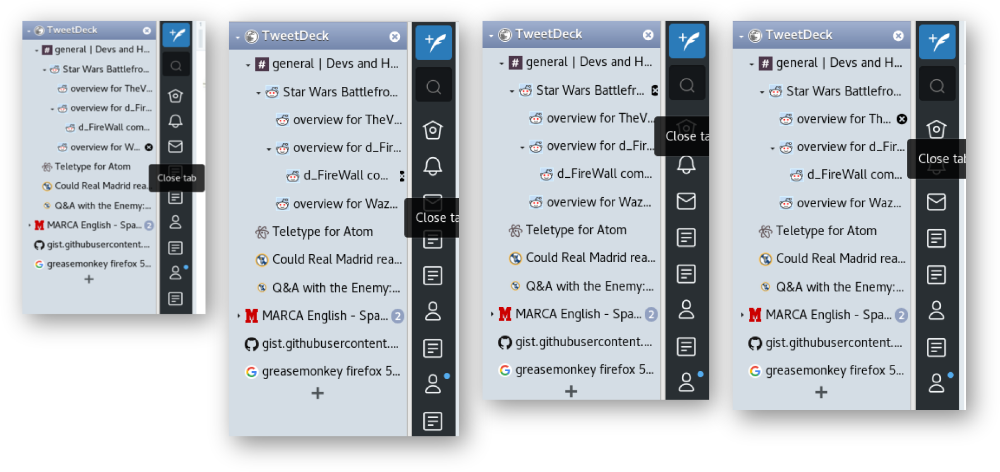

# 他の人のフィードバックから学ぼう

ここまでの解説の中でも、実際に行われたフィードバックの例をいくつか紹介してきました。ここでは、さらなるケーススタディとして、他にも「よいフィードバック」と言えそうな例をいくつかご紹介します。

他の人の成功事例から学んで、皆さんのフィードバックの参考にしてください。


## 初回使用時のつまずきを減らす提案

1つ目は、[株式会社アカツキさんの社内で実施したOSS Gateワークショップ](https://www.clear-code.com/blog/2019/5/29.html)の中で実際に行われた、Webページ上でマウスカーソル（ポインタ）をかざした位置の語句を辞書で引いて結果をポップアップ表示する[「Mouse Dictionary」というGoogle Chrome/Firefox用の拡張機能](https://mouse-dictionary.netlify.com/en/)での、「初回使用時にポップアップが真っ白になってしまう」という現象に対するフィードバックです。

* https://github.com/wtetsu/mouse-dictionary/issues/19

```text {num=false}
■タイトル

White screen shown in the first boot


■説明

Steps to Reproduce

1. Install Chrome (ver. 72.0.3626.109 Official Build 64bit) into MacOSX 10.14.3 .
2. Install Mouse Dictionary (ver. 1.1.9) from Chrome Web Store.
3. Click extension icon of Mouse Dictionary, and open the popup window.
4. Point any English term.

Expected Result

* Shown translated sentence of English term in the popup window.

Actual Result

* White screen shown in the popup window.

Suggestion

* Add how to installation (ex. "Open option menu on the first boot.") in the store page.
* Or, add description (ex. "Not initialized. Please open option menu.") in the not initialized popup window.

----

再現手順

1. MacOSX 10.14.3 に、Chromeのバージョン：72.0.3626.109（Official Build）（64 ビット）をインストールする
2. chromeウェブストアから Mouse Dictionary （バージョン：1.1.9） を拡張機能としてインストールする
3. 拡張機能一覧から Mouse Dictionary のアイコンをクリックして、ポップアップウィンドウを立ち上げる
4. ポップアップウィンドウが立ち上がった状態でウェブページ内の任意の英単語にマウスカーソルを合わせる

期待する結果

* Mouse Dictionary のポップアップウィンドウに、翻訳結果が表示される

実際の結果

* ポップアップウィンドウ内は白紙のまま、何も表示されない

提案

* 最初にオプションメニューを開くことが必須ということを、ストアページの説明文に記載してはどうでしょうか
* もしくは、辞書情報が登録されていないのでオプションメニューを開かなければならない旨を、ポップアップウィンドウに表示してはどうでしょうか
```

### 注目したい点

OSS Gateワークショップの中で行ったフィードバックなので、報告の仕方は本書で案内しているフォーマットに則っています。

ここで注目したいのは、*本文を英語と日本語の2パターンで書いている*ということです（本書に掲載するために翻訳したのではなく、元々の報告の時点で両方載っています）。これは、説明文からリンクされている開発者の方による解説記事が日本語で書かれており、作者の方が日本語話者の方だということが分かっていたためです。

フィードバックは、書ける場合は英語で書いておいたほうが望ましいです。というのも、英語を読み書きできる人と日本語を読み書きできる人とでは前者の方が圧倒的に数が多く、*日本語だけで報告を書いていると、同じ問題に遭遇した人が「既存の同様の報告」にたどり着けない恐れがある*からです。

とはいえ、英語を書くことに不慣れな人は、自分の伝えたかったことをきちんと英語で表現できているか不安なものです。この事例のように作者の方が日本語話者と分かっている場合には、両方の言語で報告を書いておくことで、万が一の場合の誤解を防げるという安心感を持って報告できるでしょう。

また、報告の最後に*「提案」として改善案を示している*ところもポイントです。操作に対する「期待される結果」は「翻訳結果が表示されること」なのですが、初回使用時という場面では、初期設定なしにそのような結果を得るのは難しいです。そこで、この報告では*次善の策*として、ユーザーがしなければならないことの案内を明示するのはどうか、と提案しています。

開発者側で気を回して「こうなっているといいのでは」と推測して実装した結果が、実際のユーザーのニーズに合致していなかった、ということは度々あります。*ユーザー自身が「どうなっていると嬉しい」という内容を詳しく伝える*ことで、そのような無駄足を踏まずに済むと言えます[^opinion-from-user]。

[^opinion-from-user]: ただ、開発者側の視点では、ユーザーから寄せられた提案にそのまま従うことが必ずしも正解とは限らない、ということも言えます。というのも、ユーザー自身の発想が特定の場面やそれまでの経験に囚われている場合、言葉として表現された物が本来のユーザー自身のニーズからかけ離れてしまっていることがあるからです。開発者はユーザーからの提案を判断材料の一つとしつつ、その提案が発せられた背景をきちんと分析し、常に最適な解決策を考えるよう努める必要があります。


## 画面上の表示に関わる問題の、より分かりやすい説明

2つ目は、筆者が開発・公開しているFirefox用のアドオン「Tree Style Tab」に寄せられたフィードバックです。このアドオンはFirefoxに「縦長のツリー表示のタブバーとして動作するサイドバー」を提供するというものです。

* https://github.com/piroor/treestyletab/issues/1539

```text {num=false}
■タイトル

Close button too small on some tabs and not of the same size in some tabs
≪いくつかのタブのクローズボタンが小さすぎ、他のタブでのものとサイズが異なる≫


■説明

Short description
≪短い説明≫
Close button too small on some tabs and not of the same size in some tabs
≪いくつかのタブのクローズボタンが小さすぎ、他のタブでのものとサイズが異なる≫

Steps to reproduce
≪再現手順≫
1. Start Firefox with clean profile.
   ≪Firefoxを新しいプロファイルで起動する≫
2．Install TST.
   ≪Tree Style Tabをインストールする≫
3. Resize the TST bar to the minimum width possible
   ≪TSTのタブバーを、可能な限り最小の幅にリサイズする≫
4. Open multiple tabs under multiple trees
   ≪複数のツリーの配下に複数のタブを開く≫

Expected result
≪期待される結果≫
Close button is of the same shape and size in all the opened tabs
≪すべての開かれたタブにおいてクローズボタンが同じサイズ・同じ形で表示される≫

Actual result
≪実際の結果≫
Screenshots 1 and 4 seem to have normal shaped and sized close buttons but screenshots 2, 3 have small button with different shapes.
≪スクリーンショットの1番と4番は通常の形とサイズでクローズボタンが表示されているようですが、スクリーンショットの2番と3番ではボタンが異なる形になっています。≫

Environment
≪環境≫
* Platform (OS): Arch Linux
  ≪プラットフォーム（OS）：Arch Linux≫
* Version of Firefox: 57.0
  ≪Firefoxのバージョン：57.0≫
* Version (or revision) of Tree Style Tab: 2.2.7
  ≪Tree Style Tabのバージョン：2.2.7≫
```



### 注目したい点

GUIを提供するソフトウェアでは、画面上の表示に関する問題が色々と起こります。その中でも、「ボタンが表示されない」のようなゼロかイチかで表現できない、*「小さい」「大きい」「普通と形が違う」といった表現しかしようのない問題*は、言葉での表現が非常に難しいです。主観的な表現は、「彼は見えにくいと言っているが、自分には十分に見える」というように、*報告者と開発者の間で解釈が食い違う*ことも多いです。

そのため、画面表示に関わる問題は、*スクリーンショット*や*スクリーンキャスト（動画）*があると、状況を開発者が正確に把握する上で大きなヒントになります。この事例でも、

* 現象が起こるのは特定のテーマが選択されたときである。
* 現象が起こるタブは深い階層に置かれたタブである。

ということが画像から読み取れて、迅速な原因究明につながりました。

　

ところで、この報告をくれた人は、GitHubのユーザー情報によるとインドのベンガル在住のようです。英語のネイティブスピーカーでないためか、タイトルの「Close button」の後にbe動詞が抜けていたり[^missing-be]、全体的に文が短かく簡潔だったりして、見る人が見れば「英語話者でない人が書く、あまり巧みでない英語」と感じられるものかもしれません。

[^missing-be]: 期待される結果の文を見ると、「Close button is」と書きたかったのではないかと推測できます。

でも、*それで全然いい*のです。報告は報告したい内容が伝わりさえすればよく、英語としての正しさは、その邪魔にならない程度に確保されていればまったく問題ないということが、この例からは分かるでしょう。

　

なお、この報告は筆者がプロジェクトに設定したイシューテンプレートに基づいており、実は、テンプレートの「再現手順」には最初から「Firefoxを新しいプロファイルで起動する」「Tree Style Tabをインストールする」という手順が書かれています。これは、*「再現手順を書くときはまっさらな環境での手順を」ということを奨励する*ためにそうしているという背景があります[^steps-on-clearn-environment]。

[^steps-on-clearn-environment]: ただ、残念ながら実際には、それでもまっさらな環境での手順を書いてもらえない場合があります。皆さんはどうか、開発者の人が求めていることには応えてあげるようにしてください……


## リリースマネジメントの不備の指摘

3つ目は、筆者の同僚の足永さんがcollectdというソフトウェアに対して行った、リリースマネジメントに関するフィードバックです。

* https://github.com/collectd/collectd/issues/3293

```text {num=false}
■タイトル

The source packages of collectd-5.9.2 aren't generated by the formal procedure
≪タイトル：colelctd-5.9.2のソースパッケージが通常の手順で生成されない≫


■説明

Version of collectd: collectd-5.9.2 on git
≪collectdのバージョン：git上のcollectd-5.9.2≫

Expected behavior≪期待される結果≫:
  version-gen.sh script should generate "5.9.2" on collectd-5.9.2 tag.
  ≪version-gen.shスクリプトがcolelctd-5.9.2タグに基づいて「5.9.2」を生成する。≫

Actual behavior≪実際の結果≫:
  version-gen.sh script generates "5.9.1.7.gdfb9dd0 on collectd-5.9.2 tag.
  ≪version-gen.shスクリプトがcolelctd-5.9.2タグに基づいて「5.9.1.7.gdfb9dd0」を生成する。≫

Steps to reproduce≪再現手順≫:
  $ git clone https://github.com/collectd/collectd.git
  $ cd collectd
  $ git checkout collectd-5.9.2
  $ ./version-gen.sh

Cause of the issue≪問題の原因≫:
  collectd-5.9.2 tag isn't annotated.
  ≪collectd-5.9.2タグに注記が付いていない。≫
```

### フィードバックの経緯

足永さんがとある案件でcollectdの独自改修版を作成して、お客さん向けに提供するためのパッケージを所定の手順で作成しようとしたところ、当時の最新リリース版である「5.9.2」からの派生版なので「5.9.2.（リビジョン番号）」というバージョン番号が自動生成されるはずが、なぜか「5.9.1.（リビジョン番号）」というバージョン番号になってしまう、という現象に遭遇しました。

この原因を足永さんが調べたところ、以下のことが分かりました。

* パッケージ作成用のスクリプトは、Gitリポジトリに対して打たれたタグのメッセージが特定の形式に則って書かれている場合にのみ、それを正常なバージョンとして認識するようになっている。
* バージョン5.9.2のタグのメッセージは、その形式に則っていなかった。

実際に、公開されているcollectdに対して*何も変更を行っていない状態*でパッケージを作成しようとしても、やはり同様の現象が発生する状態でした。そのため、足永さんはこの問題をcollectdプロジェクトで解決されるべき物として、調査結果を踏まえてフィードバックしました。

報告の後のコメントのやり取りの中では、collectdプロジェクトにおいてリリース作業の担当者が今回から変わっていたことと、前任者から手順が正しく引き継がれていなかったためにタグのメッセージが適切に設定されていない状態だったということが分かりました。その後、問題の状態は解消され、この報告もクローズされています。

### 注目したい点

「作成されたパッケージのバージョン番号が違っている」というつまずきに遭遇したときには、暫定的な回避として「できたファイルのバージョン番号の部分をとりあえず書き換えて済ませる」というような対策を取ることが多いでしょう。*そういったその場しのぎだけで終わらせずに開発元にフィードバックする*と、同じ問題につまずく人が減ります。

この報告には、*基本の3要素である「再現手順」「期待される結果」「実際の結果」が揃っていて、再現手順には実際に操作したコマンド列もそのまま記載されています*。文章で長々と説明しなくても、要点を押さえてあれば適切に伝わるということがよく分かります。

「期待される結果」「実際の結果」の説明文の英語の表現にも着目してください。

```text {num=false}
version-gen.sh script should generate "5.9.2" on collectd-5.9.2 tag.
```

「パッケージ作成手順に従って作業したら5.9.2というバージョンが付くべき」ということを言い表すのに、*リポジトリに含まれているパッケージ作成用のスクリプトを主語にして*「このスクリプトはこのような事をするべき」という書き方をしています。日本語で言いたいことを余すこととなくすべて英語で言い表そうとしなくても、動作の主体を明記することで簡潔に表現できるという好例でしょう。

このフィードバックの面白いところは、*ソフトウェアそのものの不具合というよりも、プロジェクトのリリースマネジメントへのフィードバックとなっている*という点です。プロジェクトにおいて作業を複数人で分担している場合に、そのときの作業者の属人的な知識に依存したまま体制が組まれてしまっていると、他の人に作業が引き継がれた後にこのような形でトラブルが起こる場合があります。このフィードバックがなされていなければ、新しい担当者は次のリリースで同様の問題に遭遇し、原因の究明に奔走する羽目になっていたかもしれません。


## 日本語圏に特有の問題の報告

4つ目は、筆者がチャットツールのZulipに対して行ったフィードバックです。

* https://github.com/zulip/zulip/issues/9396

```text {num=false}
■タイトル

typeahead: "keydown" events for Enter and Arrow keys should be ignored while "composition"
≪インクリメンタル検索: Enterキーと矢印キーのkeydownイベントは「コンポジション」の最中は無視されるべき≫


■説明

First, I describe what is the "composition".
≪最初に、「コンポジション」とは何かを説明します。≫

In CJK language regions, people use some software named "IM" (input method) to input heir local language text. For example, when I search a Japanese term "日本語" (means "Japanese language") in a Zulip instance with Firefox, I need to do:
≪CJK（中国語・日本語・韓国語）の言語の地域では、人々は彼らの地域言語のテキストを入力するために「IM（インプットメソッド）」と呼ばれるソフトウェアを使っています。たとえば、私が日本語の単語「日本語」をFirefoxで表示したZulipで検索するとき、私は以下のような操作をする必要があります：≫

1. Click the search field.
   ≪検索欄をクリック。≫
2. Activate the IM. The "composition" session starts.
   ≪IMを有効化する。「コンポジション」のセッションが始まる。≫
3. Type keys: `n`, `i`, `h`, `o`, and `n`. (in a composition session)
   ≪（コンポジションのセッションの中で）n, i, h, o, nとキーを入力する。≫
4. Hit the Space key to convert the text to Japanese term. "日本" is suggested. (in a composition session)
   ≪（コンポジションのセッションの中で）テキストを日本語の単語に変換するために、スペースキーを押す。「日本」が提案される。≫
5. Hit the Enter key to determine the text "日本". (in a composition session)
   ≪（コンポジションのセッションの中で）「日本語」というテキストを確定するために、Enterキーを押す。≫
6. Type keys: `g`, and `o`. (in a composition session)
   ≪（コンポジションのセッションの中で）g, oとキーを入力する。≫
7. Hit the Space key to convert the text to Japanese term. "語" is suggested. (in a composition session)
   ≪（コンポジションのセッションの中で）テキストを日本語の単語に変換するために、スペースキーを押す。「語」が提案される。≫
8. Hit the Enter key to determine the text "語". (in a composition session)
   ≪（コンポジションのセッションの中で）「語」というテキストを確定するために、Enterキーを押す。≫
9. Deactivate the IM. The "composition" session ends.
   ≪IMを無効化する。「コンポジション」のセッションが終了する。≫
10. Hit the Enter key again to search "日本語" on Zulip.
    ≪「日本語」をZulipで検索するために、Enterキーをもう1度押す。≫

While the composition session, "keydown" events for special keys (Enter and Arrow) are handled by the IM to choose a term from variations >or determine the choice. Thus I hit the Enter key three times in this case. The first time and the second are notified only to IM, so Zulip receives only the third time.
≪コンポジションのセッション中は、（Enterや矢印などの）特別なキーに対するkeydownイベントは、IMによって、複数の候補の中から単語を選択したり選択を確定したりするために使われます。そのため、私はEnterキーをこの例では3回押しています。1回目と2回目はIMに対してのみ通知されるため、Zulipは3回目のみを受け取ります。≫

And, there is one problem on lately development build of Firefox.
≪そして、最近のFirefoxの開発者向けビルドでは一つ問題があります。≫

* 1446401 - Start to dispatch keydown/keyup events even during composition in Nightly and early Beta  
  https://bugzilla.mozilla.org/show_bug.cgi?id=1446401
  ≪1446401 - Nightlyと初期ベータ版で、コンポジション中のkeydownとkeyupイベントを通知するようにする≫
* Intent to ship: Start to dispatch "keydown" and "keyup" events even if composing (only in Nightly and early Beta) - Google Group  
  https://groups.google.com/forum/#!topic/mozilla.dev.platform/oZEz5JH9ZK8/discussion
  ≪リリースしようとしているもの: Nightlyと初期ベータ版のみにおいて、コンポジション中にkeydownとkeyupイベントが通知されるようになります≫

Due to the change, now development build of Firefox (aka Nightly) notifies "keydown" events to the webpage, for all keyboard operations while "composition" sessions. As the result, the search field shows suggested results while I'm typing alphabet keys. This is good improvement, but there is one new problem: when I hit the Enter key to determine a chosen term, it is also notified to Zulip. Thus, when I just determine the first part term "日本" of the joined term "日本語", Zulip unexpectedly handles the Enter key to search the part "日本" and I cannot input following part "語" anymroe.
≪この変更のため、Firefoxの開発版ビルド（別名Nightly）は「コンポジション」セッション中の物も含めすべてのキーボード操作に対し、keydownイベントをWebページに通知します。その結果、検索欄は私がアルファベットのキーを入力している最中に候補を表示します。これは良い改善ですが、しかし新たに1つの問題が発生しています:選択を確定するために私がEnterキーを押したとき、それがZulipにも通知されます。そのため、私が「日本語」という複合語の一部として「日本」を確定しようとしたときにまで、Zulipは意図せずそのEnterキーの操作を「日本」という単語を検索するための物として取り扱い、続く「語」という単語を私は入力することができません。≫

To fix this problem, Zulip need to ignore keydown events for Enter and Arrow keys while the composition session. While a composition session, all keydown events have the `isComposing` (https://developer.mozilla.org/en-US/docs/Web/API/KeyboardEvent/isComposing) property with `true` value, so you just need to return when the property is `true`. Could you apply this change to Zulip?
≪この問題を直すためには、ZulipはEnterと矢印キーのkeyダウンイベントをコンポジションのセッション中は無視する必要があります。コンポジションのセッション中は、すべてのkeydownイベントがisComposingというプロパティをtrueという値を伴って持っています。そのため、そのプロパティの値がtrueであるときはすぐに処理をリターンする必要のみあります。この変更をZulipに反映してもらえませんか？

Environment:
≪環境≫

* Zulip 1.8.0
* Mozilla Firefox Nightly 62.0a1
* Ubuntu 16.04LTS + IIIMF ATOK X3
```

### フィードバックの経緯

筆者の所属会社では、社内のチャットとしてSlackではなく独自にサーバーを立てたZulipを使っています。その運用中に、Firefoxの開発版で問題になる箇所があることに気付いたため、開発元にフィードバックしたという事例です。

日本語のようにキーボードのキーの数よりも入力したい文字の種類が圧倒的に多い言語では、文字入力専用のソフトウェアを介して文字を入力するのが一般的です。また、日本語の文章では単語間にスペースが入らないのが一般的です。このような言語には他に中国語と韓国語もあり、テキストデータやその入力、文字コードの取り扱いの文脈ではこれらの言語がよく話題に挙がるため、3つをひっくるめて*「CJK」*[^cjk]と呼ぶことがあります。

[^cjk]: そのまま「Chinese, Japanese and Korean」の略です。

CJKを想定していない機能とCJKの言語はあまり相性が良くない傾向にあり、「インクリメンタル検索」もその一例です。英語のようにキーと入力したい文字とがほぼ1対1で対応している言語では、文字を入力したそばから検索が進行するインクリメンタル検索が好まれます。しかし、CJKの言語では「入力中の文字が最終的に入力したい文字とは異なっている（未確定である）」という状態があります。この状態を考慮していない実装でインクリメンタル検索が発動すると、日本人にとっては*文字入力がそもそもできない*という困った事態になります。

この報告を行った前後の時期には、Firefoxの仕様変更でこの種の問題が起こりやすくなっていたため、Mozillaからもソフトウェア開発者やWeb制作関係者向けに公に注意が呼びかけられていました。報告の中で紹介している記事が、まさにそれです。

### 注目したい点

CJKを母語としない開発者にはこういった事情がなかなか分からないらしく、*「そもそもどういう前提があるのか」ということから詳しく説明しないと、問題に対処してもらえない*ということも珍しくありません。そのためこの報告では、CJKの言語ではどうやって文字を入力するのか、その中でこの問題がどういう影響を及ぼすのか、ということを詳しく述べました。その後のコメントで実装の改修案を併せて示したこともあってか、開発者の方には問題をスムーズに認識してもらうことができ、迅速に解決してもらえました。

言語のように自分の生活と密接に結び付いた領域の話は、報告者にとってもあまりに当たり前のことすぎて、明確に言葉で説明するのが逆に難しいものです。報告者が「なんでこれが問題だと分かってくれないんだ！？」とフラストレーションを感じる一方で、その報告内容は、*報告を受けた側から見ると「要領を得ない言葉足らずのもの」となっている*ことも多く、何が問題なのかを理解できないために、うっかり適切でない判断をしてしまうことがあります。そのような悲しいすれ違いを避けるためにも、報告者は*自分の状態を「自明のもの」と考えず客観視して、どこが相手からは見えていない部分なのかを探り、自分から情報を積極的に開示する*姿勢を保つことが望ましいです。

なお、同様のことがアラビア語などの書字方向がRTL（右から左に文字が流れる）の言語にも言えるようです。LTR（左から右）の言語だけを想定したソフトウェアは（特にGUIが）、RTLの言語で使うと悲惨なことになりがちなようです。皆さんがOSSを公開したら、もしかするとそういった言語圏の方から逆にフィードバックを受けることになるかもしれませんので、そのときはぜひ耳を傾けてください。

ところで、以下の文のおかしいところに皆さんは気が付かれましたか？

```text {num=false}
In CJK language regions, people use some software named "IM" (input method) to input heir local language text.
```

実はこの文の「heir」は誤記で、「their」が正しいです。ベテランでもこのようなミスタイプが残ったまま報告してしまうことがある[^many-typo]と思うと、皆さんも、英語の間違いを過度に恐れる必要はないのだなと勇気づけられるのではないでしょうか。

[^many-typo]: ちなみに筆者は、コミットログのメッセージでもよくミスタイプをしていますが、そのままpushしてしまっています（pushした後で気が付くことが多い）。

## プロジェクトオーナーが把握していない使い方への対応

5つ目は、筆者の同僚の畑ケ[^hatake]さんがmeta-clangというプロジェクトに対して行ったフィードバックです。

[^hatake]: 「はたけ」と読む珍しい名字のため、社内でもよく「ケ」が行方不明になりがちです。

* https://github.com/kraj/meta-clang/issues/247

```text {num=false}
■タイトル

meta-clang's llvm-config is not compatible with MULTILIBS
≪meta-clangのllvm-configが、MULTILIBSと互換性がない≫


■説明

≪不具合の説明≫
One of the our target boards(RZ/G2E)'s Yocto default conf/local.conf specifies MULTILIBS = "multilib:lib32" and   DEFAULTTUNE_virtclass  -multilib-lib32 = "armv7vethf-neon" to be able to run 32bit ARMv7 binaries.
≪私達が開発している対象のボード（RZ/G2E）の一つのYoctoレシピの既定のconf/local.confには、32bit ARMv7バイナリを動かすために、  「MULTILIBS = "multilib:lib32"」と「DEFAULTTUNE_virtclass-multilib-lib32 = "armv7vethf-neon"」という設定が含まれています。≫
So, built binaries will be installed in /usr/lib64/ instead of /usr/lib.
≪そのため、ビルドされたバイナリは/usr/libではなく/usr/lib64/の中にインストールされます。≫

Because our SDK environment does not assume /usr/lib for library installation directory.
≪なぜなら、私達のSDKの環境は/usr/libをライブラリのインストール先ディレクトリーとして想定していません。≫
Instead, /usr/lib64 is used for 64bit libraries and shared object. And /usr/lib32 is used for 32bit objects.
≪その代わりに、/usr/lib64は64bitライブラリと共有オブジェクトに使われます。また、/usr/lib32は32bit版オブジェクトに使われます。≫

ref: https://llvm.org/docs/CMake.html#frequently-used-cmake-variables


To Reproduce
≪再現するには≫

Steps to reproduce the behavior:
≪この動作を再現するための手順：≫

1. Specify MULTILIBS = "multilib:lib32" and DEFAULTTUNE_virtclass-multilib-lib32 = "armv7vethf-neon" in local.conf
   ≪「MULTILIBS = "multilib:lib32"」と「DEFAULTTUNE_virtclass-multilib-lib32 = "armv7vethf-neon"」をlocal.confの中で設定する≫
2. Add meta-clang layer
   ≪meta-clangレイヤを追加する≫
3. bitbake clang-cross-aarch64
   ≪bitbake clang-cross-aarch64を実行する≫
4. add meta-browser and meta-rust layer
   ≪meta-browserとmeta-rustのレイヤを追加する≫
4. bitbake firefox
   ≪bitbake firefoxを実行する≫
6. See error
   ≪エラーが表示される≫


Error
≪エラー≫

≪実際に出力されたエラーの全文が貼り付けられているが、ここでは省略。≫


Expected behavior
≪期待される挙動≫

   meta-clang's llvm-config can work with DEFAULTTUNE_virtclass-multilib-lib32 specified environment.
≪meta-clangのllvm-configが、「DEFAULTTUNE_virtclass-multilib-lib32」が指定された環境で動作すること。≫

llvm-config points to \${RECIPE_SYSROOT}/usr/lib/clang/8.0.1/lib/linux/ but actual libclang libraries are put in   \${RECIPE_SYSROOT}/usr/lib64/clang/8.0.1/lib/linux/
≪llvm-configは「\${RECIPE_SYSROOT}/usr/lib/clang/8.0.1/lib/linux/」を指定しますが、実際のlibclangライブラリは「\${RECIPE_SYSROOT}/usr/lib64/clang/8.0.1/lib/linux/」に置かれます。≫

LLVM insists that using LLVM_LIBDIR_SUFFIX to control installation directory suffix such as lib64 or lib32.
≪LLVMでは、インストール先ディレクトリーの末尾をlib64やlib32のように変えたい場合、LLVM_LIBDIR_SUFFIXを使う必要があります。≫

We should handle library directory glitch it llvm-config with LLVM_LIBDIR_SUFFIX.
≪私達はLLVM_LIBDIR_SUFFIXを伴ったllvm-configのライブラリーの配置先ディレクトリーのずれに対処するべきでしょう。≫

Desktop (please complete the following information):
≪ビルド環境のデスクトップ機（以下の情報を埋めてください）≫

* OS: Ubuntu
* Version 16.04.6 LTS


Additional context
≪追加の情報≫

(Updated) I'd encountered this issue during meta-browser's firefox recipe building.
≪（追記）私はこの問題に、meta-browserのFirefoxのレシピを使ってのビルド作業中に遭遇しました。≫
```

### フィードバックの経緯

組み込み機器向けにカスタマイズしたLinuxディストリビューションを作成するためのツールセットの一種であるYoctoでは、そのLinuxディストリビューションに組み込めるパッケージが多数公開されています。その中で、C言語のコンパイラであるclangを組み込むための設定ファイルやスクリプトを提供しているのが、meta-clangというプロジェクトです。畑ケさんがとある組み込みボード[^embedded-board]用にFirefoxをビルドしようとして、Firefoxのビルドに必要なmeta-clangを構成に入れたところ、*ビルド結果が想定通りにならず、Firefoxパッケージをビルドできない*という状況に遭遇しました。

[^embedded-board]: 複合機やカーナビなどの制御に使われるコンピューター。

この時点で原因がmeta-clangにあるということは明らかだったため、畑ケさんは*手元でとりあえずの回避策を講じた*上で、問題に遭遇したということをmeta-clangにフィードバックしました。すると、その報告に対してプロジェクトオーナーから「Can you cook up a patch?（パッチを作ってもらえませんか？）」とコメントが帰ってきました。そこで、畑ケさんは「I'm cooking up patches....（今パッチを作成中です……）」とコメントした上で、*手元で行っていた暫定的な回避策を一般公開できるようにより洗練させ、プルリクエストにしました*。

その後パッチがマージされたことで、この報告もクローズされています。

### 注目したい点

これも、「自分の手元でなんとかして動くようにした」というところで終わらせないで、開発元にエスカレーションした事例です。

最終的にプルリクエストを出すところにまで至っていますが、畑ケさんは当初はそこまでするつもりはありませんでした。しかし*「パッチを作ってもらえませんか？」と逆に依頼された*ことがきっかけとなり、プルリクエストの作成に至りました。フィードバックは「自分にできることをまずはやる」所から始めるとよいですが、*やろうと思っていなかったことに挑戦する機会にもなる*ということの好例と言えるでしょう。

この報告はプロジェクトのイシューテンプレートに基づいて書かれていているため、見出しの立て方が本書で紹介しているパターンとは異なっています。しかしながら、「To Reproduce」には再現手順と実際の結果が、「Expected behavior」には期待される結果が書かれており、*本書で挙げている基本の3要素がきちんと含まれている*ことが分かります。

フィードバックする前の予備調査の時点で、畑ケさんはこの作者の人が、ここで使おうとしている「MULTILIBS」という機能を使っていないようだ、ということを把握していました。そのため、再現手順や環境の作り方をより細かく具体的に書き、*作者が容易に現象を確認できるようにすること*を意識したそうです。CJKの言語に特有の事情を詳しく説明した前述の例と、考え方は同じです。

文中に登場している「glitch」という単語は、辞書では「故障」「誤動作」「異常」といった意味と出ますが、語源は「slip（滑る）」や「slide（ずらす）」と同じで、ニュアンスとしては「本来の正常な状態からずれてしまっている」状態を表すそうです。インデントのずれや画像の位置ずれなどにも使える表現ということで、覚えておくとよいでしょう。

ところで、この例も報告文の中にミスタイプがあります。

```text {num=false}
We should handle library directory glitch it llvm-config with LLVM_LIBDIR_SUFFIX.
```

この文の「it」は誤記で、「in」が正しいです。先の筆者の例と併せて見ると、誤記はありふれたものだということをなんとなく感じて頂けるのではないでしょうか[^victim]。

[^victim]: 畑ケさん本人にこの事を知らせると「やっちまったぁぁ」と恥ずかしがっておられましたが、本書でフィードバック初心者の方に勇気を持ってもらうための礎になっていただきました。合掌。


## プロジェクトオーナーの普段の作業環境と異なる作業環境への対応

6つ目は、ここまでの「模範的な例」とは少し趣向の違う「上級編の例」です。先に登場したMouse Dictionaryに対して筆者が行った連続した一連のフィードバックですが、ここまでに解説した報告の形式から外れた流れとなっています。皆さんもいずれこういうことができるようになる、という参考事例として見て頂けると幸いです。

* https://github.com/wtetsu/mouse-dictionary/issues/32

```text {num=false}
■タイトル

初回使用時の案内がFirefoxでの状況にマッチしていない


■説明

初回使用時に辞書が未設定だと、ページ内に開いたポップアップの中に「初めに辞書データをロードしてください(拡張のアイコンを右クリック→「オプション」)」という案内のメッセージが表示されます。
しかしながら、Firefoxにはこのメニュー項目がありません。実際には、

* アイコンを右クリック→「拡張機能を管理」を選択→「...」をクリック→「オプション」を選択

とする必要があります。

初回使用時に戸惑ったため、メッセージを各実行環境向けに変えることが望ましいと思われます。
```

前述のフィードバックで表示されるようになった初期設定の案内文の内容が、Firefoxでの実際のUIに整合しない状態だったために行ったフィードバックです。

このイシューに対応するプルリクエストとして作成した物が、こちらです。

* https://github.com/wtetsu/mouse-dictionary/pull/33

```text {num=false}
■タイトル

Show initial setup guide for Firefox 
≪Firefox用の初期設定案内を表示する≫


■説明

#32 に対する実装の提案となります。
こんな感じでいかがでしょうか？


■変更内容

メッセージの定義部にFirefox用のメッセージを追加し、実行環境によってメッセージを切り替えるようにした。
```

そのレビューの中で「コーディングスタイルを[prettier](https://prettier.io/)準拠に揃えて欲しい」という指摘を受けたのですが、それをきっかけに作成した別のプルリクエストが、次の物です。

* https://github.com/wtetsu/mouse-dictionary/pull/37

```text {num=false}
■タイトル

Add prettier
≪prettierを追加する≫


■説明

#33 でコーディングスタイルのご指摘をいただきましたが、コーディングスタイルもlintの一環とすることでコーディングスタイルの揃え忘れを減らせるのではないかと思いました。
いかがでしょうか？

変更内容:
package.jsonの文法チェック用の指定に変更を加え、コーディングスタイルをチェックするようにした。
```

### 注目したい点

コミットメッセージから自動的に埋められたプルリクエストのタイトルを除いて、英語と日本語の併記ではなく、日本語だけでの報告となっています。これは、

* プロジェクトオーナーが日本語話者だと分かっている。
* 小規模な問題で、*すぐにプルリクエストを出して問題を解消するつもり*なので、イシューが長期に渡って残ることをあまり考慮しなくてもよさそう。

という前提があったためです。また、説明文については、「再現手順」「実際の結果」「期待される結果」を見出しを立てて強調するということもなく、自然文の中に入れてサラッと流してしまっています。これも、「初回起動時の一幕」という前提があるため、要点さえ押さえておけば伝わるだろう、という判断に基づいています。

フィードバックの経験が少ない状況では、どの情報を含めてどの情報を省略するべきかということの判断基準が不足していますので、下手をすると「その情報じゃなくて、こっちをむしろ残すべきだった」というような情報を省略してしまいかねません。そのため、本書では「情報不足よりは情報過多の方がよい」という考えに基づいて、基本的な報告のフォーマットを紹介しています。

そのような取捨選択の感覚は、恐らく、報告をする立場だけだとあまり身に付きません。というのも、フィードバックは*「フィードバックを受ける側（開発者）にとって助けとなる内容」であること*が望ましく、「どういう報告なら開発者は嬉しいか」ということは、突き詰めると開発者でなければ分からないからです。筆者の場合は、*自分自身が開発者としてフィードバックを受ける機会が重なる中で、「こういう場面では、この情報をもらっても開発者の自分はあまり嬉しくない」という経験*を得ており、それが取捨選択の判断基準になっています。

また、もう一つ注目して欲しいのは、「プルリクエストに対するレビューを受けたときに気が付いたことを、別のプルリクエストで即座に（カジュアルに）フィードバックしている」という点です。*1つフィードバックをすると、それがまた次のフィードバックにつながる*ということは、非常によくあります。

　

そうして行った2つ目のプルリクエストは、実は*プロジェクトオーナーの方にとっては直接的には必要のない変更*です。筆者は特に文法チェックや整形などの開発支援の仕組みを持たないテキストエディタを使っていますが、プロジェクトオーナーの方ご自身は、コーディングスタイルの整形はvscodeの設定でファイルの保存時に行うようにされているからです。

このようなときには、自分が使っているテキストエディタの設定を変更したり、そのような設定がなければ別のテキストエディタへ乗り換えたりと、*自分の手元の環境の範囲で改善を図る*方が多いでしょう。しかしここでは、それを*「個人の環境設定の問題」とは捉えず、「プロジェクトオーナーがプルリクエストの内容を一々チェックしないといけないという、プロジェクトの問題」と捉え*、それを解消するプルリクエストを出したのでした。「問題をプロジェクトの問題だと捉えると、フィードバックできる点になる」ということの実例と言えるでしょう。
