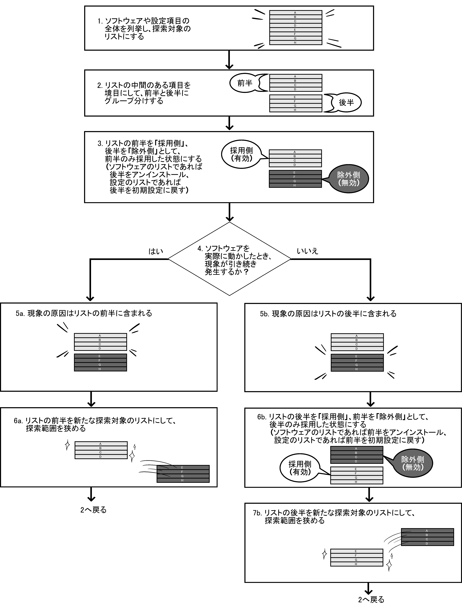

# どう報告すればいいのか分からない

フィードバックしたいOSSとフィードバックしたい内容、そして、フィードバックする先が決まりました。次は、実際にイシュートラッカーやメーリングリストに「報告」というフィードバックを行う際の、*より良い報告の書き方*を説明しましょう。

といっても、ここで説明する内容は、すでに業務でたくさんバグ票を書いているような人にとっては目新しい話ではないです。逆に、まだ業務でバグレポートを書いたことのない人や、いいレポートを書けずに困っている人には、この章は業務の上でも役に立つかもしれません。

ここでのポイントは、*開発者の負担が減るような報告にする*ということです。

もしあなたがすでにソフトウェア開発の仕事をしているなら、あるいは、自分で作ったソフトウェアを長期間メンテナンスし続けているなら、不具合の修正に日々苦労しているのではないでしょうか。そんなときに*「こういう情報があると助かるのになあ」と思うような情報*こそ、報告に書くべき情報と言えます。

　

例として、筆者が実際に報告した[Firefoxのポップアップウィンドウの動作の不具合](https://bugzilla.mozilla.org/show_bug.cgi?id=1521692)の場合を考えてみます。

トラブルに遭遇した時点での筆者の認識は、以下のようなものでした。

```text {num=false}
* ポップアップウィンドウを閉じられなくなった。
* OSはWindows。
* FirefoxのバージョンはESR60。
```

これに対して、最終的に報告した内容は以下のようなものです。

```text {num=false}
再現手順：

1. Windows Server 2008環境を用意する。Windowsのデスクトップテーマは「クラシック」を選択する。
2. Firefox 64.0.2またはFirefox ESR60.4をインストールする。
3. Firefoxを起動する。
4. ツールバーの上で右クリックして、メニューの中の「メニューバー」にチェックを入れ、メニューバーを常に表示する状態にする。
5. キーボードショートカット「Ctrl-Shift-K」を入力して、Webコンソールを開く。
6. コンソールに window.open('about:blank','_blank','toolbar') と入力して、Enterキーを押す。
7. ポップアップウィンドウがFirefoxのポップアップブロッカーによってブロックされるので、「このサイト（～）によるポップアップを許可する」をクリックする。
8. 開かれたポップアップウィンドウのウィンドウコントロール部（ Windowsではウィンドウの右上にあるボタン群）にあるクローズボックスをクリックする。

期待される結果：

* ポップアップウィンドウが閉じられる。
* 最小化・最大化のボタンも機能する。

実際の結果：

* ポップアップウィンドウが閉じられない。
* 最小化・最大化のボタンも機能しない。
```

こうして見比べると、情報量が段違いなのが見て取れるでしょう。

OSS開発者が受け取って嬉しい・問題の解決につなげやすいのは、後者のような、*要点を押さえていて説明の解像度が高い報告*です。
本章では、報告で押さえるべき要点は何か、説明の解像度をどのようにして高めればよいかを、この事例を参照しながら説明していきます。


## 報告に欠かせない3つの基本要素

開発者コミュニティの目的は、*ソフトウェアの改善・改良、ソフトウェアの問題を解決すること*です。不具合の報告はそのために行うもので、この目的に繋がらない情報は、いくらあっても役に立ってくれません。

では、一体どんな情報があれば問題解決の役に立つのでしょうか？　

一般的に「報告に必ず盛り込むべき要素」とされるのは以下の3点です。

* *再現手順（Steps to reproduce）*
* *実際に得られる結果（Actual result）*
* *期待される結果（Expected result）*

「再現手順」とは、その現象を*開発者が*再現するために必要な情報です。あなたが普段から使っている環境を開発者に物理的に差し出して直接見てもらうことは、一般的には不可能なので、*開発者は報告された再現手順に従って、自分の手元の環境で現象を再現させ、それを出発点として原因を調べる*ことになります。再現手順は、そのような使われ方をする物である、ということを念頭に置く必要があります。

「実際に得られる結果」とは、あなたの環境で再現手順を実施したときの結果・状態の説明です。*開発者は、再現手順に従ってこの結果を得ることを、まず目指します*。メッセージが表示されるならそのメッセージを、エラーが出るのならそのエラーの出力を、ありのままに書きましょう。あなたの報告に書かれた「実際の結果」を開発者が得られなかった場合、再現手順にまだ何か見落としがあったということになります。

「期待される結果」とは、あなたの思う「どうなっていて欲しい」という状態の説明です。*開発者はこれを作業のゴールと定めて*、なぜそうなっていないのか、原因を調べ対策を考えるわけです。

場合によっては、「期待される結果」は、*あなたがソフトウェアやプロトコルの仕様を正しく把握しているかどうか*を開発者が判断する資料にもなります。あなたの期待がプロジェクトの目指す方向性と一致しなかった場合、機能追加の提案であれば却下されるかもしれませんし、不具合の報告であれば「仕様」として処理されるかもしれません。

ともかく、この3つのどれが欠けても、問題の解決は途端に難しくなります。これらは、マクロなシステムからミクロな関数まであらゆる規模の「問題」を表現するための基本原則と言えるでしょう。


プロジェクトによっては、報告の書き方・形式を定めている場合がありますし、GitHubのようなサービスでは、イシュー作成用の「空欄を埋めるだけで適切な形式の報告を書けるテンプレート」（イシューテンプレート）が用意されている場合もあります。

いずれにせよ、十中八九どのプロジェクトでも、言い方は多少異なっていても[^variations-of-report-information]この3要素は必ず含めるように指定されています。

[^variations-of-report-information]: たとえば「実際に得られる結果」→「起こったこと」「現象」、「再現手順」→「やったこと」、「期待される結果」→「起こって欲しいこと」のような言い方になっている場合があります。

　

報告には他にも、以下のような情報を添える場合もあります。

* 不具合の報告か、新機能の要望か
* セキュリティ上の脆弱性かどうか
* 影響度はどのくらいの大きさか、どの程度深刻か
* どのモジュールに関する報告か

ただ、これらはあくまで*基本の3要素を踏まえた上での補足情報*です。プロジェクトの運営方針によっては、最低限基本の3要素が揃っていない報告は一律に却下される場合もあります。

慣れないうちは特に、「自分がいかに困っているか」「その問題の影響度はどのくらいか」ということばかり一生懸命書いてしまいたくなるところですが、*その気持ちはグッとこらえて*、まずは基本の3要素をきっちり押さえるようにしましょう。


### 正確な再現条件を突き止めよう

報告の中で、労力的に最も大きなウェイトを占めるのが*再現手順の特定*です。実際に、開発の現場でも不具合の修正に要する時間のほとんどはそこに費やされていると言っても過言ではないでしょう。*不具合が修正されるかどうかは、ほぼ、「現象を確実に再現できる正確な手順・条件」が明らかになっているかどうかで決まります*。

正確な再現手順は、以下の2つの意味で、原因究明や問題の解決のための大きなヒントになります。

* 開発者の環境で現象を再現できれば、現象発生時のソフトウェアの内部状態を調べられます。
* そうでなくても、その手順で操作した場合にソフトウェア内部で起こるであろうことを詳しくシミュレートして調べられます。

フィードバックするネタの見つけ方の話の中で、「OSS Gateワークショップではフィードバック初心者の方向けのファーストステップとして、公式の導入手順の中で遭遇したつまずきのフィードバックをおすすめしている」と述べました。このやり方をおすすめしているのには、*再現手順が明確になるから*という理由もあります。「実際に行ってつまずいたときの操作手順」＝「公式の導入手順」であれば、改めて自分で手順を書き起こさなくても、公式の資料を下敷きにできるからです。

しかし実際には、「新しいPCを導入して、ソフトウェアを使い始めた直後で、まだ何も設定を変えていない」というような*まっさらな状態*でつまずくことは、あまりありません。むしろ、*ある程度の期間使い込んだ状態*で、不意につまずきに遭遇することの方が多いでしょう。ともすれば、どのようなソフトウェアを他に導入したのか、どの設定をどのように変更したのか、使用者である自分自身も把握しきれていないことすらあります。

このような場合、どうやって「正確な再現条件」を明らかにすればよいのでしょうか？

### 「現在の環境」を説明してみよう

自分の環境の現状がよく分からない場合にまず試したいのは、*使用中のソフトウェア自身が提供しているデバッグ情報の採取*です。

ソフトウェアによっては、自分自身が動作している環境の情報を出力する機能を備えている場合があります。GUIを持つソフトウェアでは、「ヘルプ」メニューの項目から情報を採取できることが多いようです。たとえば以下の要領です。

* Mozilla Firefoxでは、アドレスバーから`about:support`を開くと、詳細なシステム情報を表示する「トラブルシューティング情報」のページが開かれ、ここから、ページの内容をクリップボードにコピーしたり、ファイルとして保存したりできます。
* Google Chromeでは、アプリケーションメニューから「ヘルプ」→「問題の報告」を選択し、開かれた「Googleにフィードバックを送信」のダイアログ内の「システム情報」のリンクをクリックすると、「システム情報のプレビュー」のダイアログが開かれ、詳細なシステム情報を採取できます。
* Visual Studio Codeでは、メニューから「ヘルプ」→「問題の報告」を選択し、開かれた「問題のレポーター」のダイアログ内の「自分のシステム情報を含める」のチェックボックスのラベル内の「表示」のリンクをクリックすると、詳細なシステム情報を採取できます。

CLI（コマンドラインインターフェース）のソフトウェアでは、システムの情報を出力するオプションが用意されていたり、バージョン情報の一部としてシステムの情報が出力されるようになっていたりする場合があります。以下に例をいくつか挙げます。

* `bash --version`を実行すると、OSのディストリビューションやCPUのアーキテクチャの情報を得られます[^bash-version-info]。
* `vim --version`を実行すると、有効化されている機能の情報や、読み込まれている設定ファイルの位置などの情報を得られます。
* `rsync --version`を実行すると、有効化されている機能の情報を得られます。

[^bash-version-info]: ディストリビューションのパッケージを使用している場合。

環境情報の収集用の仕組みが用意されていない場合、どういったことを調べるとよいかはケースバイケースとなります。一般的には、以下は必須の情報と思っておいてよいでしょう。

* OSの情報。
  * 種類は何か。（Windowsか、macOSか、Linuxか、など）
  * バージョンやエディション。
  * 32bit版か、64bit版か。
* 現象に遭遇したソフトウェアの情報。
  * バージョンやエディション。
  * 64bit用か、32bit用か。（Windowsでは32bit用のソフトウェアを64bit環境でも動かせるため）

冒頭の事例では、当初は環境を単に「Windows」としていましたが、実際には「Windows Server 2008」環境で発生した不具合でした。そのため、実際の報告では「Windows Server 2008」と明記しました。

ソフトウェアのバージョンを伝える際には、必ず「バージョンESR68.4.1」のように*具体的な番号を明記する*ようにしましょう[^exact-version-number]。「最新版」という言い方をする人は少なくないですが、この言葉が指す対象は非常に曖昧です。たとえば、ソフトウェアによっては*「最新版」が複数ある*場合があります。以下はその例です。

[^exact-version-number]: どうすればバージョン番号を調べられるか分からない場合は、不具合の報告時に開発者に質問しましょう。

|{width=45}「最新版」の種類|{width=75} 例 |
| -- | -- |
| 開発中の本当の最新版 | Firefoxでの「Nightly」、Google ChromeでのChromiumや「Canary」、Debianでの「Sid」など |
| 一般ユーザー向けの最新版 | Firefoxでの「通常リリース版」、Google Chromeでの「安定チャンネル」など |
| 法人向け長期サポート版の最新版 | Firefoxでの「ESR（Extended Support Release）」、Ubuntuでの「LTS（Long Term Support）」など |

また、報告がなされてから開発者が報告を見るまでの間に新バージョンが公開された場合、*報告者と開発者のそれぞれの間で「最新版」が指すバージョンの認識がずれる*こともあります。

冒頭の例では、現象が発生したのは「Firefox ESR60.1」でしたが、より新しいバージョンの「ESR60.4」でも再現する状況でした。そのため、最終的な報告には「ESR60.4で再現する」とだけ書くことにしました。

### 現象に影響する可能性がある、「現在の環境」の構成要素

現象の発生に関係しうる要素は、現象の種類によって千差万別です。ここでは、実際に筆者が遭遇したトラブルに関係していた物をいくつか紹介します。

ソフトウェア単体の動作として説明が付きにくい、不可解な現象に遭遇している場合、OS自体の設定や、別のソフトウェアの影響で現象が発生している場合は非常に多いです。たとえば、以下のような物です。

* デスクトップテーマや配色の変更、キーボードのキー割り当ての変更など、システム全体に影響する設定。
* マウスジェスチャやウィルス対策ソフトといった常駐型ユーティリティなど、システム全体に影響するソフトウェア。
* そのソフトウェアに拡張機能やプラグインの仕組みがある場合、導入済みのそれらら。

難しいのは、*長く使い込んだ環境ほど、自分がそれまで何を変更し何を導入したか分からなくなってしまいがち*なことと、*一見すると関係のなさそうな物が現象に影響している場合が少なくない*ことです。当てずっぽうで1つか2つだけ挙げても外れてしまいますし、あらゆる可能性を考慮すると際限が無くなってしまいます。開発者へ的確に情報を提示するためには、後述する絞り込みの手法や、まっさらな環境との比較などを用いる必要があります。

なお、これらを現在の環境の情報として書き添える場合は、設定であれば変更の方法が、ソフトウェアなら入手先やバージョン情報が明記されていると、開発者視点ではありがたいものです。というのも、開発者といえども、自分で使っていない設定やソフトウェアについえては詳しくないことがままあるからです。

GUIを持つアプリケーションでは、以下のようなことも現象に影響する場合があります。

* マルチディスプレイか、シングルディスプレイか。
  * マルチディスプレイなら、どのディスプレイでも再現するのか、特定のディスプレイでだけ再現するのか。
* Hi-DPI環境なのか、そうでないのか。（macOSのRetinaディスプレイなど）
* OSはローカルのコンピューターとして直接ログインしているのか、リモートデスクトップで間接的に利用しているのか。
* アプリケーションはそのOS上で直接起動しているのか、Citrix XenAppのような仮想化ソリューション越しに起動しているのか。

コンピューターを日本語環境で使用している場合、そのことも現象に関係している可能性があります。たとえば、以下の点が問題に影響していたことがありました。

* OSの言語は日本語か、英語か。
* OSのユーザー名は「user」のように英数字のみか、「検証　太郎」のように日本語の文字を含んだ名前か。（パスに日本語の文字が含まれると問題になることが多い）
* OSのワークグループ名は「WORKGROUP」（既定）のように英数字のみだったか、「検証　組織」のように日本語の文字を含んだワークグループ名か。（ワークグループ名に日本語の文字が含まれると問題になることがある）

また、Windowsのドメインが現象に関係している場合もあります。

* ドメインに参加しているか、していないか。
* Windows Serverの場合、ドメインコントローラか、ただのドメイン参加か。

アプリケーションの分野次第で、これらのほかにも色々なことが現象に影響する可能性があります。基本的には、報告したあとも開発者とやり取りしながら少しずつ情報を採取していくことを前提に、報告の時点で「必要な情報があれば、採取の仕方を教えてください」と書き添えておくことをお薦めします[^ask-to-author-about-environment-information]。

[^ask-to-author-about-environment-information]: 特にそう書き添えていなくても、報告に書かれた情報から原因を特定できなければ、開発者側から「この情報を調べてください」と訊ねられる結果にはなります。ただ、協力的でない姿勢の報告に対しては、開発者も冷淡になってしまうことはあり、最悪の場合、「必要な情報を書いてくれておらず、不完全な報告なので、対応しないでクローズする」と即断されることもあり得ます。最初の時点で報告者側から協力的な姿勢を示しておくことで、そのような不幸なすれ違いを避けられる可能性が高まる、というのが筆者の考えです。

### [column] コラム：「普段使いの環境」そのものを情報提供する

究極的には、現象が発生している状態のコンピューターを開発者が直接操作して調査できれば、原因究明はスムーズに進みます。しかし、どこの誰かも分からない開発者に秘密の情報を見られてしまうのは困りますし、そもそも、どこか遠い国に住んでいる開発者に、飛行機を乗り継いで家まで来てもらうのも、無理のある話です。

ただし、普段使いの環境全体を開発者に見せることはできなくても、*ユーザー設定*という形で、アプリケーションの「普段使いの状態」を提供できる場合はあります。

現代の多くのソフトウェアは、ユーザー設定はソフトウェアのインストール先とは別の位置に保存されています。以下はその保存先としてよく使われるフォルダー（ディレクトリー）の位置です。

* `C:\Users\（アカウント名）\AppData\Roaming\（ソフトウェア名またはベンダー名）`（Windows Vista以降のWindows）
* `/Users/（アカウント名）/Library/Application Support/（ソフトウェア名またはベンダー名）/`（macOS）
* `/home/（アカウント名）/.（ソフトウェア名またはベンダー名）/`（Linux、BSDなどのUnix系）

これらの場所にあるユーザー設定のフォルダーやファイルを、zip形式などに圧縮して開発者に提供すると、開発者の手元で詳細な調査を実施できる可能性があります。

ただ、ユーザー設定の中には住所や氏名、パスワードといった機密情報が含まれる場合があります。信用できない開発者にユーザー情報を丸ごと引き渡すのは危険なので、どのファイルに何が含まれているかを調べ上げた上で、機密情報を削除してから提供したり、後述のまっさらな環境で再現条件を整えた状態のユーザー情報のみを提供するようにしたり、といった工夫をする必要があるでしょう。

なお、筆者が業務で行っている法人向けのOSSのサポートでは、契約関係の中で秘密が保たれることを保証した上で、機密情報も含めてユーザー情報を丸ごと引き渡してもらうことも、現地に出向いて調査することもあります。つまり、そのようなことをしても大丈夫だという安心や、秘密を守った上で原因究明を迅速に行うといったサービスをお金で買えるのが、「OSSの有償サポート」の意義の1つと言えます。

### [/column]

### 操作手順を誤解のないように説明してみよう

環境の情報だけでなく、現象を再現させるための手順も、詳しく説明する必要があります。

CLIのソフトウェアの場合、*端末のシェル上で実行したコマンド列やその出力結果を、ありのままに記録した上で、コピーしてメールやチケットに貼り付ける*のがおすすめです。たとえば、筆者が作成した[Bashスクリプト製Twitterクライアント](https://github.com/piroor/tweet.sh)で「複数行の発言を投稿できない」という現象に遭遇した場合、報告は以下のように書けます。

```text {num=false}
1. Twitterのアカウントを作成する。
2. https://developer.twitter.com/ を訪問する。
3. APIキー一式を発行する。
4. Ubuntu 18.04LTSを起動する。
5. 「端末」を起動して操作する。
   以下はコマンド列での実行内容とその出力。
   -----
   $ git clone https://github.com/piroor/tweet.sh.git
   （※註：コマンドの出力はここでは省略しているが、実際の報告時にはすべてそのまま貼り付ける）
   $ cd tweet.sh
   $ vim ~/.tweet.client.key
   $ cat /.tweet.client.key（※註：ファイルの編集結果を示すために実行している）
   MY_SCREEN_NAME=piro_or
   MY_LANGUAGE=ja
   CONSUMER_KEY=***（※註：秘密情報のため「*」で置き換えている）
   CONSUMER_SECRET=***（※註：秘密情報のため「*」で置き換えている）
   ACCESS_TOKEN=***（※註：秘密情報のため「*」で置き換えている）
   ACCESS_TOKEN_SECRET=***（※註：秘密情報のため「*」で置き換えている）
   $ vim file.txt
   $ cat file.txt（※註：ファイルの編集結果を示すために実行している）
   line 1
   line 2
   $ ./tweet.sh post $(cat file.txt)
   {"errors":[{"code":32,"message":"Could not authenticate you."}]}
   -----
6. Webブラウザで確認用に https://twitter.com/piro_or を開くと、先ほどの内容は投稿されていない。
```

このように*手順に漏れが無い報告をしやすい*のは、CLIの利点の1つです。

　

他方、*GUIでは操作方法が人によって大きく変わってくる*ため、誤解のないように手順を説明するのは難しいです。

GUIでは、同じ機能をいろいろな方法で呼び出せる場合があり、そのどれを使うかで現象が再現したりしなかったりします。たとえば、筆者が遭遇した事例では、以下のような微妙な差異が、現象の必須の再現条件として重要だった、ということが度々ありました。

* 機能をツールバーのボタンやメニューからは期待通りに実行できるが、キーボードショートカットからは実行できない。
* マウスやタッチパネルでの操作には期待通りに反応するが、キーボード操作には反応しない。
* マウスの左ボタンのクリックには期待通りに反応するが、右ボタンには反応しない。
* マウスの左ボタンを押し下げて、0.2秒以内に放した場合は期待通りに動作するが、それより後に放すと反応しない。
* マウスを0.5秒以上かけて動かすと期待通りに反応するが、それより早く動かすと反応しない。
* キーをゆっくり操作して文字を入力すると期待通りに反応するが、高速に入力すると反応しない。
* ほとんどのWebページでは期待通りに機能が作用するが、特定のページでだけ機能が作用しない。

冒頭の例の「ポップアップウィンドウを閉じられない」という一言説明だけでは、そういった細かい部分が全く分かりません。そこで、誤解のないように詳しく書き下していくと、たとえば以下のように書けます。

1. Windows 2008を起動する。
2. `administrator`ユーザーとしてログオンする。
3. Firefox ESR60.1をインストールする。
4. デスクトップ上のFirefoxのアイコンを、マウスの左ボタンでダブルクリックして、Firefoxを起動する。
5. Firefoxのアドレスバーに`http://*******.***/`（※編註：実際にはちゃんとしたURLを使用）と入力し、Enterキーを押して、Webページを開く。
6. ページ内に含まれているボタンの上でマウスの左ボタンをクリックする。
7. Firefoxのポップアップブロッカーによってポップアップがブロックされる。
8. Firefoxのウィンドウ内に表示された通知のボタンの上でマウスの左ボタンをクリックする。
9. メニューが表示されるので、メニューの中の「このサイト（～）によるポップアップを許可する」の上でマウスの左ボタンをクリックする。
10. ブロックされたポップアップが開かれる。
11. ポップアップのウィンドウのクローズボックスの上で、マウスの左ボタンをクリックする。（しかし、ポップアップウィンドウが閉じられない。

当初の一言説明に比べると、冗長にも見えます。しかし、問題の報告という場面では、一般的にはこの解像度での説明が必要と言っていいでしょう。開発者が知らない他のソフトウェアとの組み合わせで現象が発生している場合、一言二言の説明だけでは、開発者にはさっぱり意味が分からないことも珍しくありません。ここは面倒臭がらずに、頑張って高い解像度で書き下すようにしましょう。

　

すべてを言葉できちんと説明しきるのは難しいですが、その補助や代替となる説明の方法として、*スクリーンショット（操作画面のキャプチャ画像）*や*スクリーンキャスト（操作の様子のキャプチャ動画）*もあります。これらを使うと、以下のような情報を端的に伝えられます。

* 複雑なUIの場合や、操作対象のUIの名前が分からない場合に、スクリーンショットを取得して、画像編集ソフトで矢印や丸などを描き加えると、文字での説明よりも効果的に操作手順を伝えられます。
* 操作の順番やタイミングが重要な場合、スクリーンキャプチャの動画であれば、それらを簡単に伝えられます。

近年のデスクトップOSでは、ゲーム需要の高まりなどの影響もあってか、[スクリーンキャストの撮影・録画機能が最初からある場合もあります](https://www.clear-code.com/blog/2018/7/31.html)。また、いざとなれば、*PCの画面をスマホで撮影・録画してアップロードする*方法もあります。固定観念に囚われず、状況説明のために使える方法はなんでも使う意識で、説明の方法を考えてみるとよいでしょう。

画像や動画を使った説明にはもう1つ、*再現条件として説明しそびれていた情報も一緒に伝わる場合がある*、という利点があります。

たとえば、*ユーザー自身は当たり前のこととして認識しているために、言葉での説明には登場していなかった暗黙的な情報*でも、画像を見れば「Windowsのテーマとしてクラシックテーマを使用している」「macOSの配色をDarkにしている」といった形で一目瞭然となり得ます。筆者の過去の体験でも、このようにして得られた*暗黙の再現条件*が重要だったケースは何度かありました。

また、複雑な処理の流れが関係する説明であれば、*フローチャートのような図*を使うのも有効かもしれません。画面上で図を用意するのが大変な場合、*紙にペンで描いた図を写真に撮る*方法もあります。

プログラムやデータを実際に作れるのであれば、*実行すれば必ず現象が再現するテストケース*を作成して報告に添付するのが、最も有効です。サーバーサイドのソフトウェアであれば、*Dockerコンテナなどの形で実行環境そのものをテストケース代わりにする*やり方もあり得るでしょう。

　

言葉での説明にせよ、画像や動画での説明にせよ、再現手順は*自分で「細かすぎるかも」と思うくらいに細かく説明するように意識しましょう*。

報告に不慣れな人ほど、荒く・情報が不足した報告をしてしまいがちですが、そのような報告は、読み手の側で想像して詳細を補わなくてはいけません。生まれも育ちもバックグラウンドがまったく異なる相手の想像に任せると、往々にして、自分の想像とは異なる受け取り方をされてしまいます。そうなると、「違う、そうじゃなくて……」と説明するための余計なコミュニケーションコストが必要になってしまいます。

また、報告を受けた側で「これは一体何のことを言っているんだろう？」と想像力を働かせ、確かめるためにあれこれ調査したり試したりするのは、物理的にも精神的にも大きなコスト負担になります。そのような報告が多いと、開発者は報告の内容を読み解く手間だけで手一杯になってしまい、肝心の調査や修正に時間ややる気を割けなくなってしまいます。

そうしないために大事なのが、*なるべく読み手に想像させない（想像に任せない）ように書く*ことです。解釈が分かれそうな部分や、曖昧な説明、環境によって状況が変わってきそうな部分は、「自分の環境ではこうだった」という基準でよいので、言葉なり画像なり映像なりで、可能な限りきちんと説明するようにしましょう

入れすぎた情報を後で削るのは容易ですが、不足した情報に後から気付くのは難しいです。最終的な報告の形にまとめ上げるまでは、基本的には*情報は常に多めに盛り込むようにする*ことを心がけて、手段を選ばず、自分にできる限りの表現方法を使って情報を伝えるようにしてみてください。

### 再現条件・再現手順を最小化しよう

現象が再現する条件・手順を書き出せたら、次は*不要な情報を削る*ことを検討してみましょう。

報告は、*必要な情報が欠けていてはいけませんが、不要な情報が多すぎてもいけません*。

ここまでの話に従って細かく書き出した情報の中には、必要な情報と不要な情報が混ざっています。たとえば、現在の環境にソフトウェアが100件インストールされていたとしても、実際に現象に影響しているのは大抵、その中の1つか2つ程度で、残りの90件以上は不要な情報です。また、OSの言語設定やユーザー名とは無関係に発生する現象なら、それらの情報も不要です。現象に無関係な情報が多すぎると、本当の原因がその中に埋もれてしまい、調査の妨げとなってしまいますので、そういった情報はなるべく報告内容から除外しておきたいところです。

では、当てずっぽうの思いつきよりも効率よく確実に、必要な情報と不要な情報とをより分けて、再現条件・手順を最小化するには、どのようにすればよいのでしょうか？

　

現象に関係していそうなソフトウェアや設定項目の中から、本当に関係している物を特定する方法としてよく使われるのが、*二分探索*という調査の仕方です。次のフローチャートを見てください。



<!--
```
1. ソフトウェアや設定項目の全体を列挙し、探索対象のリストにする。
↓
2. リストの中間のある項目を境目にして、前半と後半にグループ分けする。
↓
3. リストの前半を「採用側」、後半を「除外側」として、前半のみ採用した状態にする。（ソフトウェアのリストであれば後半をアンインストールする。設定のリストであれば後半を初期設定に戻す）
↓
4. ソフトウェアを実際に動かして、現象が再現するかどうか？
↓               ↓
Yes              ↓
↓               ↓
5a. 現象の原因はリストの前半に含まれる。リストの前半を新たな探索対象のリストにして、探索範囲を狭める。
↓               ↓
2に戻る          ↓
                 ↓
                 No
                 ↓
    5b. 現象の原因はリストの後半に含まれる。リストの前半を「除外側」として、後半のみ採用した状態にする。（ソフトウェアのリストであれば前半をアンインストールする。設定のリストであれば前半を初期設定に戻す）
                 ↓
    6a. リストの後半を新たな探索対象のリストにして、探索範囲を狭める。
                 ↓
               2に戻る
```
-->

このようにすると、*リストをしらみつぶしに調べていくよりもはるかに少ない試行回数*で、「この項目が原因だ」という項目を特定できます[^bisection-to-find-two-or-more-items]。

[^bisection-to-find-two-or-more-items]: 現象が複数項目の組み合わせで発生する場合、フローチャートの手順のとおりにやると、前半・後半のどちらを採用しても現象が再現しなくなることがあります。その場合、リストの前半と後半を分ける点を中央より前寄りや後ろ寄りにずらしたり、リストの項目をシャッフルしたりすると、二分探索を継続でき、「この2つの項目が揃ったときにだけ現象が再現する」「この3つの項目が揃ったときにだけ現象が再現する」といった形で項目を絞り込むことができます。

　

再現手順の中から、現象の再現に無関係な要素を除外するには、*手順を単純に除外する*方法と、*不確定性が高かったり複雑だったりする手順を別の手順で置き換える*方法があります。

手順を除外する場合は、単に手順を1つずつ減らしていくだけなので、特に説明の必要はないでしょう。

不確定性の高い手順とは、実際のWebページを開くなどの*外部リソースに依存する手順*や、操作のタイミングやハードウェア性能など*手順の実行時の状況に強く依存する手順*などを指します。実際のWebページは、そのURLに開発者がアクセスできない可能性があります[^inaccessible-risk]し、タイミングが重要な手順は、ともすれば報告者以外の誰も再現できない場合もあります。「現象を確実に再現できる手順」として述べるには、そのような手順は可能な限り排除したいところです。

[^inaccessible-risk]: 組織内のWebサイトには外部の開発者は当然アクセスできませんし、サービスによっては、サービスにアクセスできるユーザーを居住地などで制限している場合もあります。また、単純に、開発者が調査をするタイミングでWebサイトがサービス停止していることもあり得ます。

外部リソースが関係する手順は、静的なローカルファイルなどで置き換えられないか検討してみましょう。また、タイミングが重要な手順は、スクリプトとデバッグ用コンソールを使って「この処理を実行し、その何ミリ秒後にこの処理を実行する」といった形で、手動操作なしで代替する方法を検討してみましょう。

手順同士の間に依存関係がある場合、「この手順10個丸ごと必要で、手順を1つも外せない」ということも度々起こります。それが本当に絶対に必要な手順なのであれば仕方ないですが、手順が多かったり複雑だったりすると、開発者側での再現が大変になります。この場合もやはり、デバッグ用コンソールなどを使って、もっと単純な手順で置き換えられないか検討してみることをおすすめします。

　

なお、最小の再現条件・手順を特定できたら、その現象がそのソフトウェアの*「最新開発版」でも同じ手順で再現するかどうか*を調べ直すのがおすすめです。もしあなたが使っていた版が少し古い版で、最新開発版では現象が再現しないのであれば、その問題はすでに修正されている可能性があります。

ただ、最新かどうかに関わらず「開発版」では再現せず「リリース版」では再現する場合もあります。確実に「この問題はすでに修正された」と判断できる材料がない限りは、問題が見過ごされてしまわないことを優先して、「このバージョンで現象が再現した」という情報を添えて報告しておくことを、筆者はおすすめしたいです。


### 実際に得られた結果と、期待される結果を説明してみよう

「実際の結果」と「期待される結果」は、どちらを先に書いても構いません。*自分の中で「こうなってほしい」という期待がどれくらい強くはっきりとあったか*によって、どちらを先に考えるとよいかは変わります。

もし、はっきりした強い期待があったのであれば、そちらを「期待される結果」として先に説明するのがおすすめです。言葉で説明しにくい・視覚的な要素が絡む内容の場合は、再現手順の説明と同様に、スクリーンショットを画像編集ツールで加工して、矢印や枠線を描き込んだり、画像を切り貼りしたりして説明するのも効果的でしょう。その後、「期待される結果」と対比するように、それぞれの部分を挙げて現状がどうであるか（期待とどれだけ・どのように異なっているか）を述べると、よい「実際の結果」の説明になります。

他方、そこまではっきりした強い期待が無かった場合には、「再現手順」の説明をベースにするのがおすすめです[^actual-result-in-screencast]。実際にやった手順と、その結果起こったことを細かく説明した上で、まずはその中から*「自分の期待と少しでも異なっていた」「予想に反していて面食らった、モヤモヤした」部分*を見つけます。そうしたら、そこから先を「再現手順」から切り離して「実際の結果」という見出しを付けましょう。あとは、それと対比させるように「違和感があった部分」を1つ1つ丁寧に言葉にしていけば、「期待される結果」の説明ができあがります。

[^actual-result-in-screencast]: スクリーンキャストの動画で説明したのであれば、「実際の結果」はその中に自然と含まれることになります。

どちらの場合でも、*自分で「細かすぎるかも」と思うくらいに細かく説明するように意識する*とよいのは、再現手順の書き出し方と共通です。なるべく読み手の想像に任せずに済むように、できる限り細かく正確に説明するようにしましょう。


### [column] コラム：エラーの原因を探ってみよう

正常動作が期待されるのに、なんだかよく分からないエラー情報が表示されてしまう。そんな状況に遭遇した場合、*表示されたエラーの情報を手がかりにして*、より深く原因を調査できるチャンスです。うまく原因を突き止められれば、修正のプルリクエストもできるかもしれません。

慣れていない人は、エラーを見ると頭が真っ白になってしまいがちです。しかし、エラーには「読み方」があり、そこからは非常に多くの情報を得られます。

「エラーの読み方」そのものを解説した資料はあまり多くありませんが、*「Rubyのエラーメッセージが読み解けるようになる本」という技術同人誌（カウプラン機関極東支部・著、2019年発行）*では、Rubyで遭遇するさまざまなエラーについて、読み方や原因の例が多数紹介されています。他の言語にも適用できる部分が多いので、「エラー」に苦手意識がある人は[一読を強くお勧めします](https://kauplan.org/books/errmsg/)。

### [/column]


## ゼロベースで再現条件・再現手順を最小化する。

ここまで、普段使いの環境の中で「再現手順」「期待される結果」「実際の結果」を調査する方法の一例をご紹介しました。また、その中で、再現条件や手順を最小化するために二分探索を使う方法も述べました。

ですが、筆者が実際に報告を行う際には、実際の環境での二分探索よりも、*現象が発生した環境やソフトウェアについて、いわゆる「まっさらな、クリーンな環境」を用意して、その時点で判明している手順だけから同じ現象が再現するかどうかを調べる*ことのほうが多いです。

使い込んだ環境において、「現象に影響する情報」と「そうでない情報」とを丁寧により分けていくのは、かなり面倒な作業です。自分では「条件を特定できた」と思っても、実はまだ条件を見落としていて、開発者の環境では依然として現象を再現できない、ということはよくあります。そのたびに「ここを調べて」「あれを調べて」と指示をもらいながら何度もやり取りを繰り返すのは、時間的にも精神的にも非常に大変です。それよりは、最初から「まっさらな環境でこうすれば再現できる」という条件を特定して伝えたほうが、結果的に低コストになることが多い、という経験則が筆者にはあります。

### 「まっさらな環境」を用意してみよう

コラム「『普段使いの環境』そのものを情報提供する」でも紹介していますが、現代の多くのソフトウェアは、ユーザー設定はソフトウェアのインストール先とは別の位置に保存されています。具体的には、以下の位置が使われることが多いです。

* `C:\Users\（アカウント名）\AppData\Roaming\（ソフトウェア名またはベンダー名）`（Windows Vista以降のWindows）
* `/Users/（アカウント名）/Library/Application Support/（ソフトウェア名またはベンダー名）/`（macOS）
* `/home/（アカウント名）/.（ソフトウェア名またはベンダー名）/`（Linux、BSDなどのUnix系）

これらの場所にフォルダーがあれば、それを一時的にリネームする（たとえば、`Mozilla`というフォルダーの名前を`Mozilla_`に変更するなど）と、普段のユーザー設定を残したまま、「まっさらな状態」でソフトウェアを起動できます。調査が終わったら、リネームしたフォルダー名を元に戻すだけで普段使いの状態に戻せます。

ただ、この方法には「普段使いの状態とまっさらな環境とを同時に動かして試せない」というデメリットがあります。また、WindowsのアプリケーションやUnix系環境でのGNOMEの設定などでは、上記の場所ではない特別な場所に情報を保存する例もあります。スマートフォンやタブレットでは、ユーザー設定の保存先に簡単にはアクセスできない場合もあります。そのような場合も含めると、「OSに新しいユーザーを作成して、全てのデータをユーザー単位で切り替える」やり方の方がより安全で確実と言えます。

　

ユーザー設定ではなく、その環境にインストールされている他のソフトウェアが現象に関係している可能性が疑われる場合には、OSのレベルで「まっさらな環境」を用意するのが、より安全です。これは、Microsoft AzureやAmazon EC2のようなクラウドサービスでインスタンスを新規に作成したり、なるべく追加の出費を避けたい場合は[VirtualBox](https://www.virtualbox.org/)や[VMware Workstation Player](https://www.vmware.com/jp/products/workstation-player.html)などを使って自分で仮想マシンを構築したり、といった方法で用意できるでしょう。問題の原因がハードウェアやそれに近い部分にあるような場合は、仮想環境ではなく物理的なハードウェアから用意しないといけない場合もあります。

冒頭の例のケースでは、筆者は以下の環境を使いました。

* VirtualBoxの仮想マシン上のWindows Server 2008[^windows-different-version]
* Firefox ESR60.1

[^windows-different-version]: 筆者は会社で購入しているVisual Studioサブスクリプションがあり、その特典で検証用にOSのインストールイメージやライセンスキーを取得できる状態でした。なお、Firefoxのようなデスクトップアプリケーションにおいては、Windows Server 2008とWindows 7のように対応関係にあるバージョンのWindows同士は、ほぼ同じと見なして、検証環境の代用に使える場合があります。

仮想環境を使う場合、その仮想環境のゲストOSをどのように操作するかにも注意が必要です。クラウド上のインスタンスにリモートデスクトップ接続でログインすると、場合によっては、画面の描画のされ方が簡略化されたり、アニメーション効果が省略されたりして、現象の再現に支障が生じたり、そのこと自体が別の問題の原因になったりする場合があるからです。

もしリモートデスクトップ経由で使用した環境で現象を再現できなかった場合には、ローカルのコンピューターに仮想化ソフトウェアを導入して、そちらのコンソールで操作するするとよいでしょう。物理的なハードウェアを調達してまで検証するのは、どうしてもうまくいかない場合の最終手段です。

### 最小の再現条件・手順をボトムアップで調べてみる

まっさらな環境を用意できたら、なるべくアプリケーションの追加や設定変更などを行わない状態で、可能な限り必要最小限の要素のみ取り揃えて、現象の再現を試みてみます。冒頭の例では、筆者は以下のようにしてみました。

1. ポップアップを開くボタンを含むWebページを http://example.com/popup.html に用意する[^example-com]。
2. Windows 2008を起動して、ログインする。
3. Firefox ESR60.1をインストールする。
4. デスクトップ上のFirefoxのアイコンをダブルクリックして、Firefoxを起動する。
5. Firefoxのアドレスバーに http://example.com/popup.html と入力し、Enterキーを押して、Webページを開く。
6. ページ内に含まれているボタンの上でマウスの左ボタンをクリックする。
7. Firefoxのポップアップブロッカーによってポップアップがブロックされる。
8. Firefoxのウィンドウ内に表示された通知のボタンの上でマウスの左ボタンをクリックする。
9. メニューが表示されるので、メニューの中の「このサイト（～）によるポップアップを許可する」の上でマウスの左ボタンをクリックする。
10. ブロックされたポップアップが開かれる。
11. ポップアップのウィンドウのクローズボックスをクリックする。
12. ポップアップのウィンドウが無事に閉じられる。（問題が再現しなかった）

[^example-com]: Windowsのhostsファイルを編集して、自分が管理しているコンピューター上のWWWサーバーに、このようなURLでアクセスできるようにしました。

まっさらな環境で、思いつく限り最小の手順で操作してみて、すぐに現象を再現できた場合、非常にラッキーと言えます。というのも、開発者の環境で同じように操作して、現象を再現できる可能性が高く、そうすると開発者側での調査をスムーズに進められるからです。

ただ、実際にはそのような場合ばかりではなく、むしろ、この時点では問題を再現できないことのほうが多いかもしれません。そのようなときには、再現条件を「足していく」ステップに進みます。

　

このときに使うのが、*普段使いの環境で細かく書き出した再現条件と再現手順*です。まっさらな環境で再現手順を実施してみた場合と、手順や出力結果を細かく比較していくと、自分で思っていた以上に細かい部分で、たくさん差異があることに気が付くはずです。

もう一度、普段使いの環境での再現手順を列挙してみましょう。

1. Windows 2008を起動する。
2. `administrator`ユーザーとしてログオンする。
3. Firefox ESR60.1をインストールする。
4. デスクトップ上のFirefoxのアイコンを、マウスの左ボタンでダブルクリックして、Firefoxを起動する。
5. Firefoxのアドレスバーに`http://*******.***/`（※編註：実際にはちゃんとしたURLを使用）と入力し、Enterキーを押して、Webページを開く。
6. ページ内に含まれているボタンの上でマウスの左ボタンをクリックする。
7. Firefoxのポップアップブロッカーによってポップアップがブロックされる。
8. Firefoxのウィンドウ内に表示された通知のボタンの上でマウスの左ボタンをクリックする。
9. メニューが表示されるので、メニューの中の「このサイト（～）によるポップアップを許可する」の上でマウスの左ボタンをクリックする。
10. ブロックされたポップアップが開かれる。
11. ポップアップのウィンドウのクローズボックスの上で、マウスの左ボタンをクリックする。（しかし、ポップアップウィンドウが閉じられない。

この「普段使いの環境での再現手順と、実施したときの様子」と、「まっさらな環境での最小の手順と、実施したときの様子」とを比較すると、以下のような差異があることが分かりました。

* Windowsにログオンした時点で、画面の様子が違う。
  * 実際の状況ではウィンドウのデザインが地味になっている。普段の環境では、デスクトップテーマを「クラシック」に切り替えていた。
* Firefoxを起動した時点で、ウィンドウの様子が違う。
  * 実際の状況ではメニューバーが表示されていた。普段の環境では、メニューバーを常に表示するように設定を変えていた。
* 実際の状況では、ポップアップはとある社内システムのページのボタンをクリックして表示していた。
* 実際の状況では、ポップアップはブロックされなかった。
  * ポップアップブロック機能を無効化していた。
* 実際の状況では、ポップアップにはツールバー以外のGUIが表示されていなかった。
  * ポップアップを開くときの`window.open()`の第3引数のフラグ指定が異なっていた。

ほかにも、OSの言語設定の違いや、位置情報から得られる国・地域の違い[^geo-region]、タイムゾーンの違いなど、自分が「まっさらな環境」を用意した時点での暗黙の前提部分にも差異はあります。

[^geo-region]: 実際、Firefoxでは「米国地域だけを対象に機能が先行して有効化される」といったことが行われています。

このように炙り出されたさまざまな差異について、まっさらな環境に1つずつ反映していき、*どこまで反映した時点で現象が再現するか*を調べます。そして、現象が再現したら、二分探索の要領で無関係な条件や手順を除外します。このようにすると、長期間使い込んで、何をどのように変更したか・どんなソフトウェアをインストールしたか把握しきれていない常用環境での調査に比べて、少ない労力で最小の再現手順を特定できる可能性が高いです。

また、このとき、外部リソースや不確定な外部要因に依存する手順を、ローカルファイルやより安定した結果を得られる手順で置き換える、ということも同時に行います。

そうして特定した「現象を再現するために必要な最小の条件」が、冒頭で記載した、以下の内容となります。

1. Windows 2008が動作する環境を用意する。Windowsのデスクトップテーマは「クラシック」を選択する。
2. Firefox ESR60.1をインストールする。
3. Firefoxを起動する。
4. ツールバーの上で右クリックして、メニューの中の「メニューバー」にチェックを入れ、メニューバーを常に表示する状態にする。
5. キーボードショートカット「Ctrl-Shift-K」を入力して、Webコンソールを開く。
6. コンソールに`window.open('about:blank','_blank','toolbar')`と入力して、Enterキーを押す。
7. ポップアップウィンドウがFirefoxのポップアップブロッカーによってブロックされるので、「このサイト（～）によるポップアップを許可する」をクリックする[^popup-unblock]。
8. 開かれたポップアップウィンドウのクローズボックスをクリックする。

[^popup-unblock]: 「ポップアップブロックの有効・無効」は現象に関係しませんが、最小の条件のみを整えた状況ではポップアップがブロックされることから、手順の中にブロック解除の操作も明示的に含めています。


## 後退バグを報告しよう

不具合にはいくつかの典型的なパターンがありますが、その中でも特によく見られる物に*「regression」*（日本語では*「リグレッション」*や*「後退バグ」*と表記）があります。これは、「今まで正常に動いていた機能が、別の箇所の変更の影響を受けて、意図せず壊れてしまった」という種類の不具合のことを指す言葉です。「自分が愛用しているソフトウェアのよく使っている機能が、最新開発版では動かなくなっている」といった状況を発見したときは、後退バグを報告するチャンスです。

### Regression Windowを特定しよう

後退バグの報告では、「再現手順、実際の結果、期待される結果」の基本の3要素に加えて*「Regression Window」*（または*「Regression Range」*）の情報があると開発者に非常に喜ばれます。これは、コミットグラフの中の「このリビジョンからこのリビジョンまでの間のどこかで機能が壊れて後退バグが発生した」という範囲のことです。

たとえば、最新のコミットで機能が壊れたのであれば、Regression Windowは最新のコミット1つだけということになります。


Regression Windowが特定されていると、「どの変更が原因で壊れたのか」の調査がその範囲の中だけで済むため、*修正に必要な労力が大幅に軽減されます*。迅速な問題解決のためには欠かせない情報と言えます。

### [column] コラム：「Regression Point」ではない理由

Regression Windowを特定するには、後退バグが発生した機能について「期待通りの動作結果を得られていた最後のリビジョン」と「期待通りの動作結果を得られなかった最初のリビジョン」の2つを特定する必要があります。しかし、そのためにはそもそも、*そのソフトウェアを実際に動作させて*結果を確認する必要があります。

ところが、「これらのコミットは一組になっていて、その前とその後のリビジョンは起動できるが、これらのリビジョンの間はどれを取っても起動すらできない」というコミット群の中に原因があると、後退バグの出所を単一のコミットにまで絞り込むことは不可能となります。


また、「動かして動作を確かめられるビルドが1コミットずつには提供されていない」という場合も、絞り込める範囲はビルドが提供されているコミット同士までに制限されます。

このようなケースがあるため、ある程度の幅を持つ「window（窓）」という表現が使われているのでしょう。

### [/column]

### 二分探索でRegression Windowを特定しよう

再現条件の特定の方法として紹介した二分探索は、Regression Windowを特定する場面でも使えます。次のフローチャートを見てください。


<!--
```
1. 期待通りの結果を得られると分かっている最後のリビジョン（Last Good）と、期待通りの結果を得られないと分かっている最初のリビジョン（First Bad）を選ぶ。
↓
2. コミットグラフ上で両者のちょうど真ん中にあるリビジョンを取得する。
↓
3. ソフトウェアを実際に動かして、期待通りの結果を得られるかどうか？
↓               ↓
Yes              ↓
↓               ↓
4a. そのリビジョンを新たな「Last Good」として、探索範囲を狭める。
↓               ↓
2に戻る          ↓
                 ↓
                 No
                 ↓
    4b. そのリビジョンを新たな「First Bad」として、探索範囲を狭める。
                 ↓
               2に戻る
```
-->

このようにすると、*全リビジョンをしらみつぶしに試すよりもはるかに少ない試行回数*で、「このリビジョンから後退バグが発生した」というリビジョンを特定できます。

二分探索によるRegression Windowの特定は頻出する作業のため、ツールの側にもこれを支援する仕組みがあります。たとえば、Gitには`git bisect`というサブコマンドがあり、これを使うと、ユーザーは「Gitがcheckoutしてくれたリビジョンの動作を試して、結果が期待通りかどうかを答える」操作を繰り返すだけで、Gitが自動的に二分探索を進めてくれます[^git-bisect]。同様の機能がMercurialにも`hg bisect`というサブコマンドとして実装されています。

[^git-bisect]: 具体的には、`git bisect start （壊れていることに気付いたリビジョン） （正常に動作していたリビジョン）`と実行するとその間のリビジョンがチェックアウトされます。動作確認の結果が正常なら`git bisect good`を、壊れていれば`git bisect bad`を実行すると、さらに別のリビジョンがチェックアウトされます。

また、Mozillaは[mozregression](https://mozilla.github.io/mozregression/)というツールを公開しており、これを使うと`git bisect`と同様のことをFirefoxやThunderbirdの自動ビルドされたバイナリを対象に行えます[^mozregression-usage]。

[^mozregression-usage]: mozregressionのWindows用GUI版の使い方については、https://www.clear-code.com/blog/2018/7/18.html に筆者による日本語での解説があります。

自動テストによるCI（継続的インテグレーションテスト）が運用されており、テストが失敗するコミットに対しては自動的にエラーが通知されるような仕組みがあれば、理想的には後退バグが見過ごされたままにならないはずです。しかし、実際には規模の大きなソフトウェアや複雑なソフトウェアでは、後退バグがCIをすり抜けてしまうことが度々あります。

後退バグが残ったまま正式版がリリースされてしまうと、各方面に甚大な影響を与えかねません。皆さんも、普段から使っているソフトウェアで後退バグを見つけたら、まめに報告するようにぜひ心がけましょう。
