# OSSを探そう

OSSにフィードバックするということは、当たり前ですが、フィードバック先のOSSが必要です。

本節では、フィードバック先を思いつけない人のために、無理のないフィードバック先OSSの見つけ方を紹介します。すでに「このOSSにフィードバックしたい」という対象が決まっている・フィードバックしたい対象がOSSと分かっている場合、この章は斜め読みで飛ばしてもらってもおおむね問題ないです。


## 身のまわりにたくさんあるOSS

OSS Gateワークショップに来られた方に「フィードバックしたいOSSは何かありますか？」と聞くと、「Linuxカーネル」や「Docker」といった有名なプロジェクトの名前を挙げられる事が度々あります。

もちろん、本当にLinuxカーネルをガッツリ読んでパッチを書きたいという人もいるとは思うのですが、単に「OSSと言われてそれらの有名なプロジェクトくらいしか思い浮かばなかった」と見受けられるケースでは、筆者はなるべく*もっと身近な・小規模のOSS*へのフィードバックから始めるようお薦めしています[^small-start]。

[^small-start]: というのも、有名だったり大規模だったり歴史が長かったりするOSSは、「別に今の段階で何か具体的に使用上で困っているわけではない」という人がフィードバック先にするには色々とハードルが高い場合が多いからです。例えば、メーリングリストが主な情報のやり取りの場だったり、独自のツールを独特の運用ルールに基づいて使っていたり、プルリクエスト形式ではなく伝統的なパッチの形で修正を送る必要があったりということがあります。

「身近なOSS」なんて思いつかない、という人でも、普段の仕事で使うアプリケーションやコマンドを作業の順番に従って思い浮かべてみると、恐らくOSSがいくつも見つかるはずです。例えば以下の要領です。

* インターネット上の情報を調べるためにChromeを起動した。
  - ChromeのベースとなっているChromiumはOSSです。
  - Chromiumが依存しているcrc32c[^crc32c]、dom-distiller-js[^dom-distiller-js]、enum34[^enum34]などの多数のライブラリ（ `chrome://credits/` で確認できます）もOSSです。
  - Chromiumで使える拡張機能にもOSSが多くあります。
* 作業を始めるために、ターミナルを起動して、Bashの上で`git clone`を実行した。
  - GitはOSSです。
  - BashもOSSです。
* Ruby on Railsで構築されたサービスのユニットテストを走らせるために、`bundle instalL`して`rake test`した。
  - Ruby on RailsはOSSです。
  - RubyもOSSです。
  - RailsやRailsアプリケーションの`Gemfile`に従って`bundle install`でインストールされた多くのGemもOSSです。
  - `bundle`コマンドを提供するBundlerもOSSです。
  - `rake`コマンドを提供するRakeもOSSです。
* ソースコードを編集するためにVisual Studio Codeを起動した。
  - VSCodeはOSSです[^is-vscode-oss]。
  - VSCodeのベースになっているElectronもOSSです。
  - ElectronのベースになっているChromiumもOSSです。
  - VSCodeで使えるプラグインにもOSSが多くあります。
* Vue.jsで構築されたフロントエンドにファイルを追加し、ESLintでエラーがない事を確かめて、Babelでトランスパイルした。
  - Vue.jsはOSSです。
  - ESLintもOSSです。
  - BabelもOSSです。
  - ESLintやBabelの`package.json`に従ってインストールされた多くのNPMモジュールもOSSです。
* 編集したソースコードをコミットする時、コミットメッセージの編集にVimを使った。
  - VimもOSSです。
  - VimのプラグインにもOSSが多くあります。

[^crc32c]: https://github.com/google/crc32c
[^dom-distiller-js]: https://github.com/chromium/dom-distiller
[^enum34]: https://bitbucket.org/stoneleaf/enum34/src/default/
[^is-vscode-oss]: 身近な例として挙げましたが、実際には、配布されているVSCodeのバイナリには公開されているソースコードには含まれていないモジュールが含まれているらしく、「VSCodeはOSSだ」とは厳密には言えないようです。そのため、公開されているVSCodeのソースのみに基づいてビルドしたバイナリを提供する「VSCodium」（ https://github.com/VSCodium/vscodium ）というプロジェクトが有志の手により運営されています。

こうして見てみると、*開発に使用しているフレームワーク自体*や*ツール*がOSSであったり、また、有名なOSSも*名前を聞いた事のないような無数のOSSを利用*して作られていたり、という状況である事が分かります。現代のソフトウェア開発の現場では、OSSを全く使わずにいるということはあまりないでしょう。

## ソフトウェアがOSSかどうかを調べよう

ところで、いきなりたくさん例を挙げましたが、そもそも「どうだったらOSSなのか？」を説明していませんでした。

皆さんは、「GitHubにある物はみんなOSSなんだろう」「ソースコードを読める物はみんなOSSなんだろう」と思っていませんか？　だとしたら、それは大きな誤解です。

OSS（Open Source Software）とは、端的には*オープンソースイニシアティブという団体（OSI）がオープンソースライセンスだと認定しているライセンス一覧に載っているいずれかのライセンスの元で頒布されているソフトウェア*のことを言います。

[OSIの認定ライセンス一覧](https://opensource.org/licenses)

多くのオープンソースライセンスは「何らかの形でライセンスを明記する事」を利用条件に含めているため、根気よく調べると何かしらの情報を見つけられるようになっているはずです。「OSSに何かフィードバックしてみたいが、具体的にはビッグネーム以外すぐに思いつけない」という場合には、まずは自分が直接的・間接的に使用しているソフトウェアの中からOSSを探してみるのがお薦めです。LinuxカーネルやDockerよりは、ずっと身近な所で見つけられるはずです。

確認方法を端的にフローチャートにまとめると、次のようになります。

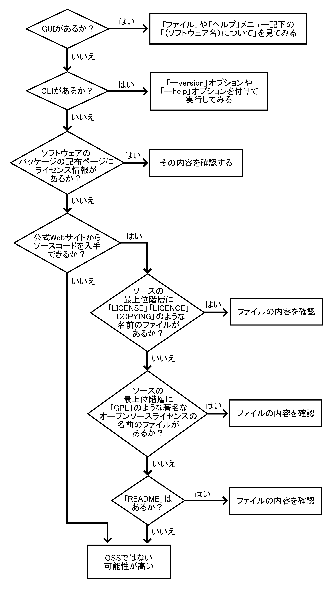

<!--
```
GUIがあるか？→はい→「ファイル」や「ヘルプ」メニュー配下の「（ソフトウェア名）について」を見てみる。
↓
いいえ
↓
CLIがあるか？→はい→「--version」オプションや「--help」オプションを付けて実行してみる。
↓
いいえ
↓
ソフトウェアのパッケージの配布ページにライセンス情報があるか？→はい→内容を確認
↓
いいえ
↓
公式Webサイトからソースコードを入手できるか？→いいえ→OSSではない可能性が高い
↓
はい
↓
ソースコードの最上位階層に「LICENSE」「LICENCE」「COPYING」のような名前のファイルがあるか？→はい→ファイルの内容を確認
↓
いいえ
↓
ソースコードの最上位階層に「GPL」のような著名なオープンソースライセンスの名前のファイルがあるか？→はい→ファイルの内容を確認
↓
いいえ
↓
「README」はあるか？→はい→内容を確認
```
-->

以下、それぞれについて詳しく説明しましょう。


### ソフトウェア自体を操作してライセンス情報を見る

GUIを持つソフトウェアだと、「ファイル」や「ヘルプ」メニュー配下の「（ソフトウェア名）について」「ライセンス」のような項目からライセンスを情報を確認できる場合が多いです。いくつか例を示しましょう。

* テキストエディターのMicrosoft Visual Studio Codeでは、「Help」→「View License」で開かれるページ[^vscode-license-info]の冒頭に「Source Code for Visual Studio Code is available at https://github.com/Microsoft/vscode under the MIT license agreement at https://github.com/Microsoft/vscode/blob/master/LICENSE.txt.（VSCodeのソースコードはMITライセンスの元で入手可能です）」と書かれています。MITライセンスは前述したOSIのオープンソースライセンス一覧に記載されているので、VSCodeはOSSだと言えます。
  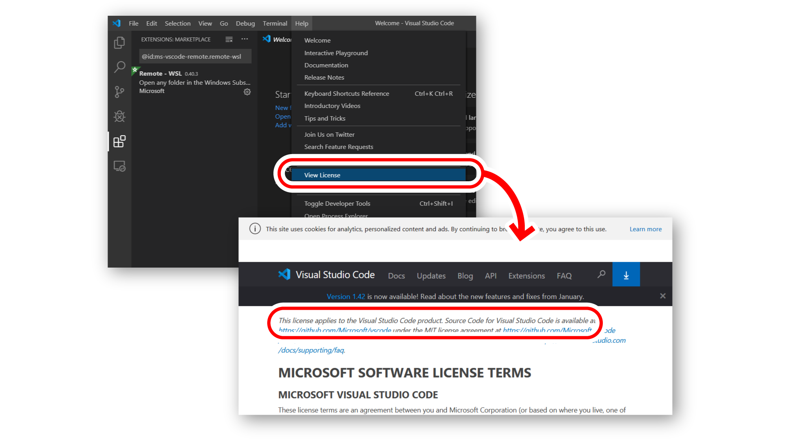
* WebブラウザのMozilla Firefoxでは、「ヘルプ」→「Firefoxについて」を選択して開かれるバージョン情報のダイアログに含まれている「ライセンス情報」というリンクをクリックすると、`about:license` というFirefoxに内蔵されたページが開かれます。この冒頭には「Binaries of this product have been made available to you by the Mozilla Project under the Mozilla Public License 2.0 (MPL).（この製品のバイナリはMozillaプロジェクトによってMozilla Public License 2.0で利用可能とされています）」と書かれています。MPL2.0もOSIのオープンソースライセンス一覧に記載されているので、FirefoxもOSSだと言えます。
  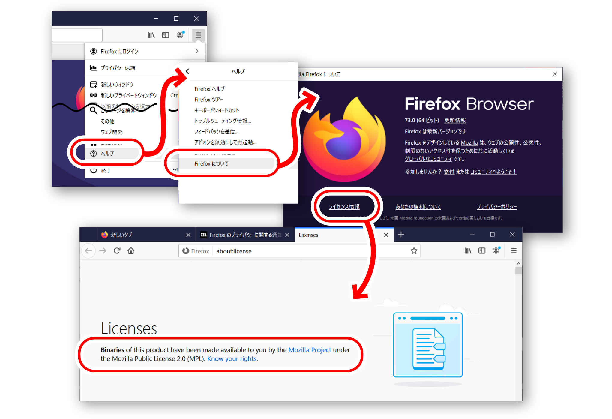

[^vscode-license-info]: https://code.visualstudio.com/license

CLI（コマンドラインインターフェース）のソフトウェアだと、必要な引数を何も指定しなかったり、`--version` オプションを指定したり、あるいは `--help` オプションを指定して起動したりすると、バージョン情報の一環としてライセンスに関する記述が出力される場合があります。例えばUbuntu 18.04LTSの端末上で`bash --version`を実行すると、以下のように出力されます。

```bash
$ bash --version
GNU bash, バージョン 4.4.20(1)-release (x86_64-pc-linux-gnu)
Copyright (C) 2016 Free Software Foundation, Inc.
ライセンス GPLv3+: GNU GPL バージョン 3 またはそれ以降 <http://gnu.org/licenses/gpl.html>

This is free software; you are free to change and redistribute it.
There is NO WARRANTY, to the extent permitted by law.
```

GPLバージョン3もOSIのオープンソースライセンス一覧に記載されているので、GNU bashもOSSと言えます。

デーモンのような常駐型の物やライブラリなどのように、直接操作するためのインターフェースを持たないソフトウェアでは、残念ながらこの方法は使えません。それらの場合は別の方法でライセンスを確認する必要があります。

### パッケージの詳細ページでライセンス情報を見る

RubyGems、npmなどのパッケージ管理システムのリポジトリのWebサイトでは、パッケージの詳細情報を見るとライセンスの情報が標示されている場合があります。代表的な各言語のパッケージ管理システムで、ライセンスを実際に確認できる例をいくつかご紹介しましょう。

* Node.jsのnpmでは、パッケージの詳細ページの右側にライセンスが標示されます。
  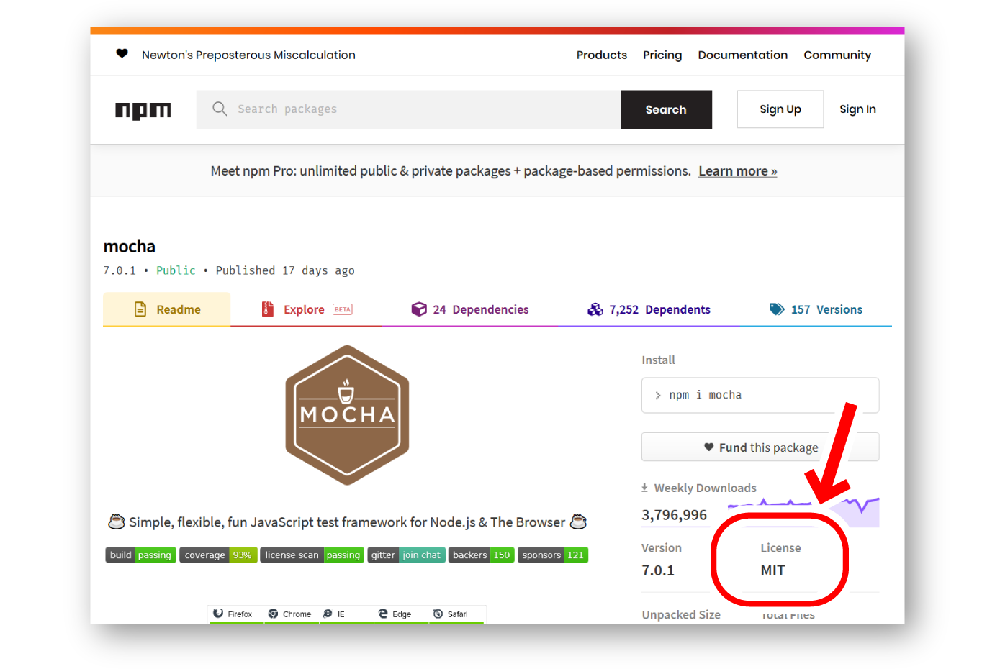 
  <!-- https://www.npmjs.com/package/mocha -->
* PythonのPyPIでは、パッケージの詳細ページの左側にライセンスが標示されます。
  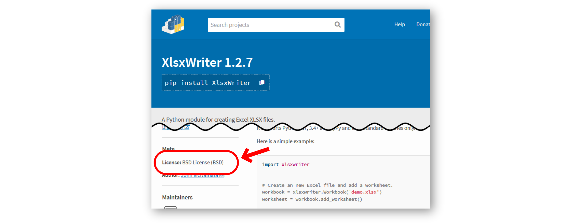
  <!-- https://pypi.org/project/XlsxWriter/ -->
* RubyのRubyGemsでは、パッケージの詳細ページの右側にライセンスが標示されます。
  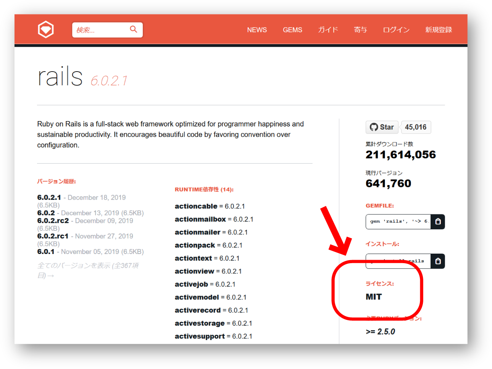
  <!-- https://rubygems.org/gems/rails -->
* PHPのPackagistでは、パッケージの詳細ページの下の方にライセンスが標示されます。
  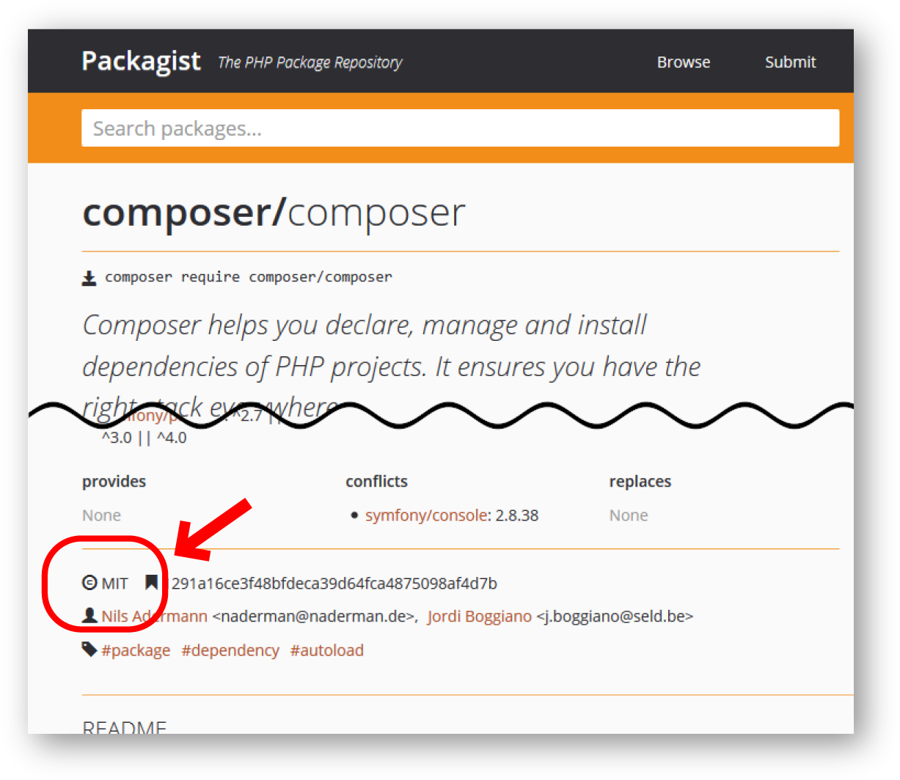
  <!-- https://packagist.org/packages/composer/composer -->
* Rustのcrates.ioでは、パッケージの詳細ページの右側にライセンスが標示されます。
  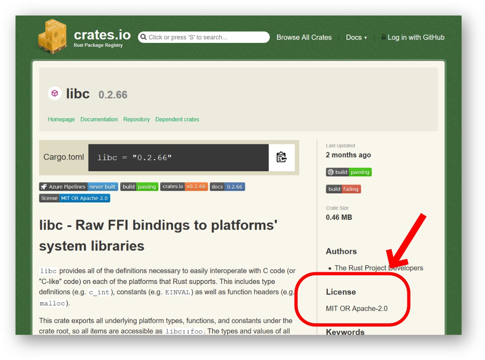
  <!-- https://crates.io/crates/libc -->
* PerlのCPANでは、パッケージの詳細ページの左側にライセンスが標示されます。
  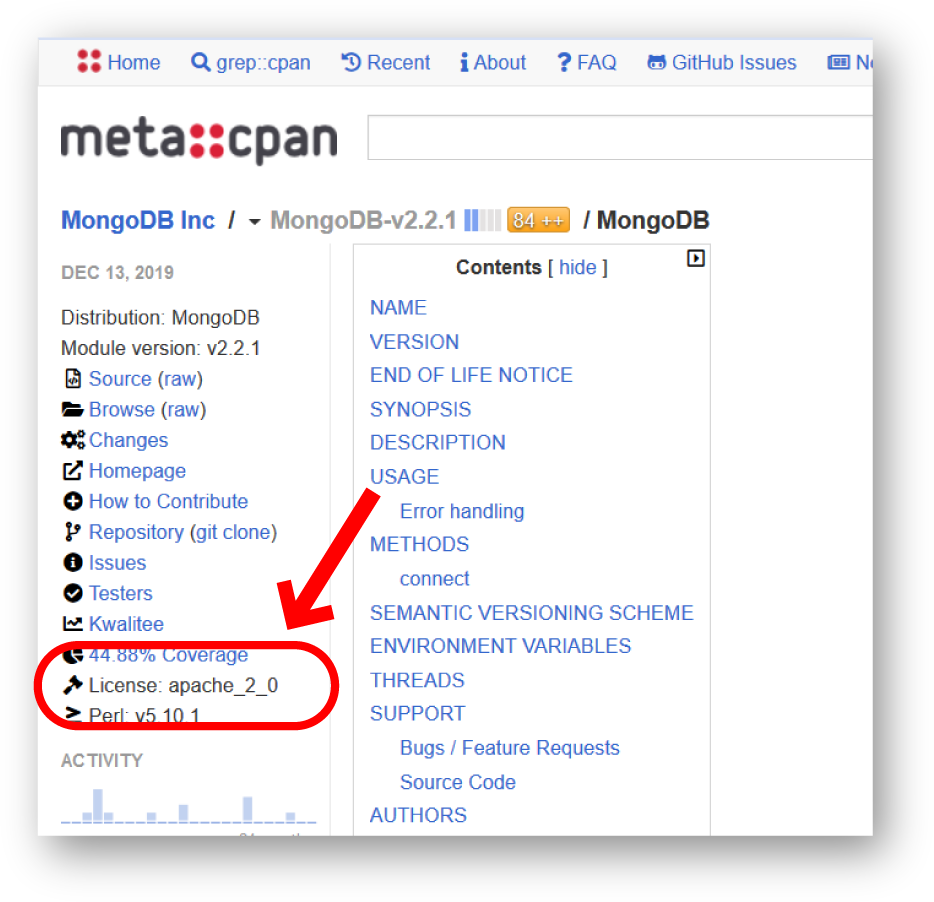
  <!-- https://metacpan.org/pod/MongoDB -->

これらのライセンス情報は、作者によってパッケージ自体に記載されたメタ情報に基づいて標示されています。ライセンス情報はメタ情報としては必須項目になっていない場合があるため、パッケージによってはライセンスが標示されていない事もあります。

LinuxやBSDなどのOSディストリビューションのパッケージ管理システムにおいても、同様に各ソフトウェアのライセンス情報が標示されています。例えば、以下の要領です。

* Debianのパッケージ詳細ページやUbuntuのパッケージ詳細ページでは、右側にある「著作権ファイル」というリンクの遷移先でライセンスを確認できます。
  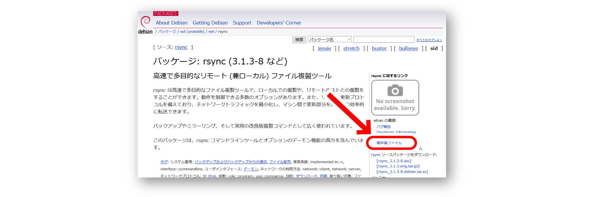
  <!-- https://packages.debian.org/ja/sid/rsync -->
  <!-- https://packages.ubuntu.com/eoan/rsync -->
* Portsのパッケージ検索結界一覧では、検索結果の情報の中にライセンスが標示されています。
  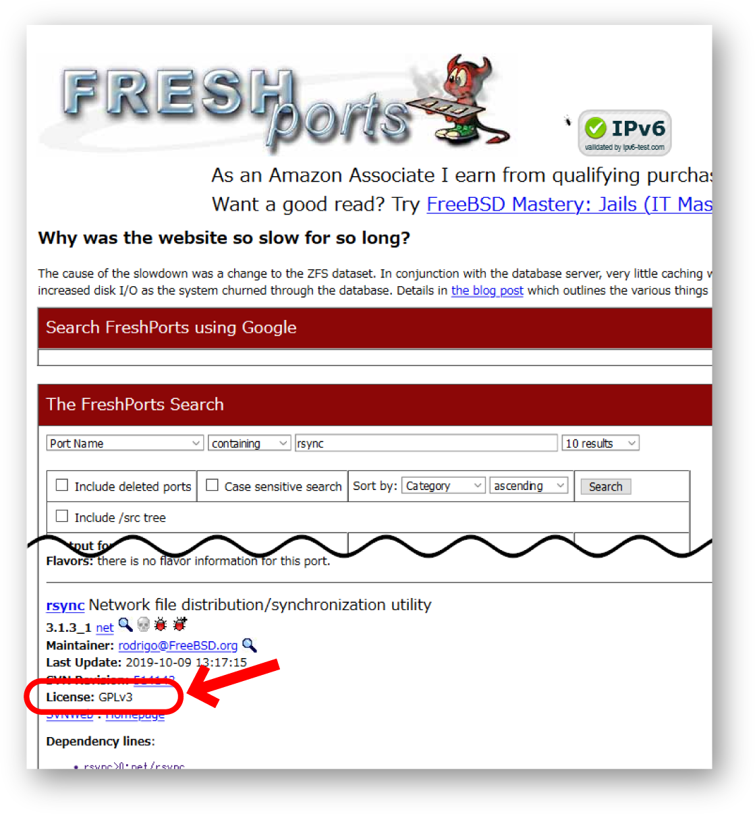
  <!-- https://www.freshports.org/search.php?query=rsync&search=go&num=10&stype=name&method=match&deleted=excludedeleted&start=1&casesensitivity=caseinsensitive -->
* MacPortsのパッケージ検索結果一覧でも、検索結果の情報の中にライセンスが標示されています。
  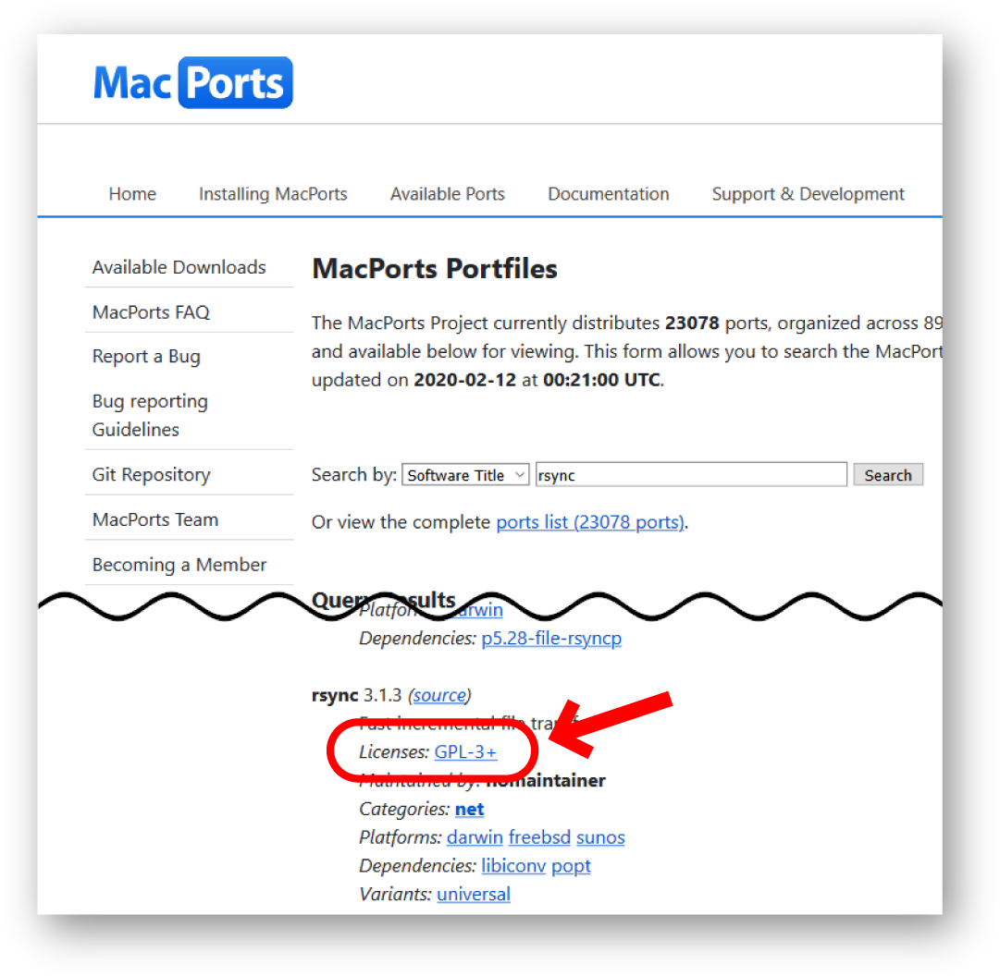
  <!-- https://www.macports.org/ports.php?by=name&substr=rsync -->

各OSディストリビューションのパッケージリポジトリでは、パッケージは各ソフトウェアの作者ではなくパッケージメンテナーという専任者が登録作業を行っています。ライセンスが不明瞭なままリポジトリに格納されることはあり得ないため[^package-license]、これらの情報の信頼性は高いと言えます。

[^package-license]: 各パッケージリポジトリは、ソフトウェアの作者が許諾した条件の下で各ソフトウェアをパッケージ化して再配布しています。よって、リポジトリへ収録されている時点で、そのソフトウェアのライセンスの確認は必ず取れている事になります。

### プロジェクトの公式サイトを見る

信頼できる情報ソースという意味では、各ソフトウェアの開発プロジェクトの公式サイトを参照するのも良い方法に思えます……が、実はこれは筆者としてはあまりお進めできません。何故かというと、*調べるのが大変なわりに不正確な情報である場合があるから*です。

例えばMariaDBの公式サイト[^mariadb]では「About」配下にライセンスの情報があり「MariaDB Server is open source software and free to use as stated in the General Public License.（MariaDBサーバーはオープンソースソフトウェアで、GPLの条件下で無償/自由に利用できます。）」と書かれています。

[^mariadb]: https://mariadb.org/

しかし、GPLのバージョンがいくつであるか記載されていません。GPLはバージョンによって条件が異なるため、バージョンを誤認して使うとトラブルの元になり得ます。

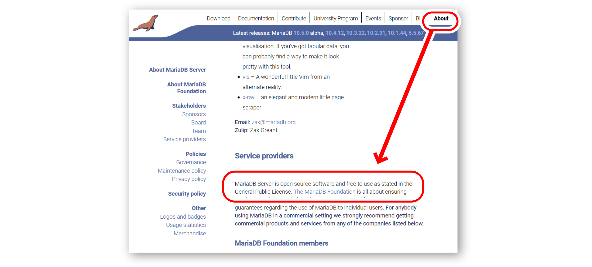

別の例として、Apache HTTP Serverの公式サイト[^apache-http-server]を見てみましょう。こちらは左側のメニューに「License」という項目があり、ここからライセンスの情報を確認できそうに見えます。

が、実際にはこのリンク先はApacheライセンスというオープンソースライセンスそのものの説明になっています。ここからは、Apache HTTP Serverというソフトウェア自体がApacheライセンスのバージョンいくつに該当するかは読み取れません。

[^apache-http-server]: https://httpd.apache.org/

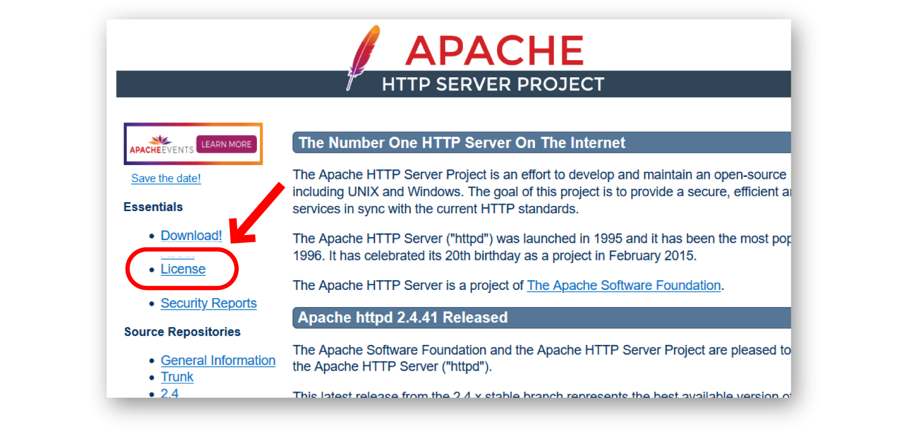

このように、公式サイトから正確なライセンス情報を確認するのは意外と大変です。しかも、場合によっては不正確な情報に辿り着いてしまって内容を鵜呑みにできないとなると、労多くして実り無しという事になってしまいます。

こういう事が起こってしまうのは、公式Webサイトが外部ドキュメントの一種として、ソフトウェア本体とは別に管理されている場合が多いためです。ソフトウェアだけ更新されてドキュメントが更新されていないというのは、残念ですがOSSに限らずよくあることですよね。

ですので、筆者はソフトウェアのライセンスを確認する方法としては、*ソースコード自体に添付されたライセンス情報を確認すること*をお薦めしています。


### ソースコードを見る

ソフトウェアのライセンスを知るには、ソースコードを確認するのが最も確実です。これは、多くのオープンソースライセンスでは、ソフトウェアをそのライセンスの元で配布する場合にライセンス情報を明示すること自体が利用条件の1つになっているためです。

ソースコードを入手する方法が分からない場合、*公式サイトのダウンロードページ*を参照してみましょう。インストール可能なパッケージと併せてソースコードのアーカイブがダウンロード可能になっていたり、ソースコードのリポジトリへのリンクが記載されていたりする場合があります。また、*公式サイトに「Getting Started」や「開発に参加するには」といった標題の情報がある*場合、そこにリポジトリの在処やソースコードの入手方法が記載されている場合もあります。

*ソースコードを入手できるようになっていない場合は、そもそもそのソフトウェアがOSSではないという可能性が高い*です。OSSの中には「ソフトウェアを購入した人が要求した場合にソースコードが開示される」というような条件の物もあり得ます[^no-need-to-publish]が、ここまでに紹介した各種の方法でライセンスを確認できず、ソースコードも入手方法が分からないというソフトウェアがOSSである可能性は、常識的に考えれば相当低いでしょう。

[^no-need-to-publish]: 誤解されがちですが、OSSであってもソースコードを万人に開示する必要はありません。「とにかくソースコードを公開しなければならない」というイメージの強いGPLでも、条件として定められているのはあくまで「ソフトウェアのユーザーには求めに応じてソースコードを開示しなければならない」という事で、ユーザーでない人にまでソースコードを公開する義務は無いのです。

　

さて、ソースコードを無事入手できても安心するのはまだ早いです。ライセンスが設定されていない場合や、オープンソースではないライセンスが設定されている場合があるからです。

もしかしたら「オープンソースじゃないのにソースコードを見たな！　あんたがその後に開発したこのソフトウェアは俺のソフトウェアを参考にしたに違いない！　賠償しろ！」と訴訟をふっかけられてしまう可能性も無いとは言いきれません。

なので、*手当たり次第にファイルの中を覗くのではなく、ライセンス情報が記載されている可能性が高いファイルに絞って内容を確認していきましょう*。

多くの場合、ライセンス情報は最上位階層の以下のような名前のファイルに記載されています。

* `LICENSE`
* `LICENCE`（「ライセンス」のイギリス英語での表記）
* `COPYING`（「著作権情報」の意）
* 著名なオープンソースライセンスの略称と同じ名前のファイル、例えば `GPL` など

ファイル名は目立つように全て大文字になっていることが多いですが、もちろん小文字でも意味は変わりません。また、`.txt` や `.md` などの拡張子が付いている場合もあります。

ファイルではなくそのような名前のフォルダがある場合は、その中にライセンス情報が詳しく書かれたファイルがあるという事もあります。ライセンス名のファイルの場合、ライセンスのバージョン番号が末尾に付いている場合もあります（ `GPL3.txt` など）。

このような名前のファイルが見当たらない場合は、`README` （こちらも `.txt` や `.md` などの拡張子が付いている場合があります）を見てみます。`README` はソフトウェアの使い方や権利者名など重要な情報を端的にまとめて記載している場合が多く、ライセンス情報も含まれていることがあります。


### ライセンスが明記されていない場合は？

ここまで、ライセンスを確認するための方法を色々とご紹介してきました。しかし、どこを探してもライセンス情報が見つからないという場合もあります。

その場合は安全のために、*OSSではない可能性が高い*と考えるようにするとよいでしょう。

また、ラインセンス情報が見つかっても、そのライセンス名がOSIの認定するオープンソースライセンスの一覧に載っていない場合は、「OSSっぽいけれども、OSSではない」ということになります。

ただし、ライセンス情報を確認できなかった場合でも、*作者はOSSのつもりだったもののライセンスを明示し忘れていた*、ということは希にあります。GitHubなどでソースコードが公開されているのにライセンス情報が無い場合にはその可能性がありますので、「駄目でもともと」の精神で、イシュートラッカーに「ライセンス情報が明示されていない（明示して欲しい）」といった内容で報告をしたり、作者の連絡先として記載されているメールアドレスに「ライセンス情報が明示されていませんが、これはどのようなライセンスでしょうか？」と質問を送ったりしてみることをお薦めします。そうすると、案外あっさりオープンソースライセンスを設定してもらえることもあります。

　

もちろん、「オープンソースでなければフィードバックしてはいけない」ということはありません。商用のソフトウェアでも、お客さま窓口から障害報告や要望をフィードバックすることはあります。

ただ、ソースコードを入手できる状態なのにオープンソースではないというソフトウェアについては、無闇にソースコードの内容を読んで記憶に留めたりファイルを抽出したりして一部だけでも再利用してしまうと、下手すれば訴訟にもなりかねません。「問題無い」という事を確認できるまでは、くれぐれも慎重に取り扱うようにしましょう。
