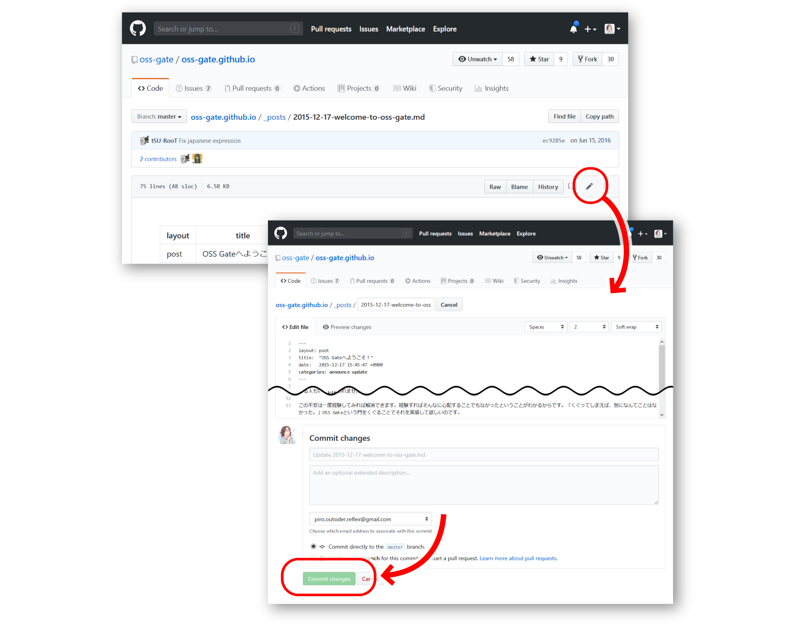
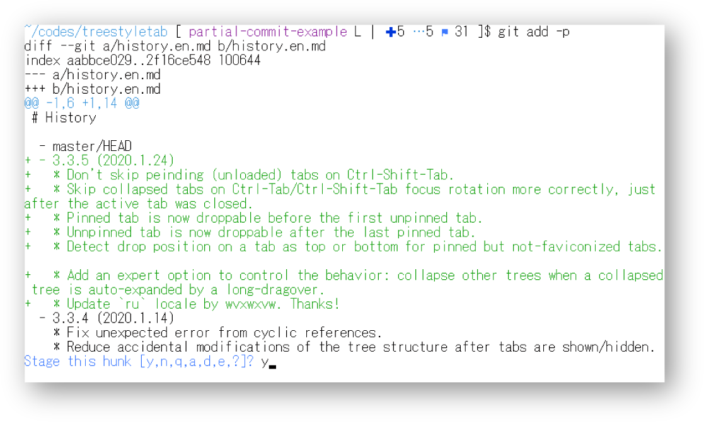
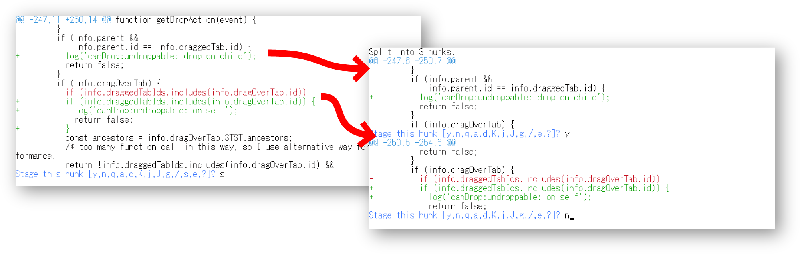
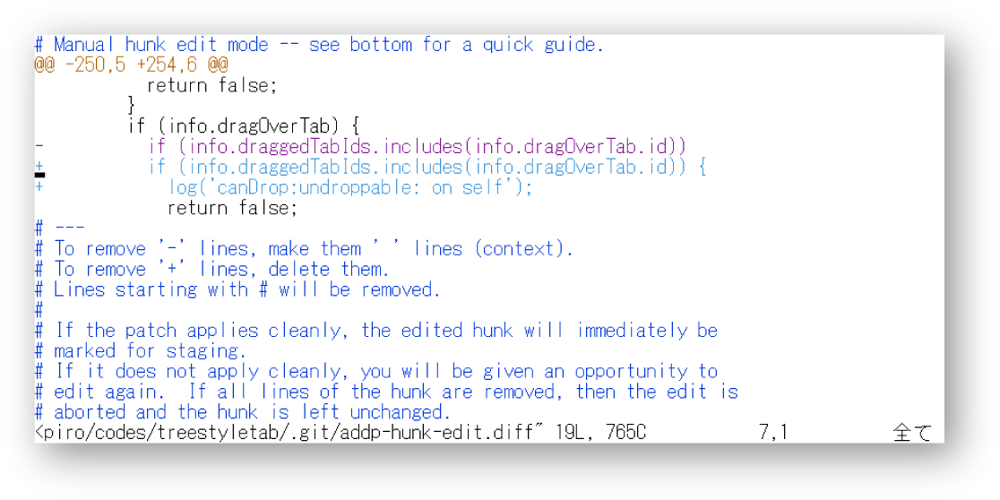

# プルリクエストしてみたい！

「プルリクエスト」は元々はGitHubの用語で、それ以前は一般的には「パッチを送る」とか「変更を取り込んでもらう」といった言い方をされていました。また、GitLabでは同じような機能が「マージリクエスト」という名前になっています。色々な言い方はありますが、本書ではGitHubや同様の形態のサービスで変更を取り込んでもらうことも、伝統的なパッチ形式で変更を提案することも、便宜的にすべて「プルリクエスト」と呼称することにします。

Gitの使い方やGitHubを使ったプルリクエストの方法自体の解説は、初心者にも分かりやすい解説に定評のある湊川あい氏によるWeb連載の「[マンガでわかるGit](https://next.rikunabi.com/journal/tag/webdesign-manga/)」や、その増補改訂版の書籍「わかばちゃんと学ぶ Git使い方入門」（シーアンドアール研究所より、2017年刊行）などで学べます。しかし、やり方は分かっても、実際のOSSでプルリクエストするのにはまだ抵抗がある、という人もいるのではないでしょうか。この節ではそんな方のために、見ず知らずの相手が運営しているOSSプロジェクトにプルリクエストするときの取り組み方を説明してみます。


## 初めてのプルリクエストで気をつけたいこと

### 変更の意図をきちんと説明しよう

読者の皆さんの中には、「実際にコードを書いて、早くOSS開発に参加したい」という思いが強い人もいるでしょう。また、「英語の読み書きは苦手だけれどもコードなら書ける」ということで、端的にコードの提供だけで済ませたい人もいると思います。筆者もかつてはそのように考えていて、言葉での説明を煩わしく感じていました。

しかし、例え1行だけの変更であっても、何の説明もないプルリクエストだけが単発で送られてきては、開発者は戸惑うだけです。「開発者なんだからプロジェクトの隅々まで完璧に把握してるはずだろう、だったら説明なんかなくてもコードを見れば分かるはずだ」と思いますか？　残念ながら、それは過剰な期待というものです。*開発者といえど、ある程度以上の複雑さを持ったソフトウェアでは、どの変更がどこにどういう影響を与えるのかを一目で判断するのは難しいです*。変更が予想外の場所で不具合を引き起こす「後退バグ」が起こったり、後退バグの早期検出を図る「回帰テスト」があったりするのは、そのためです。

開発者がプルリクエストの内容をスムーズに理解し、レビューやマージするかどうかの判断を迅速に行えるようにするためには、そのプルリクエストがどんな問題を解決する物なのかの説明が必要です。具体的には、「修正したい現象の再現手順」「現時点で実際に得られる結果」「その変更によって得られるようになる、本来期待される結果」の説明が必要です。

この説明でピンときた人もいるかと思いますが、プルリクエストの説明に含める必要がある情報は、イシューで問題を報告するときの内容と変わりません。ということは、*すでにあるイシューの番号（もしくはURL）を添えて、「これを修正するための変更です」と書くだけで十分*[^pullrequesst-link-to-issue]と言えます。また、既存イシューとの関連付けには、経緯や過去の議論をたどりやすくなるというメリットもあります。

[^pullrequesst-link-to-issue]: 英語では「This fixes the issue #12345.」といった文になります。

言い直すと、プルリクエストはイシューに対応付けて行うことを原則としましょう。英語が苦手だからイシューを立てるのは怖い、だからプルリクエストだけで済ませたい、という気持ちは分かりますが、それではかえって開発者に負担をかけてしまったり、悪ければ開発者に無視されてしまったりします。

### コラム：「Good First Issue」から始めるフィードバック

本書では基本的に「自分が遭遇したつまずきを報告する」という流れでのフィードバックを推奨しています。しかし、まだ何もつまずいていないものの、自分が普段からお世話になっている有名なOSSの開発に参加してみたい、問題解決に取り組んだりプルリクエストを出したりしてみたい、という人もいるかもしれません。あるいは、つまずいた問題が大きすぎて、自分には手に負えない、という場合もあるかもしれません。

そういう人は、そのプロジェクトのイシュートラッカーで「Good First Issue」や「Good First Bug」などとタグ付けされたイシューを探してみるとよいかもしれません。規模の大きなプロジェクトで、プロジェクトに協力してくれる人を随時募っている場合には、新規のプロジェクト参加者が挑戦するのにちょうどいい難易度の課題に、そのようなタグが付けられている場合があります。

取り組めそうな課題を見つけたら、「これに挑戦します」と宣言するコメントを追加して、進捗状況を随時共有しながら取り組んでみるとよいでしょう。分からないことがあったら、質問をするとプロジェクトに参加中の先達からアドバイスをもらえるかもしれません。

### プルリクエストから始めてもいい場合

プルリクエストはイシューと紐付けるのが原則だと述べたところですが、動作そのものに影響がなく、是非の議論の余地が無い変更の場合、イシューを経ずにプルリクエストから始めても問題無いことがあります。例えば以下のようなケースです。

* ローカルな変数名やプライベートな関数名の綴り間違いの修正
* 言語リソースの誤訳の修正
* 言語リソースの未翻訳部分に対する訳文の追加
* Webサイトやドキュメントの誤記の修正
* Webサイトやドキュメントのリンク切れの修正

こういうものは「再現手順」「実際に得られた結果」「期待される結果」の枠に当てはめにくいので、イシューを立てようと思うと逆に難しいです。実際のプロダクトやドキュメントに残る形でフィードバックをしたいという思いが強い場合には、こういったものから手を着けてみるのもよいかもしれません。

GitHub上では、ログイン済みの状態でファイルの個別のページを表示すると、オンラインで編集を開始できます。他人のリポジトリだった場合、変更を保存するタイミングで自動的に自分のアカウント配下にフォークが作られて、プルリクエストの作成画面になります。GitLabやBitBucketなどのサービスでも、操作の順番は多少異なりますが、同様のことができます。



ただ、変更時に意図せず混入してしまった文法エラーによって、その変更をマージすると初期化に失敗して起動できなくなってしまったり、ドキュメントのレイアウトが崩れてしまったり、というようなケースはあります。筆者が公開しているFirefox用アドオンにおいても、日本語と英語以外の翻訳リソースを提供してもらえることがありますが、文法エラーが残ったままの状態でマージしてしまって、自分の手元の環境で突然動かなくなって焦った、ということが度々ありました[^auto-lint]。Webサイト上からのファイル編集でプルリクエストした場合などには事後的にでもよいので、*どんな変更であっても、必ず一度は自分の手元で動かして（表示して）みて、問題が無いかどうかを確認するようにしましょう*。

[^auto-lint]: そのため現在は、コミットやマージの際に自動的に文法チェックを行うような設定をしていて、マージ前にそれらのミスに気付けるようにしています。

また、*変数名・関数名・API名といった、動作に影響を与える部分の誤記の修正は、特に慎重に行う必要があります*。ローカル変数やプライベートなメソッド・関数は、他から参照されないため、変更しても動作が壊れることはあまりありません。しかし、グローバルな変数や公開のメソッド、モジュール名自体の誤記は、下手に変更すると動作を壊してしまうことがあります。また、一見するとプライベートな変数や関数であっても、コード片単位でのインクルードや、メタプログラミングによって実行時に外部から参照されるなどのことによって、変更が思わぬ所に影響を及ぼしてしまうリスクがあります。実行可能なコードに関わる変更は、原則として、GitHubなどのサイト上から編集して直接プルリクエストするやり方を取らずに、手元で動作に問題が無いことを確認してからプルリクエストを出すようにすることを強くお勧めします。

なお、プロジェクトメンバー間での対面での相談やチャットなど別の場所で既に議論が尽くされていて、後はコードを変更するだけであるという場合に、傍目からは「急にプルリクエストが行われて、何故かすぐにマージされた」という見え方になる場合もあります。これは経緯を知らない人には区別が付かないので、注意が必要です。「あっちはすぐにマージしてるのに、なんでこっちは放ったらかしにされるんだ！」と思うようなケースに遭遇した場合でも、「ならば自分も」と短絡的には考えないようにしましょう。

### 分かる範囲のことから取り組もう

理想的なプルリクエストは、「元々の開発者が書いていたら、きっとこう書いていただろう、と思える」「後からコード全体を通して見ても、どこが元の開発者の手による箇所で、どこがプルリクエストで変更された箇所か、見分けが付かない」というものです。技術力があまりに違いすぎると、加えた変更が「馴染まないコード」として悪目立ちしてしまいがちです。

「じゃあ、元々の開発者と同じレベルの技術力が無いとプルリクエストしちゃ駄目ってことなのか！」と思ってしまうかもしれませんが、それはちょっと早計です。

確かに、まったく新しいモジュールを追加するような変更になると、そのレベルで「馴染むコード」を書くには、元の開発者と同等の技術力が必要になってきます。ですが、「既存のモジュールの、特定の関数の中だけの変更」というように限定的な場面であれば、スーパーエンジニアでなくても「馴染むコード」は書けます。というのも、多くのOSSでは、全体に渡って超絶技巧が凝らされているわけではないからです。心臓部になるような部分は別としても、*部分部分だけを取り出して見れば、特に末端ほど、どこにでもあるようなごく普通のコードになっています*[^importance-of-readability]。

[^importance-of-readability]: 例えば、「ボタンがクリックされた時の動作の定義の仕方」だったり「ファイルの読み込み方」だったり、そういったものは誰がどう書いても同じにしかなりようがありません。そもそも、OSSで「難解で分かりにくいコード」を書くのは、開発者にとっても自殺行為です。性能的な問題とならない限りは、なるべく可読性の高いコードにしてメンテナンス性を高く保っておかないと、開発者自身が後々困ることになります。

皆さんがOSSのソースコードを前にしてたじろぐのは、どこに何があるのか分からない状態の物がたくさん積み重なっているせいで、一つの「何か巨大なスゴイ物」に見えているから、という理由の方が大きいでしょう。そういうときは、近付いて・分解してよく見てみることが大事です。そうすると、「どこかで見たことがあるような書き方だ」と感じる箇所がそこかしこに見つかるはずです。

*慣れないうちは、コードの変更に取り組むときは、部分部分で見た時に「これなら自分でも完全に理解できる」という範囲のことに留めるようにしましょう*。少し背伸びして「ちょっと難しいかも……」という課題に取り組むのは、簡単な課題の解決をいくつかこなして自信を付けてからでも遅くはないです。


## プルリクエストのテーマは1つに絞ろう

### 粗探しは楽しいけれど……

問題の修正に取り組み始めてみると、「なんだかすごい物」と思っていたOSSのコードが、実は普通のコード……どころか、意外と粗だらけだということに気が付くことがあるかもしれません。

そう感じるのは、何も不思議なことではありません。というのも、有志の手により開発されているOSSは、「ものすごく技術力の高い人が作っている、完成度の高いソフトウェア」であるとは限らず、「切実にそれを必要としていた人がDIY[^diy]の精神で作っている、間に合わせのソフトウェア」である場合も多々あるからです。もしかしたら、あなたの方がプロジェクトオーナーより技術力が高い場合すらあるかもしれません。

[^diy]: 「Do It Yourself」。日本語で言えば「自給自足」。

そういうときに、「この書き方は効率が悪いから駄目だと教わったやつだ」とか、「こういう設計は分かりにくいから避けろと言われたやつだ」といった要領で、本来やりたかった事と無関係ながらついでに直したい箇所が目につくこともあるでしょう。ですが、*無関係な変更まで「ついで」でやってしまうのは、プルリクエストでは避けた方がよいです*。開発者側で変更内容を把握しやすくするために、プルリクエストは1回につき1つの趣旨に則った変更のみに留めましょう。

### 趣旨が異なる変更は、分けてプルリクエストしよう

具体的にどういうものがそれにあたるのかを説明しましょう。例えば、以下のようなJavaScriptのコードがあったとします。

```javascript
// リンク先のURL文字列を収集して返す
function getLinkURLs() {
  let links = document.querySelectorAll('a[href]');
  // ↓プロパティ名を間違えている（hre ではなく href が正しい）
  let urls = Array.from(links, link => link.hre);
  return urls;
}

// ページ内にある見出し（h1～h6）を収集して返す
function getHeadings() {
  // ↓h2とh3の間に「,」が抜けている（'h1,h2,h3,h4,h5,h6' が正しい）
  return document.querySelectorAll('h1,h2h3,h4,h5,h6');
}
```

見ての通り2箇所に間違いがありますが、こういう場面で「自分にも直せそう！」と思って両方を一度に変更してプルリクエストしてしまうのは良くないです。というのも、*この2箇所の間違いは、表面的にはどちらも「誤記」ですが、それぞれ趣旨・性質が異なる*からです。イシューとして報告するなら、この2つは以下のようにそれぞれ別個に報告するのが適切でしょう。

* リンク先のURLを収集する関数が、実際にはURLを返さない問題。
* 見出しを収集する関数が、実際にはh2とh3を収集しない問題。

もし「リンク先のURLを収集する関数が、実際にはURLを返さない問題」の修正のためのプルリクエストに「見出しを収集する関数が、実際にはh2とh3を収集しない問題」の修正が混入していたら、開発者は「えっ、この変更はリンク先のURLと関係なさそうなんだけど……自分の知らない所で、これがリンク関係に影響してたの？」と混乱して、*余計な調査に時間を使わないといけなくなります*[^developer-confused-from-unrelated-change]。

[^developer-confused-from-unrelated-change]: 前述しましたが、開発者は今あるコードのすべてを把握できているとは限りません。変更に変更を重ねた結果、自分の意識していないところでの変更が別の所に影響するようになってしまっている、ということはよくあります。そのため、常に変更の副作用を疑う癖が付いているのです。

また、後々後退バグが見つかったときの原因調査でも、このように複数の趣旨が混ざった変更があると、調査の妨げになりがちです。複数の趣旨が混ざったコミットやプルリクエストは、プルリクエストの時点でも問題を生むし、その後も問題を生むということで、原則としては百害あって一利なしと言えるでしょう。

### 複数の変更を一度にしてもよい場合

元々直したかった問題を直す過程で、その変更の範囲に自然に含まれる変更であれば、一度に行っても問題ないと言える場合はあります。例えば、以下のようなコードがあったとしましょう。

```javascript
function getLinkURLs() {
  let links = document.querySelectorAll('a[href]');
  // ↓プロパティ名を間違えている（hre ではなく href が正しい）
  // ↓この行だけインデントが揃っていない
    let urls = Array.from(links, link => link.hre);
  return urls;
}
```

この場合、「プロパティ名の間違いを直す」という趣旨の変更の一環でインデントも揃えてしまう、ということはよく行われます。*動作を変えるために変更しないといけなかった行については、動作を変えない範囲の変更であればついでに行っていい*、というのが一般的な慣習だと言っていいでしょう。

ただし、単に「同じ行なら複数の変更をまとめてやってしまってもよい」というわけではない、ということに注意してください。1行の中であっても、*趣旨の異なる変更は別々のプルリクエストに分けることが望ましい*です。

細かいレベルでは別々の変更と言えるけれども、大局的には1つの趣旨にまとめられる、という場合には、1つのプルリクエストにしてよい場合もあります。例えば、「Firefox 60までにしか対応していなかったFirefox用アドオンを、Firefox 68に対応させるため」という名目で以下の2つの変更を1つのプルリクエストにまとめるのは、問題無いと判断してもらえるかもしれません。

* Firefox 68で廃止されたJavaScriptのメソッドを使っていた部分を、Firefox 68以降でも動作する書き方に修正する。
* Firefox 68で廃止されたCSSのプロパティを使っていた部分を、Firefox 68以降でも有効な書き方に修正する。

筆者の個人的な感覚では、この2つをまとめてプルリクエストすることは問題無いと感じます。しかし、プロジェクトオーナーによっては異なる判断をするかもしれません。心配な場合は、プルリクエストのコメントの中で「変更ごとに分けた方がよいでしょうか？（Should I separate this for each change?）」と尋ねてみるか、最初から分けてプルリクエストすることをおすすめします。

### 複数の変更を分けてコミットするには

そうは言っても、作業中の勢いでうっかり複数の趣旨の変更をしてしまうということはあります。そういう場合は、変更点をすべてコミットせず、一部ずつコミットするという方法が便利です。Gitを端末上で使っている場合であれば、以下の要領です。

1. `git add -p`（`git add --patch`）または `git commit -p`（`git commit --patch`）を実行する。
2. 変更箇所が一部だけ表示されるので、`y`（yes：その部分をコミットする）か`n`（no：その部分かでその部分をコミットに含めるかどうかを指定する。
   
3. 趣旨の異なる変更箇所が隣接していて一緒に出てきてしまった場合は、`s`（split：変更を分割する）でさらに細かい単位に変更を分ける。
   
4. `s`でも思い通りに分割されない場合は、`e`（edit：エディタで編集）で差分を直接編集する。
   
5. すべての変更箇所について、2～4を繰り返す。

このようにして作業の一部をコミットした後は、

1. `git stash`で未コミットの変更を退避する。
   （図：変更を退避する様子）
2. `git checkout -b ブランチ名`で新しくブランチを作り、作業環境をそちらに切り替える。
   （図：ブランチ切り替え）
3. 退避した変更を `git stash pop` で再反映する。
   （図：変更を再反映する様子を描く）

筆者は誤った状態のままコミットしてしまうことを防ぎたいという目的もあって、コミットはほぼ毎回 `git commit -p` を使うようにしています。


## テストを直してみよう

### テストを実行してみよう

プルリクエストの中でも受け入れてもらいやすい物に、「自動テストの修正[^what-is-automated-test]」があります。

[^what-is-automated-test]: 自動テストとは、「テストの手順、実測値、期待値」の3つを定義しておき、手順の実行結果の実測値が期待値と異なっていればテスト失敗の旨を教えてくれる、というプログラムのことを言います。最も単純な例では、ある関数を引数を変えながら何度か呼び、関数の戻り値が想定通りかどうかを比較して、一致していれば成功、不一致なら失敗とする、といった要領です。

プロジェクトによっては、説明文の中にテストの実行手順が書かれている場合があります。その場合、*ソースコードをダウンロードしたら、まずはテストを実際に動かしてみましょう*。

実行手順が書かれていないけれどもテストらしきファイル（`test`や`tests`と名付けられたフォルダー）がある、という場合、ソフトウェアの種類によっては、一般的なテストの実行手順を適用できる場合があります。例えば、Node.jsのnpmのモジュールなら`npm install && npm run test`、RubyのGemなら`bundle install && bundle exec rake test`といったコマンド列を端末上のシェルで実行する方法が一般的です。

テストの実行手順がどうしても分からない場合は、「実行手順が説明に書かれていないので、テストを実行できない」ということ自体をイシューとして報告してみましょう。また、うまくテストを実行できたら、その手順を説明に追加するプルリクエストを出すようにしましょう。そうすることで、次以降に同じ所でつまずく人が減ります。

### 失敗しているテストを直そう

自動テストは、基本的にはすべて成功する状態になっていることが期待されます。しかし、プロジェクトによっては、自動テストが失敗する状態になっていることがあります。開発者がそのことに気付いていない場合もありますし、気付いていてあえて放置している場合もあります。いずれにしても、*自動テストの失敗は、開発者の手が回っていないということの表れ*ですから、今まさにフィードバックが望まれている状態だと言えるでしょう。テストがすべて成功する状態に修正するプルリクエストは、開発者も大抵は喜んでマージしてくれるはずです。

自動テストの壊れ方には、「実装の方が壊れている場合」と「テストの方が壊れている場合」の2種類があります。実装の方が壊れているとは、つまり、後退バグが発生しているということです。テストの方が壊れているとは、実装が変化したり[^test-fail-from-updated-implementation]実行環境の事情が変わったりした[^test-fail-from-updated-environment]にもかかわらず、自動テストの方にそれが反映されていない、ということです。放置されていることが多いのは後者のパターンでしょう。というのも、後者の状態でも通常の使用そのものには支障はないからです。

[^test-fail-from-updated-implementation]: 例えば、「関数に機能が追加されて引数の数が2つから3つに増えたにもかかわらず、テストでは引数を2つしか渡していない」「関数の戻り値の種類が整数から小数に変わったのに、テストでは小数が返ってくることを想定していない」などのような場合。
[^test-fail-from-updated-environment]: 例えば、「実験的に導入されていた演算子をテストで使っていたが、実行環境が更新されてその演算子が廃止された」「テストで使っていた組み込みのクラスが、その言語の新しいバージョンでは廃止された」などのような場合。

自動テストはそのOSSの「期待される動作」「詳細な使い方」を説明するものでもあります。テストを熟読しながら、なぜテストが失敗しているのか原因を調べて、すべて成功する状態に修正する、という作業をすると、確実にそのOSSへの理解が深まります。OSSでテストの失敗に遭遇したら、是非挑戦してみて下さい。


## ダーティなハックをそのまま提案するのはやめよう

ここまでに述べたことにまるっきり反することをしてしまったアンチパターンの例として、筆者が過去に行った（関わった）フィードバックの事例を紹介します。

### パッチ提出までの経緯

* [61846 - Undockable My Sidebar - in a new window](https://bugzilla.mozilla.org/show_bug.cgi?id=61846)

Firefoxの前身となったMozilla Application Suite（以下、コードネームの「Seamonkey」で表記します）には、Firefoxと同様に、ブックマークや履歴などを表示する「サイドバー」機能がありました。しかし、当時の競合製品であったMicrosoft Internet ExplorerをはじめとしたWindowsアプリケーションでは、「サイドバーをウィンドウから分離して別ウィンドウにできる」という挙動が広く採用されていました。Seamonkeyのサイドバーではそういうことができなかったため、この点は競合に対する見劣りする点、もしくは、一般的なWindowsアプリケーションの挙動に慣れた人がSeamonkey使用時に違和感を覚える点となっていました。

そこで当時の筆者は、「ウィンドウからサイドバーを切り離したかのように振る舞わせる機能」を提供する拡張機能を個人的に開発・公開していました[^mozilla-legacy-extension]。しかし、その拡張機能の実装は、当時の筆者の技術力[^tech-level]が今よりはるかに低かったこともあり、「*なんだかよく分かってないけど、ガチャガチャいじってたらとりあえず動くようになった。使えるから、まあいいや*」という、素人改造の域を出ない物だったと言えます。

[^mozilla-legacy-extension]: 当時のSeamonkeyの拡張機能は、実態としてはプログラムに対する動的なパッチ（いわゆるmonkey patch）だったため、多少腕に覚えがあれば大抵のことはできたのです。
[^tech-level]: その場のやっつけ仕事でとりあえず当座をしのぐ、ということが可能な程度の技能は持っていましたが、長期的な維持を考慮して適切に設計したり、適切な設計での解決が可能なように問題を再定義したりといったことをするための、より高次の技能は持っていませんでした。

筆者の失敗は、*この素人改造の成果をほぼそのままパッチとして提出したこと*でした。

### 変更内容自体の問題点

このときの素人改造の結果そのままのパッチには、以下のような問題がありました。

* 動的なゲッター[^getter]定義やオーバーライド[^override]を多用しており、処理の流れを追いにくくなるため、長期的なメンテナンス性や見通しの良さが大きく損なわれている。
* 改行や変数名の付け方といったコーディングスタイルだけは一応合わせていたが、そもそも設計方針が他の箇所と大きく異なっている。
* 根本的な解決ではなく、間に合わせで強引に機能を実現しており、安定性に難がある。

[^getter]: プロパティとして参照されたときに、事前に定義された関数を実行してその結果を値として返す、特殊なプロパティのこと。
[^override]: ここでは、既存の関数と同名の関数を後から定義し直すことを指します。

これには、どこかで聞きかじった「パッチを提出するときは、*変更の量をなるべく狭く・小さくする*」という話だけに意識を囚われてしまっていたから、という理由もあります。

変更が小さい方がよいというのは、あくまで、変更のテーマが1つに絞られた結果としてそうなるのが望ましい、という意味です。本質的に広範囲に影響を及ぼすことを避けられないテーマなのであれば、テーマを1つに絞ったとしても変更量は必然的に多くなります。*「変更量を小さくするためにアクロバティックなプログラミング技法を駆使せよ」という意味ではありません*。そのような、多くの歪みを一手に引き受ける形で書かれたコードは、例え分量が少なかったとしても、大きな技術的負債となります。

当時の筆者は、*「どんな難解なコードでも、優秀なOSS開発者たちであれば平然とメンテナンスできるのだろう」と、過剰な期待を抱いていました*。また、「自分にはここまでしかできない」「ここから先はプロのあなた達がなんとかしてくれるのだろう。実験的な実装を提供した時点で、自分の役目は終わった」と、*自分のコード提供者としての責務の範囲を大幅に小さく見積もってしまっていました*。

### 本来するべきだったこと

この機能を実現するためには、本来であれば、*抜本的な設計変更・広範囲に渡る改修*が必要だったのだと考えられます。また、そのような広範囲に渡る変更はプロジェクトに与える影響が大きいため、*多くの関係者に相談・交渉する*必要もあったのでしょう。技術的にもコミュニケーション能力的にも、当時の筆者のキャパシティを大きく超える、難しく複雑な課題でした。

そのような客観的な認識すらもできていなかったということも含めて、当時の筆者は、この課題に取り組むには顕著に役者不足だったと言えます。


また、パッチを提出したとはいっても、実際には当時の自分は英語が不得意だったため、別の方に代理で投稿して頂いていたという状況でした。これは、「提出すれば、すぐ受け入れてもらえるだろう」と甘く考えて、*コードに対する指摘への応答や相談など複数回のやり取りが発生する*ことを想定せずに、非常にコストの高いコミュニケーション方法を選んでしまったということです。

そのようなことが分かっていなかった当時の筆者は、開発者によってパッチに否定的なコメントがなされた時点で「なんだ、せっかくこっちができる限りのことをしたのに！」とヘソを曲げてしまい、そこからのさらなる改良には乗り出さずに終わってしまったのでした。

自分の身の程に応じた課題に取り組むべきだった。自分の身の程を越えた課題に取り組むのなら、その課題を正しく解決できるようになるまで、なにがなんでもしぶとく食らいつき続けて、真摯に学ぶべきだった。簡単にチヤホヤされたいという思いだけで、近視眼的な行動を取ってしまった。色々な意味で、この事例は筆者にとって、OSSの世界での適切なフィードバックの仕方を考える上での戒めとなったのでした。
