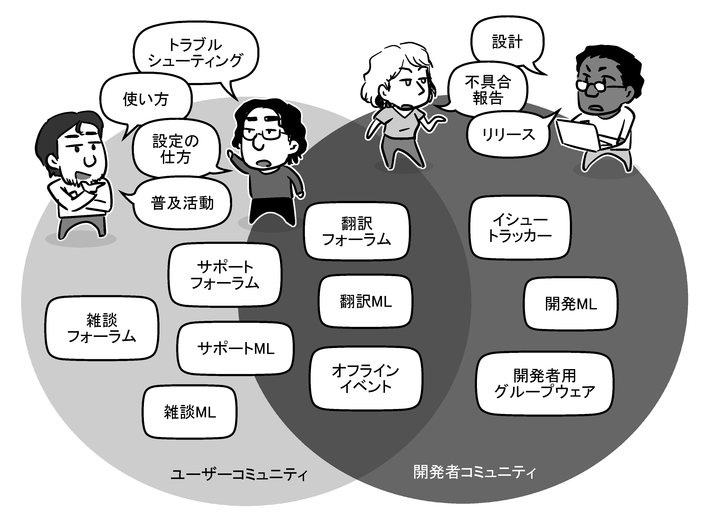
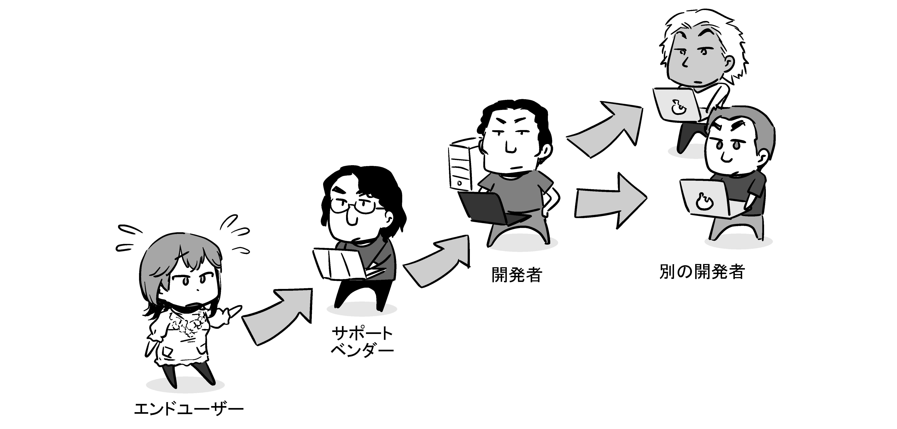
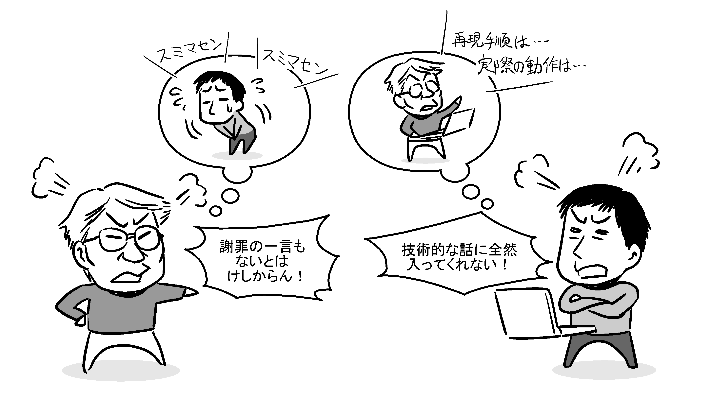

# どこにフィードバックしたらいいか分からない

さて、「フィードバックしたい内容」が見つかったらいざフィードバック！　といきたい所ですが……フィードバックって、一体どこにすればいいのでしょうか。

知り合いが作っているソフトウェアなら直接伝えてもいいでしょうし、作者の人が参加している技術イベントの懇親会で口頭で伝えるという方法を採れるかもしれません。しかし大抵の場合、フィードバックしたいOSSはどこの誰かも分からない人が作っていて、インターネット経由で連絡する以外に方法が無いという場合の方が多いでしょう。

## フィードバック窓口を調べよう

フィードバック先の窓口が分からない場合は、まずそのOSSのプロジェクト公式Webサイトを確認してみましょう。OSSによっては、*要望や不具合のフィードバック方法を説明している*場合があります。「コントリビュート（Contribution）」や「開発に参加するには（Get Involved）」といったメニューがサイト上にあれば、まずはそこから見てみるとよいでしょう。

例えば、筆者も開発に関わっている全文検索エンジンの[Groonga](https://groonga.org/)では、公式サイト上の「開発者向け情報」というリンクを辿った先に[バグレポートの送り方の説明ページ](https://groonga.org/ja/docs/contribution/report.html)があり、GitHubのイシュートラッカーかメーリングリストで報告する旨の案内が書かれています。

（Webサイト上のメニューのスクリーンショット）

また、テキストエディターの[Emacs](https://www.gnu.org/software/emacs/)では、公式サイト上の「Documents & Support」というリンクを辿ると[「Reporting bugs（バグの報告）」という見出しの下に説明があり](https://www.gnu.org/software/emacs/documentation.html)、メーリングリストで報告するように案内されています。

（Webサイト上のメニューのスクリーンショット）

このように、OSSにフィードバックする窓口としてはイシュートラッカーやメーリングリストが使われる場合が多いようです。他にも以下のような選択肢があります。

* ユーザーコミュニティや公式のフォーラムに投稿する。
* TwitterなどのSNS上で開発者にメンションする。
* 開発者にメールを送る。

小規模なプロジェクトでは公式サイトに案内が無かったり、そもそも、RubyGemsやアプリストアのようなWebサイト上のダウンロードページのみで公開されていて「公式サイト」が無かったりという場合もあります。その場合、上に挙げた例のような方法で連絡を取れないか調べてみるとよいでしょう。

### コラム：イシュートラッカーとは？

「ソフトウェアの不具合」を「バグ」と呼ぶことから、バグの修正状況の追跡をする物として「バグトラッキングシステム（Bug Tracking System、BTS）」という呼び方が以前はよく使われていました。しかし、この呼び方だと「不具合ではないただの要望はバグとして取り扱うべきなのかどうなのか？」という点で混乱が生じる場合があります。

Mozillaが運用するバグトラッキングシステム「Bugzilla」では、不具合報告だけでなく要望もすべてひっくるめて「バグ」と呼ぶという運用ルールにする事でこの混乱を回避していますが、運用ルールを知らない人にとっては違和感が残ります。そのため現在は一般的には、バグや要望などを「解決されるべき課題＝issue」と捉えて「イシュートラッキングシステム（Issue Tracking System、ITS）」や「イシュートラッカー」と呼んだり、あるいは、どんな課題であってもシステム上で管理される時はひとつの「チケット」になるからという事で「チケットトラッキングシステム」と呼んだりします。本書では、一般名として「イシュートラッカー」で呼称することにしています。

GitHubの場合、本稿執筆時点（2020年1月）では、イシュートラッカーが有効になっているプロジェクトでは、ページ上部のタブから「Issues」を選択すると、現在登録されているイシューの一覧を閲覧できます。

（スクリーンショット：イシュートラッカーの様子）

サービスにログイン済みの状態だと、このページの右上に「New issue」というボタンが表示されます。クリックすると新しいイシューの入力画面に遷移します（プロジェクトによっては、イシューの種類の選択画面がその間に挟まることもあります）ので、タイトルと説明を入力して「Submit new issue」ボタンを押せば、それでもうイシューを登録できます。

（スクリーンショット：イシューの編集画面）

## ユーザーコミュニティと開発者コミュニティ、どちらに投稿するべきか

ところで、OSSにおいて「フィードバック先」となり得る場所は、大きく分けると*ユーザーコミュニティ*と*開発者コミュニティ*の2つがあります。

ユーザーコミュニティは、*ユーザー同士で交流したり相互に手助けしあったりする場*です。一般的に「コミュニティ」と言うとこちらを指す場合が多いでしょう。

一方、「開発者コミュニティ」という言葉には馴染みが薄い人も多いかもしれません。OSSでは、開発者達がお互いに協力しあいながら、新機能を実装したり問題を修正したりしています。また、プロジェクト同士で連携を図るために連絡を取り合うこともあります。そのための*開発者同士での情報共有・交換の場*が開発者コミュニティです。

OSSの開発者は「特定の会社に雇われた開発チーム」のようなカッチリした集団であるとは限らず、有志の開発者達のゆるやかな集まりだったり、個人の主要開発者と協力者の集まりだったり、雇用された開発者と有志の開発者が入り交じった雑多な集まりだったりします。なので、呼び方としては「チーム」ではなく「コミュニティ」となるわけです。例えば、Chromiumの開発者コミュニティにはGoogle Chrome開発チームを中心とつつ、Microsoftなど他社の開発者、個人参加の開発者など幅広い参加者がいます。

<!--
（図：さまざまなコミュニティと連絡ツール
  * ユーザーコミュニティ
    - ユーザーフォーラム
      - サポートフォーラム
      - 翻訳フォーラム
      - 雑談フォーラム
    - ユーザー向けメーリングリスト
      - サポートML
      - 翻訳ML
      - 雑談ML
  * 開発者コミュニティ
    - イシュートラッカー
    - 開発者向けメーリングリスト
    - 開発者向けグループウェア
それぞれをベン図で表した上で、一人の人が複数に属している事もあり、ユーザーコミュニティは普通のユーザーの集まりなので使い方の会話がなされていて、開発者コミュニティは開発者同士の技術的な会話がなされている、という図）
-->

一般に、フォーラムは大抵はユーザーコミュニティ、イシュートラッカーは開発者コミュニティが使っています。メーリングリストは、ユーザー向けと開発者向けの2つが同時に存在する場合もあります。どちらかにしか関わっていないという人もいれば、1人で両方に関わっているという人もいます。

さて、ここで悩ましいのが、*自分が遭遇したつまずきを「ユーザーコミュニティに相談」するべきか、それとも「開発者コミュニティに報告」するべきか*、という点です。OSS Gateワークショップでも、初めてフィードバックをしようとしているビギナー参加者から、「こんな簡単な・くだらないレベルの事を開発者に報告してもいいの？」「フォーラムとイシュートラッカーのどっちに投稿すればいいの？」と質問されることがあります。

また、そもそも「どのプロジェクト（開発元）に言えばいいのか？」という質問を受けることも多いです。複数のソフトウェアが関わる問題では、経験者でもたびたび、どのソフトウェアがその問題の主要因なのか判断が付かないことがあります。

結論を先に述べておくと、これらの問いに対する筆者の回答は端的には以下のようになります。

* *これは自分個人の問題ではなく、そのソフトウェアの全ユーザー向けに解決されるべき問題だ*、と思えるなら開発者コミュニティに報告していい。
* 報告する問題は、簡単でも些細でも何でも、*未解決の問題であれば何でも構わない*。
* *自分で確かめられる範囲ではこのソフトウェアを使ったときしか問題に遭遇しない、他のソフトウェアでは問題が再現しない*、と言えるなら、とりあえずそのソフトウェアの開発元に報告していい。

## フィードバックのエスカレーション

ここで参考事例として、筆者が2019年5月頃に実際に行ったフィードバック[^feedback-from-client]をご紹介しましょう。そのつまずきは、「EメールクライアントのMozilla Thunderbirdでのメール作成時に、Microsoft IME（MS-IME）での日本語入力で漢字への変換ができなくなることがある」という物でした。

[^feedback-from-client]: 元々は、筆者の所属会社で提供している有償のサポートにおいてお客さまから頂いた問い合わせを発端とした物でした。

この現象から思いつくキーワードでWebを検索してみると、この時点ですでに、Firefoxのユーザーコミュニティが運営している「MozillaZine」というサイトのフォーラムに[同様の事例の投稿がありました](https://forums.mozillazine.jp/viewtopic.php?f=3&t=17326)。見てみると、スレッドの大まかな流れは以下のようになっていました。

1. このような現象が起こっている、既知の解決策はどれも有効でなかった、という情報が投稿される。（2018年12月末）
2. 現象の再現条件の特定が複数人によって進められる。（2018年12月末～1月頭）
3. Thunderbirdに対して行われた変更のうち、どの変更以降からこの現象が起こるようになったのかが特定される。(2019年1月）
4. 暫定的な回避作として、とあるアドオンをインストールすると現象が起こらなくなる、という情報が寄せられる。(2019年1月末～2月）

次に、Mozillaが製品開発のために運用しているイシュートラッカーである[Bugzilla](https://bugzilla.mozilla.org)にすでに報告されている問題かどうかを調べました。しかしながら、思いつく限りのキーワードで検索しても該当するBugを見つけられませんでしたので、[新しいBugとして報告することにしました](https://bugzilla.mozilla.org/show_bug.cgi?id=1550670)。前章で述べたような「傍観者心理」によって誰も報告しないままになるといけないので、筆者はこういう場合は重複を恐れずに報告することにしています。もし既に報告されている問題でも、そちらを参照するように誘導してもらえるはずと考えたからです。ただ、実際にはこれが最初の報告だったようで、技術的な知識のある方の目に留めてもらえた結果、FirefoxとThunderbirdの共通基盤である「Geckoエンジン」の日本語入力部分の担当者の方に作業を引き取ってもらえることになりました。

ただ、話はそれで終わりませんでした。仮にこれがGeckoの明白なミスに起因する現象だったのであれば、Gecko側で修正されてBugはクローズされます。しかし実際には、Mozillaの担当者の方による詳細な調査ではGecko側に問題は見当たらなかったため、Microsoft IME側の不具合である可能性があるとして、その方からMicrosoftのフィードバック窓口へ2019年5月末に報告されたそうです。

このように、一人のユーザーから他のもっと詳しいユーザーへ、詳しいユーザーから開発者へ、開発者から別のソフトウェアの開発者へと、より適切と思われる所に情報が伝えられていることを「エスカレーション」と言います。この事例を見ても分かるとおり、妥当なフィードバックはどこに報告しても最終的には届くべき所に情報がエスカレーションされていくので、極論すれば「どこに報告しても構わない」と言うことはできます。

## 誰の問題を解決したいか、という観点で投稿先が変わる

ただ、*情報をどこに投稿するかによって、その後の展開には差が出ます*。というのも、ユーザーコミュニティと開発者コミュニティは*目的が異なっている*からです。この違いを意識しないまま適切でない場所にフィードバックすると、解決したい問題がいつまでも解決されないままになってしまいます。

不具合や要望の投稿先の代表は、ユーザーコミュニティであればフォーラム、開発者コミュニティであればイシュートラッカーでしょう[^feedback-to-other-places]。以下、これらの場の性質の違いを表で整理してみました。

[^feedback-to-other-places]: メーリングリストやグループウェアなどの場合でも、ここにまとめた性質は基本的には変わりません。

|      | ユーザーフォーラム | イシュートラッカー |
| ---- | ------------------ | ------------------ |
| 利用者 | ユーザーコミュニティ | 開発者コミュニティ |
| 場の性格 | ユーザー同士の連絡手段 | 開発者同士の連絡手段 |
| 場の目的 | ユーザー同士で相互に情報を共有しあい、*報告者の眼前で今起こっている問題を解決する*こと。 | 開発者同士で相互に「そのソフトウェアにどんな問題があるのか、解決されるべき問題はどんな内容なのか」という情報を共有しあい、*ソフトウェアの問題を解決して、品質を高め、開発を前に進める*こと。 |
| 投稿の種類 | 相談 | 報告・提案 |
| 投稿者の目的 | 「どうすれば自分が今困っているこの状況を脱せるのか？」という*自分の問題*を解決すること。 | 自分が持っている情報を共有して*ソフトウェアの問題*を解決し、品質を高めること。 |
| 得られる成果 | 投稿者の眼前で今起こっている問題のとりあえずの解決策が見つかること。 | 将来リリースされるバージョンが改善され、同じ問題が再発しなくなること。 |
| 得られ*ない*成果 | 将来リリースされるバージョンが改善され、同じ問題が再発しなくなること。 | 投稿者の眼前で今起こっている問題のとりあえずの解決策が見つかること。 |

この表を見て分かるとおり、ユーザーフォーラムとイシュートラッカーでは「得られる成果」と「得られない成果」がちょうど逆の関係になっています。もちろん、ユーザーフォーラムへの投稿がきっかけで製品が改善されることも、その逆に、イシュートラッカーの中で提示された情報によって報告者の眼前の問題が解決されることも、どちらも確かにあります。が、それらはあくまで「運がよければそうなる」という臨時の副産物（ボーナス）に過ぎないと言えます。

さて、改めて考えてみましょう。*あなたが望むのは「今あなたが遭遇しているつまずきが一刻も早く解決されること」でしょうか？　それとも「ソフトウェアが改善され、将来のバージョンで同じつまずきが起こらなくなること」でしょうか？*　後者に少しでも関心を持てるなら、イシュートラッカーへ――つまり開発者コミュニティへとフィードバックする頃合いだと言えます。

一般的には、OSSへのフィードバックというと開発者コミュニティへ対して行うもののことを言います。なので、これ以降本書において単に「フィードバック」と書く場合の投稿先は、開発者コミュニティの連絡ツール、具体的にはイシュートラッカーや開発者向けメーリングリストなどを想定することにします。

## イシュートラッカーの使い方

### イシュートラッカーでのフィードバックの流れ

イシュートラッカーでは、通例、問題解決までの間に報告者と開発者の間で何度かやり取りが交わされます。一般的な流れは以下のようになります。

1. 報告者がイシューを登録する（イシューを立てる）。
2. 開発者が追加の情報を求める質問のコメントを付ける。
3. 報告者が追加の情報をコメントする。
4. 2～3を数回繰り返す。
5. 開発者が不具合の原因を特定し、修正する。
6. 不具合が確かに修正されたかどうかを、報告者が確認する。
7. 問題が解消された時点で、開発者または報告者がイシューをクローズする。

もし可能であれば、調査は開発者に任せきりにするのではなく、報告者側でも自主的に調査して、その結果を随時共有するのが望ましいです。「ここが原因であるらしい」「ここをこのように変更すると現象が起こらなくなる」といった情報は、例えそれが最良の修正でないとしても、開発者にとっては調査の大きな助けとなります。

あなたにソフトウェア開発の知見があって、調査の協力だけでなく実際にその問題を自力で修正できるのであれば、修正作業を開発者に代わって報告者が引き継ぐこともできます。イシュー上のやりとりで「この人なら修正もできそう」と開発者が判断した場合、修正作業自体まで依頼される場合もあります。その場合、作業は以下のような流れで進行します。

1. 報告者が、修正のための変更内容（ソースコードに対する具体的な変更。パッチやプルリクエストなど）を提案する。
2. 開発者から、変更内容の説明を求める質問や、修正が必要な箇所の指摘のコメントが付く。
3. 報告者が、追加の情報をコメントしたり、指摘に則った修正をしたりする。
4. 2～3を数回繰り返す。
5. 提案されている変更内容が妥当だと開発者が確認したら、開発者がその変更をソフトウェアに取り込む。

イシュートラッカーでは、*報告者は報告をしてそれで終わり、というわけではありません*。特に、開発者の環境では再現しない問題の場合、問題が解消されたかどうかの確認は報告者がする必要があります。

### イシュートラッカーに「お客さま」として関わって起こる不幸

イシュートラッカーは「開発者コミュニティ」の一部で、「開発者達がソフトウェアの改善のために集まっている場所」です。そこに関わるときは、*開発に関わる仲間としての振る舞いが求められる*ということに注意が必要です。――といっても、あなたがもしソフトウェアの開発経験があるのなら、普段通りの振る舞いをすればよいというだけのことなのですが。

もし「お客さま」気分でイシュートラッカーに「報告」ではなく「相談」をしてしまうと、誰にとっても望まれない結果になってしまいます。トラブルに遭遇したユーザーが「お客さま」のつもりでイシュートラッカー上で「相談」をしていたら、どうなっていたでしょうか。投稿者と開発者のそれぞれの視点での見え方をシミュレートしてみた物が、以下の表です。

| 投稿者からの見え方 | 開発者からの見え方 |
| ------------------ | ------------------ |
| 自分は相談者、相手は責任を持って問題を解決してくれる担当者 | 相手は開発に新たに参加したい人、自分は既存の開発者 |
| そもそも自分の不得意な「英語」で投稿することを強いられる。日本語のまま投稿してもイシューを閉じられてしまう。*こちらの事情に寄り添ってもらえない*。 | 参加者には日本語が使える人は少ないのに、報告者は一方的に日本語で書いていってしまう。*開発者達の事情に寄り添ってもらえない*。 |
| 開発者は*自分の今この瞬間の困っている状況を解消する情報を答えてくれない*。 | 報告者は*自分が困っている状況の話ばかりで、ソフトウェアの改善に繋がる話をしてくれない*。 |
| 開発者は*謝罪の一言も発しない*。それどころか、あれを試せこれを試せという指示ばかりされて、どのライブラリが原因だとか、どのコンテンツの問題だとか*言い逃ればかりする*。 | 報告者は*謝罪を求めるばかりで、原因の切り分けに協力してくれない*。切り分けのために試して欲しい色々な調査の*結果を詳しく共有してくれない、有効な情報を返してくれない*。 |
| 開発者は*優しく説明してくれない*。専門用語を並べ立てるばかりで、こっちのレベルに合わせてくれない。 | 報告者は、何を示しても「分からない」としか返してくれない。報告者の状況をあれこれ推測する必要があり、*時間と手間を大量に消費する*必要がある。 |
| 問題がまだ解決されていないのに、どんなに食い下がってもイシューは容赦なくクローズされてしまう。こちらのことは*結局放ったらかしにされてしまう*。 | 原因の特定ができなくては回避も修正もできず、原因を特定できる見込みがないのに、報告者は*とにかく直して欲しいとばかり繰り返す*。 |
| 「次のバージョンで修正される」と言われたが、*自分が使っているバージョンは直してもらえない*。自分の環境での*問題は解決されないまま*である。 | 修正は次のバージョンに反映されると説明したのに、リリース計画やリリースモデルを無視して、すでにリリース済みの古いバージョンに修正を反映するという*無理を求められる*。 |
| 自分の要望を受け入れてくれない。挙句の果てに荒らし扱いされて*締め出されてしまう*。 | プロジェクトの方針に合わない提案をいつまでも繰り返される。対応に手を取られるばかりで開発の支障になるので、*締め出すことにした*。 |

どうでしょう。こうして対比すると、お互いの自己認識や求めている物が噛み合っていないのがよく分かるのではないでしょうか。別にどちらが悪いということではなく、ただ*認識がお互いにずれている*のです。

開発者コミュニティは、「お客さまと、開発者」や「相談者と、開発者」ではなく、*「後輩であまり詳しくない開発者と、先輩で詳しい開発者」が交流する場*です。参加者の誰もが開発者である想定なので、関わる人にはある程度の技術的な知識が要求されます。また、基本的には、*既存の開発者達が一斉に反省して技術水準を引き下げることよりは、新たに参加する開発者が成長して平均的な技術水準に追いつくことの方が重視されます*。

なので、報告者に全く知識が無いという場合、問題自体の深刻度がよほど高いと判断されない限りは、「原因究明に必要な情報を報告者から引き出そうとして手厚く手助けする」ということはあまり行われません。「お客さまとして歓待され手厚いサポートを受けられるはず」と期待していると、肩透かしを食らうどころか不快な思いをする羽目にもなってしまいます。

### コラム：それでも「お客様気分」が抜けない問題

どこに投稿するのが適切かは分かっているけれども、それでも開発者コミュニティに飛び込むのは怖いからフォーラムに書き込むだけで済ませたい、という人もいるかもしれません。筆者もかつてはそういう時期がありました。さすがに「こっちは使ってやってるんだぞ！」といったレベルの「お客様気分」ではありませんでしたが、それでも結構な間、「こっちは協力してやってるんだぞ！」という「お客様気分」はまだ抜けきっていなかったように思います。

当時の考えを率直に言えば、「ソフトウェアの改善は開発者の人の仕事で、ただのユーザーに過ぎない自分の領分ではない」ということだったのだと思います。それは「プロのソフトウェア開発者でもなんでもないただの学生の僕ごときが関わってよい場ではない」という*畏れ*でもありましたし、同時に、「ソフトウェアを改善したいなら、改善したい開発者の側から積極的に動いて有用な意見を吸い上げるべきで、ただの善意のユーザーである僕に苦労を強いるべきではない」という*傲慢*でもありました。

後者をもっと詳しく言うと、こんな感じです。

* 自分はここまで頑張って調べたのだから、この情報には大きな価値があるはず。
* 価値ある情報は当然注目されるべきで、当然開発者にも見つけてもらえるべき。
* むしろ、この価値ある情報を見つけに来ない開発者の方に問題がある。

今から考えれば、こういった上から目線の考えは、*「失敗したくない」「恥をかきたくない」「邪険に扱われたり、取るに足らないものとして扱われたりするのが怖い」という本心*の裏返しだったのだと思います。フィードバックの回数を重ねる中で、そして自分自身がフィードバックを受ける側になることで、そういった感覚はだんだんと薄れていったのでした。

## 「開発者」としてソフトウェアの改善・問題解決に関わろう

### 誰もが開発者、開発関係者として関われる

例えて言えば、バザール方式のOSSの開発者コミュニティというのは、*企業の社屋や工場に誰でも出入り自由になっている状況のようなもの*です。社会科見学では見学しかできないのに対し、見学ルートを外れて「中の人達」同士の議論に混ざって発言できる、*誰にでも開発への参加の機会が開かれている*のがOSSです。そう考えれば、そこで行われている議論や開発に文字通り「誰でも」気軽についていけるわけではなく、「開発者として」関わる必要があるということも納得しやすいでしょう。

これは別の言い方をすると、*開発に関わりたい・品質向上に寄与したいという積極的な意志を持つ人にとっての門戸が開かれている*ということでもあります。開発の拠点が海外でも、普段の仕事がソフトウェア開発と無関係でも[^non-software-engineer]、あるいはライバル製品の開発元に所属していてすらも[^competitor]、やる気次第で自分から参入できます。

[^non-software-engineer]: ソフトウェア開発ではなく運用に従事しているという人や、まだ就職していなくて学生で開発に参加する人もいます。
[^competitor]: 実際に、Mozillaに雇用されている人達もChromiumにバグ報告をしています。

* 「ここの所に穴が開いてるみたいなんだけど、大丈夫かなあ……塞がれないのかなあ……？　気になる……」「この機能のこの部分、これだと不十分に見えるんだけどなあ……ソワソワする……」という風に、ソフトウェアのちょっとした不具合が気になって仕方ない人。
* 「ああもう！　この人達（開発者）はまるで分かってない！　俺の方がずっとスマートにこの問題を解決できるのに！」「ああもう！　なんでここの所はこんな風にできてるんだ？　使いにくい！　俺ならこんな作り方にしないのに！」という風に、問題が放置されていることに我慢がならない人[^bumptiousness]。

[^bumptiousness]: 「プログラマーの三大美徳」の1つの「傲慢」とは、このようなこと（自分にはこの問題を解決できるはず、という考え方をすること）を指します。

こういったモヤモヤを感じた時に、*「でも、手を出せないんだからしょうがない」と諦めないで根本的解決できる可能性が開かれているのがOSS*です。開発者として「ソフトウェアの改善に関わりたい」と考えているのであれば、「開発者コミュニティに報告する」という選択をして全く問題ありません。

筆者の経験上では、開発者として関わろうとしている人に対して、開発者の人達は総じて好意的に振る舞ってくれます。最初から理想的なスーパーエンジニアのようには振る舞えなくても心配いりません。「OSSプロジェクトに初めて関わる人」は「会社の新入社員」「チームの新人」と同じですから、要領は良くなく、最初は簡単な仕事からしかこなせず、あるいはミスもする、といったことは開発者の人達も折り込み済みです。分からないことがあれば、会社の先輩に質問するのと同じように、先に参加していた人を捕まえて質問するだけのことです。インターンとしてチームに参加するようなつもりで、気を楽にして飛び込んでみるといのではないでしょうか。

### Code of Conductを知ろう

ところで、OSSプロジェクトによっては、プロジェクトに参加する人に求められる行動の指針が示されている場合があります。これをCode of Conduct（コード・オブ・コンダクト、行動規範）と言います。内容はプロジェクトによりけりですが、大抵は以下のことが書かれています。

* プロジェクトに関わる人がするべき行動・慎むべき行動
* Code of Conductに反した行動に対するペナルティ

開発者が一人で運営しているような小規模のプロジェクトではCode of Conductは特に定められていない場合が多いですが、その場合は元GitHubのエンジニアの方が[Contributor Covenant（コントリビューターの盟約）というサイト](https://www.contributor-covenant.org/)で公開している一般的なCode of Conductの例を参照するとよいでしょう。2020年1月現在、バージョン2.0とされている物は以下のような内容[^code-of-conduct-example]となっています。

[^code-of-conduct-example]: ここに記載しているのは筆者による要約です。公式の翻訳ではありません。また、原文ではこの後に「このような不適切な行動を取った人には、このようなペナルティを課す」という運用のガイドラインが続いています。

* プロジェクトの参加者全員が、コミュニティに関わるすべての人に対し、年齢、体格、目に見える・あるいは目に見えない障碍、民族、性徴、性自認とその表現の仕方、技術経験の程度、教育程度、社会的・経済的地位、国籍、外見、人種、宗教、性同一性と性的指向を問わず、嫌がらせに遭うことがないようにするよう協力しあうことの誓約。
* 奨励される良い行動の例。
  * 他者に対して共感と優しさを示す。
  * 異なる視点や経験を尊重する。
  * 建設的な批判を行うと同時に、そのような批判を受容する。
  * 個人としてだけでなく、コミュニティにとって何が最善かに焦点を当てる。
* 容認されない行動の例。
  * 性的な言葉や画像の使用、あらゆる種類の性的なアピール（ナンパなど）。
  * 荒らし・煽り、侮辱的・軽蔑的なコメント、個人攻撃、政治的な攻撃。
  * 公私に渡るハラスメント。
  * 現実の住所やオンラインでの連絡先など、他人の個人情報を明示的な許可を得ず暴露すること。
  * 職場において不合理・不適切と考えられるその他の行為。
* プロジェクト管理者は、上記のような判断基準を明確にし実施する責任と、許容されない行いに対して適切で公正な措置を講じる責任があり、行動規範に反するコメントやコミットなどのあらゆるコントリビュートを排除したり、不適切・脅迫的・攻撃的・有害な行動を取る人を排除したりする権限を有するということ。
* 個人がプロジェクトやコミュニティを代表する場合（プロジェクト公式のメールアドレスやSNSアカウントを使った投稿、オンライン・オフラインのイベントで代表者として振る舞う場合など）には、この行動規範が、プロジェクト内だけでなく公の場においても適用されるということ。
* 行動規範に反する行いを見かけた場合の通報先を明示すること。
* 通報を受けた人には、通報者のプライバシーと安全を守る義務があるということ。

フィードバックを行う最初の時点では、これらのことを意識する必要はあまり無いかもしれません。本節に書かれているような内容を意識して常識的な振る舞いを心がけていれば、おおむねこれらの規範に則った行動になるはずです。

どちらかというと、気をつけないといけない度合いが高いのは、フィードバックに対する開発者の反応が芳しくないものだった場合や、フィードバックを何度も重ねて「常連」になり、他の報告者に何かアドバイスをしようとした場合などでしょう。これについては、フィードバックをした後のことを解説する第3章以降でまた述べることにします。
